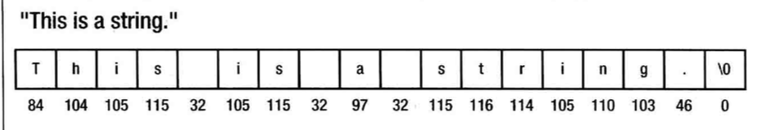

# C语言入门

## 基础概念

1. 预处理指令

   ```c
   #include <stdio.h>
   /*
   	符号#表示这是一个预处理指令,告诉编译器在编译源代码之前，要先执行一些操作。编译器在编译过程开始之前的预处理间断处理这些指令。
   */
   ```

2. 预处理器

   宏是提供给预处理器的指令，来添加或修改程序中的C语句。

   ```c
   #define INCHES_PER_FOOT 12
   ```

3. 输出格式

   * `%d` 以十进制输出带符号整数
   * `%f` 以小时形式输出单、双精度小数
   * `%c` 输出单个字符。
   * `%s` 字符串。
   * `%p` 输出变量的地址。
   * `%u` 以十进制形式输出无符号整数

4. **内存泄漏** 当动态分配了一些内存时，没有保留对它们的引用，就会出现内存泄漏，此时无法释放内存。

## 函数

1. `sizeof` 运算符

   * 使用 `sizeof` 运算符可以确定给定的类型占据多少字节。

   * 表达式`sizeof(int)` 会得到 int 类型的变量所占据的字节数，所得的值是一个`size_t` 类型的整数。 
   * `size_t` 类型在标准头文件 `<stdio.h>` （和其它头文件）中定义。

   ```c
   size_t size = sizeof(long long int)
   ```

2. `scanf(要读入的数格式，变量地址)` 

   ```c
   int a;
   scanf("%d",&a) //读入一个十进位的整数。
   ```

## 变量的可视范围

1. __局部变量__ ：属于某个{}，在{}外部不能使用此变量，在{}内部是可以使用。执行到普通局部变量定义语句，才会分配空间，离开{}，自动释放。普通局部变量不初始化，默认值为随机数。

2. 在编译阶段分配空间，只有整个程序结束才释放。普通全局变量只要定义了，任何地方都能使用，使用前需要声明所有的.c文件，只能定义一次普通全局变量，但是可以声明多次（外部链接）。

3. 全局变量

   - 声明在函数定义外
   - 因为容易造成名称污染，避免使用全局变量

   ```c
   #include<stdio.h>
   int i = 1;
   int main()
   {
   	printf("%d\n", i);
   	return 0;
   }
   
   ```

4. 局部变量

   - 声明在函数定义内

   - 大括号表示一个范围

     ```c
     int i = 1;
     int main()
     {
     	printf("%d\n", i);    	1
     	int i = 2;
     	printf("%d",i);     	2 
     	{
     		printf("%d",i); 	2
     		int i = 3;
     		printf("%d", i); 	3
     	}
     	printf("%d",i);      	2
     	return 0;
     }
     
     int main(){
     	int i = 3;
     	printf("%d\n", i);		3
     	if(i == 3){
     		i = i + 1;
     		int i = 6;
     		printf("%d\n", i);	6
     		i = i + 1;
     		printf("%d\n", i);	7
     	}
     	printf("%d\n", i);		4
     	if(i == 3){
     		printf("%d\n", i);
     	}
     	return 0;
     }
     ```

## 编程初步

### 计算机内存

1. 计算机中的位以8个为一组，每组的8个位称为一个字节（byte）。
2. 每个字节在内存里都有一个和其他字节不同的地址，字节的地址唯一地表示计算机内存中的字节。
3. 1KB 是 1024 字节。

### 变量

1. 定义变量

   ```c
   int num;     //先声明
   int num = 0; //声明并初始化
   ```

2. 变量是计算机里一块特定的内存，它是由一个或多个连续的字节所组成。

3. 声明变量时就初始化它一般是很好的做法。它可以避免对初始值的怀疑，当程序运作不正常时，它有助于追踪错误。避免在创建变量时使用垃圾值。

4. 相同类型的不同变量总是占据相同大小的内存（字节数）。但不同类型的变量需要分配的内存空间就不一样。

### 数据类型

1. 任何数，只要有小数点，就是double 类型，除非加了f。
2. 使用浮点数进行除法运算，会得倒正确的结果--- 至少是一个精确到固定位数的值。

### 定义常量

```c
#define PI 3.141592f
```

### 整数类型

- 一个位（bit）可以存储一个0或者1。
- 一个字节（位元组）通常可以存储8个位。
- 一个字节可以存储256中不同的组合
  1. 从 0 开始 255 （无符号）
  2. 从-128 到 127 （有符号）

|          类型          | 字节数 |
| :--------------------: | :----: |
|      signed char       |   1    |
|       short int        |   2    |
|          int           |   4    |
|        long int        |   4    |
|     long long int      |   8    |
|     unsigned char      |   1    |
|   unsigned short int   |   2    |
|      unsigned int      |   4    |
|   unsigned long int    |   4    |
| unsigned long long int |   8    |

```c
#在数值的后面加上一个大写L或小写l，表示long类型
long Big_Number = 187600L;
#将整数常量指定为long long 类型时，应添加两个L
long long really_big_number = 123456789LL;
#将常量指定为无符号类型时，应添加U
unsigned int count = 1000U;
unsigned long value = 9999999999UL;
#最大范围的整数
unsigned long long max = 946073047250800ULL
```

### 浮点数类型

|   关键字    | 字节数 |     数值范围     |
| :---------: | :----: | :--------------: |
|    float    |   4    | 精确到6到7位小数 |
|   double    |   8    |  精确到15位小数  |
| long double |   12   |  精确到18位小数  |

```c
int main()
{
	float a = 123.45;
	double b = 123.45;
	printf("%f\n",a); //123.449997
	printf("%f\n",b); //123.450000
	return 0;
}
```

## 字符串

### 字元

1. char 类型的变量有双重性，可以把它解释为一个字符，也可以解释为一个整数。

   ```c
   char letter = 'C'
   letter = letter + 3;
   ```

2. 大小写转换

   ```c
   int main()
   {
   	char input,output;
   	scanf("%c",&input);
   	output = input + 32;
   	printf("%c\n",output);
   	return 0;
   }
   ```

### 字符串

1. 字符串是放在一对双引号中的一串字符或者符号。

2. 内存中字符串的例子

   

3. 字符串的结尾 `\0`，也叫空字符。

```c
//1.方法一
//这个变量最多存储19个字符的字符串，因为必须给终止符号提供一个数组元素。
	char saying[20];
//2.方法二
//编译器会指定一个足够容纳这个初始化字符串常量的数值。
	char saying[] = "This is a string";
```

4. 字符串长度

   ```c
   #include <stdio.h>
   int main()
   {
       char str1[] = "To be or not to be";
       unsigned int count = 0;
       while (str1[count] != '\0'){
           ++count;
       }
       printf("The length of the string %d\n",count);
       return 0;
   }
   ```

### 枚举

```c
enum Weekday {Monday,Tuesday,Wednesday}
```

## 条件判断

### if

```c
#include <stdio.h>
#include <stdbool.h>
int main()
{
    bool res = true;
    if(res)
        printf("%c",'A');
    else
        printf("%c",'B');

    return 0;
}
```

### 按位运算符

| 运算符 |         说明         |
| :----: | :------------------: |
|  `&`   |     按位与运算符     |
|  `|`   |     按位或运算符     |
|  `^`   |    按位异或运算符    |
|  `~`   | 按位非运算符（补码） |
|  `<<`  |    按位左移运算符    |
|  `>>`  |    按位右移运算符    |

```c
#include <stdio.h>
int main()
{
    int x = 0;
    int y = 1;
    printf("%d \n",x&y); //0
    printf("%d \n",x|y); //1
    int d = 3; //011
    int c = 4; //100
    printf("%d \n",d^c); //111 --> 整数的 7
    return 0;
}
```

## 循环

### for

### while

### switch

```c
#include <stdio.h>
int main()
{
	int num1,num2;
	char op;
	float anawer;
	scanf("%d%c%d",&num1,&op,&num2);
	switch(op){
		case '+': anawer = num1 + num2; break;
		case '-': anawer = num1 - num2; break;
		case '*': anawer = num1 * num2; break;
		case '/': anawer = (float)num1 / num2; break;
	}
	printf("ans %.2f\n",anawer);
	return 0;
}
```

### do -- while

```C
int main()
{
	int total;
	int id;
	do{
		scanf("%d",&id);
		switch(id){
			case 1 : total += 90; break;
			case 2 : total += 75; break;
			case 3 : total += 83; break;
			case 4 : total += 89; break;
			case 5 : total += 71; break;
		}
	} while(id != 0);
	printf("Total:%d\n",total);
	return 0;
}
```

## 数组

数组是一组数目固定、类型相同的数据项，数组中的数据项称为元素。

### 初始化

```c
#初始化整个数组，使得每个元素都有一个值
int counter[6] = {1,2,3,4,5,6};
#初值的个数少于元素数，没有初值的元素就设成0
int counter[6] = {9};
int counter[] = {1,2,3,4,5,6};
```

### 数组大小

```c
//sizeof
#include <stdio.h>
int main()
{
    int values[5] = {1,2,3,4};
   printf("%zd\n",sizeof(values)/sizeof(values[0]));
    return 0;
}
//用特定保留值表示数组长度
#include<stdio.h>
int length(int[]);
int main()
{
	int v[4] = {1,2,3,-1};
	printf("%d\n",length(v));
	return 0;
}
int length(int v[])
{
	int i = 0;
	while(v[i] != -1){
		i++;
	}
	return i;
}
```

### 多维数组

```c
//二维数组
int v[2][3] = {{1,2,3},{4,5,6}};
```

### 数组排序

```c
#include <stdio.h>
int main()
{
	int v[5],i,j;
	for(i=0;i<5;i++){
		scanf("%d",&v[i]);
	}
	for(i=0;i<4;i++){
		for(j=0;j<4-i;j++){
			if(v[j] > v[j+1]){
				int t = v[j+1];
				v[j+1] = v[j];
				v[j] = t;
			}
		}
	}
	for(i=0;i<5;i++){
		printf("%d",v[i]);
	}
	return 0;
}
```

### 数组复制

```c
#include<stdio.h>
void increase(int[3]);
int main()
{
	int i,n[3] = {1,2,3};
	increase(n);
	for(i=0;i<3;i++){
		printf("n[%d] = %d \n",i,n[i]);
	}
	return 0;
}
//这里是传的引用。
void increase(int n[3]){
	int i;
	for (i=0; i < 3; i++)
	{
		n[i]++;
	}
}
```

## 指针

### 基本概念

1. 存储地址的变量称为指针。
2. 类型名 void* 表示没有指定类型，所以 void* 类型的指针可以包含任意类型的数据项地址。类型 void* 常常用做参数类型，或以独立于类型的方式处理数据的函数的返回值类型，在使用它时，再将其转换为合适的类型。

### 声明指针

1. 代码

   ```C
   //下面两种方式是等价的
   int *pnumber;
   int* pnumber;
   ```

   __注意__ 未初始化的指针式非常危险的，比未初始化的普通变量危险的多，所以应总是在声名指针时对它初始化。

   ```C
   int *pnumber = NULL;
   ```

2. NULL 

   是在标准库中定义的一个常量，对于指针它表示0。NULL 是一个不指向任何内存位置的值。这表示，使用不指向任何对象的指针，不会意外覆盖内存。当编译器不能识别NUll，就应该在源文件中包含`<stddef.h>` 头文件。

3. 用已声明的变量地址初始化子针变量

   ```c
   int number = 99
   int *pnumber = &number;
   ```

4. 批量声明

   ```c
   double value,*pVal=NULL;
   ```

5. `void*` 类型的指针可以包含任意类型的数据项地址。类型 `void*` 常常用做参数类型，或以独立于类型的方式处理数据的函数的返回值类型。

```c
#include <stdio.h>
int main(void)
{
    int number = 0;
    int *pNumber = NULL;
    number = 10;
    printf("%p\n",&number);
    printf("%d\n",number);
    pNumber = &number;
    printf("%p\n",pNumber);
    printf("%d\n",*pNumber);
    printf("%zd\n",sizeof(pNumber));
    return 0;
}
```

### 使用指针

1. 取消引用的指针

   ```c
   //*号表示访问 pnumber 变量所指向的内容。这里它是变量 number 的内容。
   *pnumber += 25;
   ```

2. 改变指针的指向

   ```c
   int value = 999;
   int *pnumber = NULL;
   pnumber = &value;
   *pnumber += 25;
   ```

3. 指针可以包含同一类型的任意变量的地址，所以使用一个指针变量可以改变其他许多变量的值。

4. 使用指针`++`数值

   ```c
   int *pnum = NULL;
   int val = 1;
   pnum = &val;
   ++(*pnum);
   (*pnum)++;
   ```

5. NULL 的指针，它是相当于数字0的指针。

### 指向常量的指针

1. 声明指针时，可以使用 const 关键字指定，该指针指向的值不能改变。

   ```c
   long value = 9999L;
   const long *pvalue = &value;
   ```

2. 把 pvalue 指向的值声明为 const。所以编译器回检查是否有语句试图修改 pvalue 指向的值，并将这些语句标记为错误。

   ```c
   *pvalue = 888L;
   ```

3. pvalue 指向的值不能改变，但可以对 value 进行任意操作

   ```c
   value = 777L;
   ```

### 常量指针

1. 声明指针时，使的指针中存储的地址不能改变。

   ```c
   int count = 43;
   int *const pcount = &count;
   ```

2. pcount 该指针存储的地址不能改变。编译器会检查代码是否无意中把指针指向其他地方。

   ```c
   //报错
   int item = 34;
   pcount = &item;
   ```

3. 但使用 pcount，仍可以改变 pcount 指向的值

   ```C
   *pcount = 345;
   ```

### 数组和指针

1. 数组和指针
   * 数组是相同类型的对象集合
   * 指针是一个变量，它的值是给定类型的另一个变量或者常量的地址。使用指针可以在不同的时间访问不同的变量，只要它们类型相同即可。

2. 如果需要传入一个引用，但没有使用 & 运算符，而是使用数组名称，同时也没有带索引值，它就引用数组的__第一个元素的地址__ 。但数组不是指针，它们有一个重要区别：可以改变指针包含的地址，但不能改变数组名称引用的地址。

   ```c
   #include <stdio.h>
   int main()
   {
       char multiple [] = "My string";
       char *p = &multiple[0];
       printf("The address of the first array element : %p\n",p);
       p = multiple;
       printf("The address of the first array name:%p\n",multiple);
       return 0;
   }
   ```

3. 指针地址的累加。

   ```c
   #include <stdio.h>
   #include <string.h>
   // #include <stdlib.h>
   int main(void)
   {
       char multiple[] = "a string";
       char *p = multiple;
   
       for(int i =0;i < strnlen(multiple,sizeof(multiple));i++){
           printf("multiple[%d] = %c *(p+%d) = %c &multiple[%d] = %p p+%d = %p\n",i,multiple[i],i,*(p+i),i,&multiple[i],i,p+i);
       }
       return 0;
   }
   ```

### 多维数组和指针

1. 二维数组和一维数组的关系

   ```c
   #include <stdio.h>
   int main(void)
   {
       char board[3][3] = {
           {'1','2','3'},
           {'4','5','6'},
           {'7','8','9'}
       };
       printf("address of board :%p\n",board);
       printf("address of board[0][0]:%p\n",&board[0][0]);
       printf("value of board[0]:%p\n",board[0]);
       return 0;
   }
   //输出结果
   /*
   address of board :0x7ffee1b2fb8f
   address of board[0][0]:0x7ffee1b2fb8f
   value of board[0]:0x7ffee1b2fb8f
   */
   ```

   * 3个输出值都是相同的，说明：声明一维数组 `x[n1]`时，`[n1]`放在数组名称之后，告诉编译器它是一个有n1个元素的数组，声明二维数组`y[n1][n2]` 时，编译器就会创建一个大小为n1的数组，它的每个元素是一个大小为n2的数组。
   * 声明二维数组时，就是在创建一个数组的数组，因此，用数组名称和一个索引值访问这个二维数组时，例如 `board[0]`，就是在引用一个子数组的地址。仅使用二维数组名称，就是引用该二维数组的开始地址，它也是第一个子数组的开始地址。
   * board、`board[0]` 和 `&board[0]`的数值相同，但它们并不是相同的东西，board 是char型二维数组的地址，`board[0]` 是char 型以为子数组的地址，它是 board 的一个子数组，`&board[0][0]`是char型数组元素的地址。

2. 二维数组的存储方式

   ```c
   //二维数组的元素存储为一个很大的一维数组，编译器确保可以像一维数组的数组那样访问它。
   #include <stdio.h>
   int main()
   {
       char board[3][3] = {
           {'1','2','3'},
           {'4','5','6'},
           {'7','8','9'}
       };
       for(int i = 0; i < 9; ++i){
           printf("board:%c\n",*(*board+i));
       }
       return 0;
   }
   /*
   board:1
   board:2
   board:3
   board:4
   board:5
   board:6
   board:7
   board:8
   board:9
   */
   ```

3. 多维数组和指针

   ```c
   #include <stdio.h>
   int main()
   {
       char board[3][3] = {
           {'1','2','3'},
           {'4','5','6'},
           {'7','8','9'}
       };
       char *pboard = *board;//char *pboard = &board[0][0];
       for(int i = 0; i<9;++i){
           printf("board:%c\n",*(pboard+i));
       }
       return 0;
   }
   ```

   **注意：** 取消了对 board 引用`(*board)`，得到了需要的地址，因为 board 是 `char **` 类型，是指针的指针，是子数组 `board[0]`的地址，而不是一个元素的地址（它必须是 char*类型）。 

## 内存的使用

### 基本概念

1. **堆**： 在程序的执行期间分配内存时，内存区域中的这个空间称为堆。堆中的内存时由程序员控制分配和释放的。
2. **堆栈：** 用来存储分配给函数的参数和本地变量。在执行完该函数后，存储参数和本地变量的内存空间就会释放。

### 动态内存分配：malloc() 函数

```c
#分配25个 int 值的内存
int *pNumber = (int*)malloc(25*sizeof(int));

#include <stdio.h>
#include <string.h>
#include <stdlib.h>
int main()
{
    int *p = NULL;
    p = (int *)malloc(sizeof(int)*10);
    //因为某种原因而不能分配请求的内存，malloc()会返回一个NULL指针。
    if(p == NULL){
        printf("Cant get memory! \n");
    }
    printf("%d\n",*p);
    memset(p,0,sizeof(int)*10);
    printf("%d\n",*p);
    *p = 10;
    printf("%d\n",*p);
    return 0;
}
```

### 释放动态分配的内存

要释放动态分配的内存，必须能访问引用内存快的地址。

```c
//只要 pNumber 包含分配内存时返回的地址，就会释放所分配的整个内存块，以备以后使用。在指针指向的内存释放后，应总时是指针设置为NULL。
free(pNumber);
pNumber = NULL;
```

### 示例:寻找质数

```c
#include <stdio.h>
#include <stdlib.h>
#include <stdbool.h>
int main(void)
{
    //如果一个数不是质数，它必定能被比它小的质数整除。需要按照顺序查找质数，所以可以把已经找到的质数作为除数，确定所检查的数是否为质数。
    unsigned long long *pPrimes = NULL;
    unsigned long long trial = 0;
    bool found = false;
    int total = 0;
    int count = 0;
    printf("How many 4 ?");
    scanf("%d",&total);
    total = total < 4 ? 4 : total;
    pPrimes = (unsigned long long*)malloc(total*sizeof(unsigned long long));
    if(pPrimes == NULL){
        printf("Not enough memory. It is the end Im afraid.\n");
        return 1;
    }

    *pPrimes = 2ULL;
    *(pPrimes+1) = 3ULL;
    *(pPrimes+2) = 5ULL;
    count = 3;
    trial = 5ULL;
    while(count < total)
    {
        trial += 2UL;
        for(int i = 1; i < count; ++i){
           //bool 类型，非0值转换为true；0值转换为false
            if(!(found = (trial % *(pPrimes+i)))){
                break;
            }
        }
        if(found){
            *(pPrimes + count++) = trial;
        }
    }
    for(int i = 0;i < total; ++i){
        printf("%12llu",*(pPrimes + i));
        if(!((i+1)%5)){
            printf("\n");
        }
    }
    printf("\n");
    free(pPrimes);
    pPrimes = NULL;
    return 0;
}
```

### 用 calloc() 函数分配内存

1. 在`<stdlib.h>` 都文件中声明。

2. 它给内存分配为给定大小的数组

3. 它初始化了所分配的内存，所有的位都是0。

4. 分配75个 int 元素的数组分配内存。

   ```c
   int *pNumber = (int*) calloc(75,sizeof(int));
   ```

### realloc() 函数扩展内存

1. `realloc()` 函数可以重用或扩展以前 `malloc()` 或 `calloc()` 或者 `realloc()` 分配的内存。

```c
int current_element = 0;
int total_element = 128;
char *dynamic_arr = (char *)malloc(total_element);
void add_element(char c)
{
  if(current_element == total_element-1)
  {
    char *p_temp = NULL;    //很关键
    total_element*=2;    //给内存扩容，一般都是直接扩大为2倍
    p_temp = (char *)realloc(dynamic_arr, total_element);
    if(p_temp == NULL) 
    {
      printf("扩展表内存失败！");
      return;
    }
    dynamic_arr = p_temp;
  }
  current_element++;
  dynamic_arr[current_element] = c;
}
```

1. 避免分配大量的小内存块，分配堆上的内存有一些系统开销，所以分配许多小的内存块比分配几个大内存块的系统开销大。
2. 仅在需要时分配内存。只要使用完堆上的内存块，就释放它。
3. 总是确保释放已分配的内存，在编写分配内存的代码时，就要确定在代码的什么地方释放内存。
4. 在释放内存之前，确保不会无意中覆盖堆上已分配的内存的地址，否则程序就会出现内存泄露。在循环中分配内存时，尤其需要注意。

## 程序的结构

### 变量的作用域和生存期

1. 变量只存在于定义它们的块中，他们在声明时创建，在遇到下一个闭括号时就不存在了。

2. 在一个块内的其他块中声明的变量也是这样。

3. 变量在一个块内声明时创建，在这个块结束时销毁，这中变量称为自动变量。

   ```c
   {
       int a = 0; //create a
       // reference to a is ok here
       // reference to b is an error here - it hasn't been created yet
       {
           int b = 10;  // create b
       }
       // refernce to b is an error here - it has been destroyed
       // reference to a is ok here
   }
   ```

4. 希望返回一个能灵活返回指向各种类型的地址时，就可以使用`void *`。

### 按值传递机制

1. 给函数传送变量时，变量值不会直接传递个函数，而是先制作变量的副本，存储在栈上，再时这个副本可用于函数，而不是使用初始值。
2. 给函数传递变量的地址，它只是传递地址的副本，而不是初始的地址。但是，副本仍是一个地址，仍引用最初的变量。

## 函数再探

### 函数指针

1. 函数的内存地址存储了函数开始执行的位置（起始地址），存储在函数指针中的内容就是这个地址。

2. 声明函数指针

   ```c
   //这个指针的名称是 pfunction，指向一个参数是 int 类型、返回值是int类型的函数。
   int (*pfunction) (int)
   ```

### 通过函数指针调用函数

```c
//1. 假定定义如下函数原型
int sum(int a,int b); //calculates a+b
//2. 它的地址存储在声明如下的函数指针中：
int (*pfun)(int,int) = sum;
//3. 通过函数指针调用sum()函数。
int result = pfun(45,55);

//示例
#include <stdio.h>
int sum(int,int);
int product(int,int);
int difference(int,int);
int main()
{
    int a = 10;
    int b = 5;
    int result = 0;
    int (*pfun)(int,int);

    pfun =sum;
    result = pfun(a,b);
    printf("pfun = sum result = %2d\n",result);

    pfun = product;
    result = pfun(a,b);
    printf("pfun = product result = %2d\n",result);

    pfun = difference;
    result = pfun(a,b);
    printf("pfun = difference result = %2d\n",result);
    return 0;
}
int sum(int x,int y)
{
    return x+y;
}
int product(int x,int y)
{
    return x*y;
}
int difference(int x,int y)
{
    return x - y;
}
```

### 函数指针的数组

```c
//声明函数指针数组。
int (*pfunctions[10]) (int);

//示例
#include <stdio.h>
int sum(int,int);
int product(int,int);
int difference(int,int);
int main()
{
    int a = 10;
    int b = 5;
    int result = 0;
    int (*pfun[3])(int,int);
    pfun[0] =sum;
    pfun[1] = product;
    pfun[2] = difference;
    for(int i = 0; i < 3; ++i){
        result = pfun[i](a,b);
        printf("result = %d\n",result);
    }
    result = pfun[1](pfun[0](a,b),pfun[2](a,b));
    printf("result = %2d\n",result);
    return 0;
}
int sum(int x,int y)
{
    return x+y;
}
int product(int x,int y)
{
    return x*y;
}
int difference(int x,int y)
{
    return x - y;
}
```

### 作为变元的函数指针

可以将函数指针作为变量来传递，这样就可以根据指针所指向的函数而调用不同的函数了。

```c
#include <stdio.h>
int sum(int,int);
int product(int,int);
int difference(int,int);
int any_function(int(*pfun)(int,int),int x,int y);
int main()
{
    int a = 10;
    int b = 5;
    int result = 0;
    int (*pf)(int,int) = sum;

    printf("result = %2d\n",any_function(pf,a,b));
    printf("result = %2d\n",any_function(product,a,b));
    printf("result = %2d\n",any_function(difference,a,b));
    return 0;
}
int any_function(int(*pfun)(int,int),int x, int y)
{
    return pfun(x,y);
}
int sum(int x,int y)
{
    return x+y;
}
int product(int x,int y)
{
    return x*y;
}
int difference(int x,int y)
{
    return x - y;
}
```

### 静态变量：函数内部的追踪

