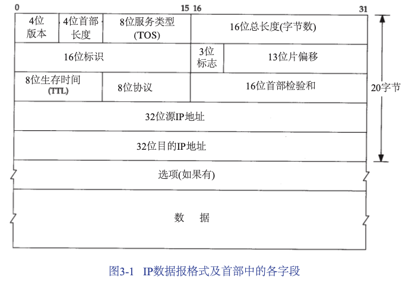
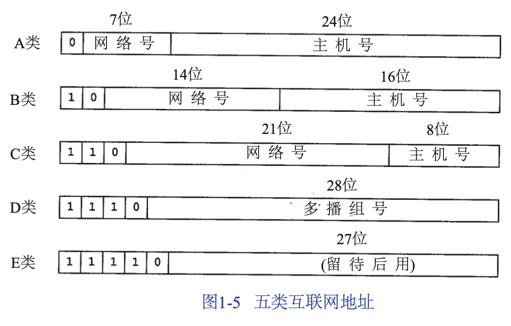
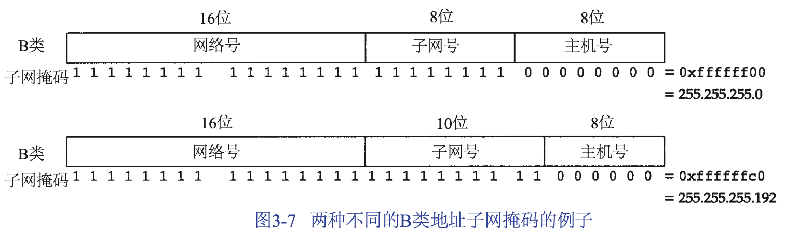
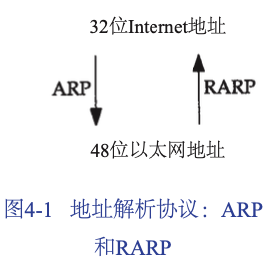
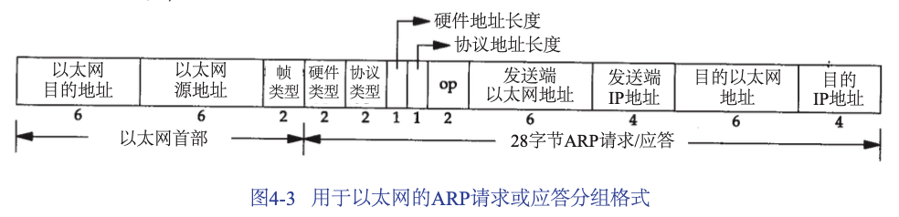
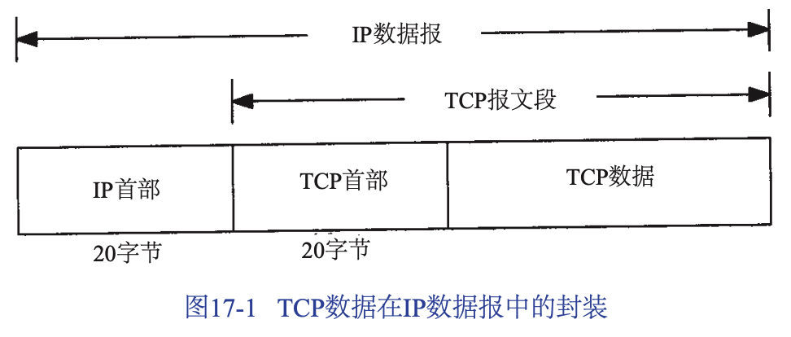
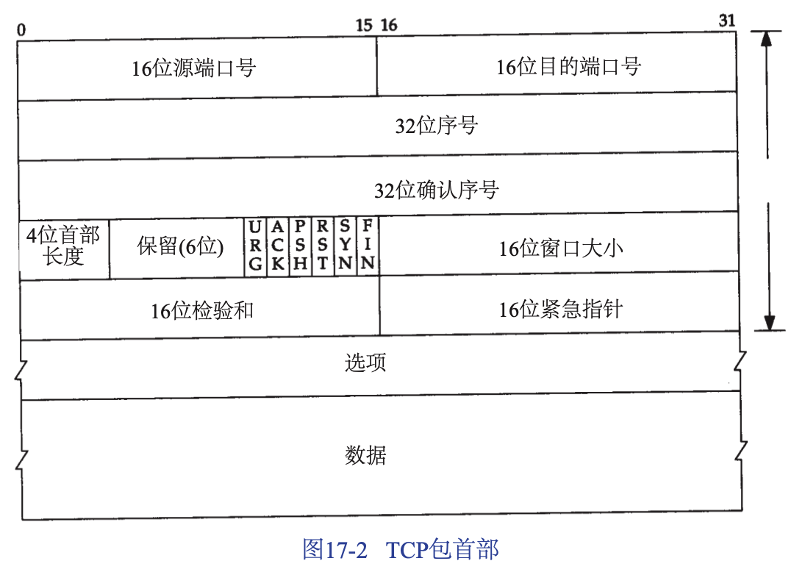

## 概述

### 分用

当目的主机收到一个以太网数据帧时，数据就开始从协议栈中由低向上升，同时去掉各层协议加上的报文首部。每层协议盒都要去检查报文首部中的**协议标识** ，以确定接收数据的上层协议。这个过程称为**分用** 。

## 网际协议

IP协议的认识：

1. **不可靠：** 不可靠的意思是它不能保证IP数据报能成功地到达目的地。IP仅提供最好的传输服务。如果发生某种错误时，IP有一个简单的错误处理算法：丢弃该数据报，然后发送ICMP消息给信源端。任何要求可靠性必须由上层来提供。
2. **无连接：** 这个术语的意思是IP并不维护任何关于后续数据报的状态信息。每个数据报的处理是相互独立的。这也说明，IP数据报可以不按发送顺序接收。如果一个信源向相同的信宿发送两个连续的数据报（先是A，然后是B），每个数据报都是独立地进行路由选择，可能选择不同的路线，因此B可能在A到达之前先到达。

### IP的首部



1. 图中IP的首部。最高位在左边，记为0bit；最低位在右边，记为31bit。
2. 4个字节的32 bit值以下面的次序传输：首先是0～7bit，其次8～15bit，然后16～23bit，最后是24～31bit。这种传输次序称作大端字节序。**由于TCP/IP首部中所有的二进制整数在网络中传输时都要求以这种次序，因此它又称作网络字节序** 。
3. **首部长度** 指的是首部占 32bit 字的数目，包括任何选项。由于它是一个 4 比特字段，因此首部最长为60个字节。普通IP数据报（没有任何选择项）字段的值是5。
4. **总长度字段** 是指整个IP数据报的长度，以字节为单位。利用首部长度字段和总长度字段，就可以知道IP数据报中数据内容的起始位置和长度。由于该字段长 16 bit，所以IP数据报最长可达65535字节。
5. **标识字段** 唯一地标识主机发送的每一份数据报。通常每发送一份报文它的值就会加1。
6. **TTL（time-to-live）** 生存时间字段设置了数据报可以经过的最多路由器数。它指定了数据报的生存时间。TTL的初始值由源主机设置（通常为32或64），一旦经过一个处理它的路由器，它的值就减去1。当该字段的值为0时，数据报就被丢弃，并发送 ICMP 报文通知源主机。
7. **协议字段** 被IP用来对数据报进行分用（接收数据时对数据的逆向过程）的。根据它可以识别是哪个协议向IP传送数据。
8. **首部检验和字段** 是根据IP首部计算的校验和码。它不对首部后面的额数据进行计算。
   * 首先把校验和字段置为 0。
   * 对首部中每个16bit进行二进制反码求和（整个首部看成是由一串16bit的字组成），结果存在检验和字段中。
   * 当收到一份IP数据报后，同样对首部中每个16bit进行二进制反码的求和。
   * 由于接收放在计算过程中包含了发送方存在首部中的检验和，因此，如果首部在传输过程中没有发生任何差错，那么接收方计算的结果应该为全1。如果结果不是全1（即检验和错误），那么IP就丢弃收到的数据报。但是不生成差错报文，由上层去发现丢失的数据报并进行重传。

```html
IP 报文头
  4500 0212 0000 4000 4006 ec91 c0a8 0103 276a
二进制(首部)
  0100 0101 0000 0000   4500   //协议版本 4，首部长度 5*32/8 = 20
  0000 0010 0001 0010   0212   //总长度 530
  0000 0000 0000 0000   0000
  0100 0000 0000 0000   4000
  0100 0000 0000 0110   4006   //ttl 64 协议 tcp(6)
  1110 1100 1001 0001   ec91   //检验和
  1100 0000 1010 1000   c0a8   //192.168
  0000 0001 0000 0101   0103   //1.3
  0010 0111 0110 1010   276a   //39.106
  0110 0011 0011 1111   633f   //99.63
```

### 子网寻址



1. 不是把IP地址看成由单纯的一个网络号和一个主机号组成，而是把主机号再分成一个子网号和一个主机号。
2. 这样做的原因是因为A类和B类地址为主机号分配了太多的空间，可分别容纳的主机数为 `2^24-2` 和 `2^16-2` 。事实上，在一个网络中人们并不安排这么多的主机。由于全0和全1的主机号都是无效的，因此我们把总数减去2。
3. 在`InterNIC` 获得某类IP网络号后，就由当地的系统管理员来进行分配，由他(或她)来决定是否建立子网，以及分配多少比特给子网号和主机号。

### 子网掩码

1. 用来确定IP地址中有多少比特用于子网号及多少比特用于主机号。
2. 这个掩码是一个 32 bit的值，其中值为1的比特留给网络号和子网号，为0的比特留给主机号。



## ARP 地址解析协议

1. 数据链路如以太网或令牌环网都有自己的寻址机制（常常48bit），这是使用数据链路的任何网络层都必须遵从的。
2. 当一台主机把以太网数据帧发送到位于同一局域网上的另一台主机时，是根据 48bit 的以太网地址来确定目的接口的。设备驱动程序从不检查IP数据报的目的IP地址。
3. 地址解析为这两种不同的地址形式提供映射：32bit的IP地址和数据链路层使用的任何类型的地址。



4. ARP为IP地址到对应的硬件地址之间提供动态映射。
5. ARP 发送一份称作 ARP 请求的以太网数据帧给以太网上的每个主机。这个过程称作广播。

### ARP的高速缓存

ARP 高效运行的关键是由于每个主机上都有一个 ARP 高速缓存。这个高速缓存存放了最近 Internet 地址到硬件地址之间的映射记录。高速缓存中每一项的生存时间一般为 20分钟，起始时间从被创建时开始算起。

```shell
#arp命令来检查ARP高速缓存。
arp -a
```

### ARP的分组格式



1. 以太网报头中的前两个字段是以太网的源地址和目的地址。目的地址为全1的特殊地址是广播地址。电缆上所有以太网接口都要接收广播的数据帧。
2. 2个字节长的以太网帧类型表示后面数据的类型。对于 ARP 请求或应答来说，该字段的值为 0x0806。
3. 硬件类型字段表示硬件地址的类型。它的值为1即表示以太网地址。协议类型字段表示要映射的协议地址类型。它的值为 `0x0800` 即表示IP地址。它的值与包含IP数据报的以太网数据帧中的类型字段的值相同。
4. 接下来的两个1字节的字段，硬件地址长度和协议地址长度分别指出硬件地址和协议地址的长度。以字节为单位。对于以太网上IP地址的ARP请求和应答来说，它们的值分别为6和4。
5. 操作字段指出四种操作类型
   * ARP请求（值为1）
   * ARP应答（值为2）
   * RARP请求（值为3）
   * RARP应答（值为4）

对于一个ARP请求来说，除目的端硬件地址外的所有其他的字段都有填充值。当系统收到一份目的端为本机的ARP请求报文后，它就把硬件地址填进去，然后用两个目的端地址分别替换两个发送端地址，并把操作字段置为2，最后把它发送回去。

### 其他应用

1. 委托 ARP：当路由器对来自于另一个路由器接口的 ARP 请求进行应答时。
2. 免费 ARP：发送自己 IP地址的ARP请求。

## RARP 逆地址解析协议

网络上的每个系统都具有唯一的硬件地址，它是由网络接口生产厂家配置的。无盘系统的 RARP 实现过程是从接口卡上读取唯一的硬件地址，然后发送一份 RARP请求（一帧在网络上广播的数据），请求某个主机相应该无盘系统的IP地址（RARP应答中）。


## TCP：传输控制协议

### TCP的服务

TCP 提供一种面向连接的、可靠的**字节流** 服务。

1. 面向连接意味着连个使用 TCP 的应用（通常是一个客户和一个服务器）在彼此交换数据之前必须先建立一个 TCP 连接。

2. 两个应用程序通过 TCP 连接交换 8 bit 字节构成的字节流。TCP 对字节流的内容不作任何解释。TCP不知道传输的数据字节流是二进制数据，还是 ASCII 字符或者其他类型数据。对字节流的解释由 TCP 连接双方的应用层解释。

TCP通过下列方式来提供可靠性：

1. 应用数据被分割成 TCP 认为最适合发送的数据块。这和 UDP 完全不同，应用程序产生的数据报长度将保持不变。由 TCP 传递给 IP 的信息单位称为**报文段** 或段。
2. 当 TCP 发送一个段后，它启动一个定时器，等待目的端确认收到这个报文段。如果不能及时收到一个确认，将重发这个报文段。
3. 当 TCP 收到发自 TCP 连接另一端的数据，它将发送一个确认。这个确认不是立即发送，通常将推迟几分之一秒。
4. TCP 将保持它首部和数据的校验和。这是一个端到端的校验和，目的是检测数据在传输过程中的任何变化。如果收到段的检验和有差错，TCP 将丢弃这个报文段和不确认收到此报文段（希望发端超时并重发）。
5. 既然TCP 报文段作为IP数据报来传输，而IP数据报的到达可能会失序，因此 TCP 报文段的到达也可能会失序。如果必要，TCP将对收到的数据进行重新排序，将收到的数据以正确的顺序交给应用层。
6. TCP 还能提供流量控制。TCP 连接的每一方都有固定大小的缓冲空间。TCP的接受端只允许另一端发送接收端缓冲区所能接纳的数据。这将防止较快主机致使较慢主机的缓冲区溢出。

### TCP的首部





1. 每个TCP段都包含源端和目的端的端口号，用于寻找发端和收端应用进程。这两个值加上IP首部中的源端IP地址和目的端IP地址唯一确定一个TCP连接。
2. 序号用来标识从TCP发端向TCP收端发送的数据字节流，它表示在这个报文段中的第一个数据字节。如果将字节流看作在两个应用程序间的单向流动，则 TCP 用序号对每个字节进行计数。序号是 32 bit 的无符号数，序号到达 2^32-1 后又从0开始。