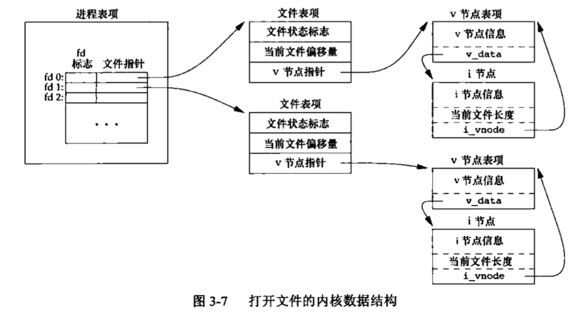
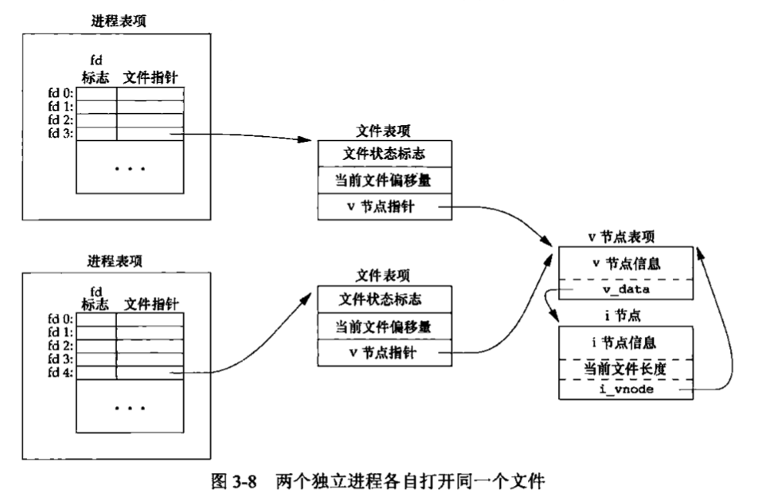
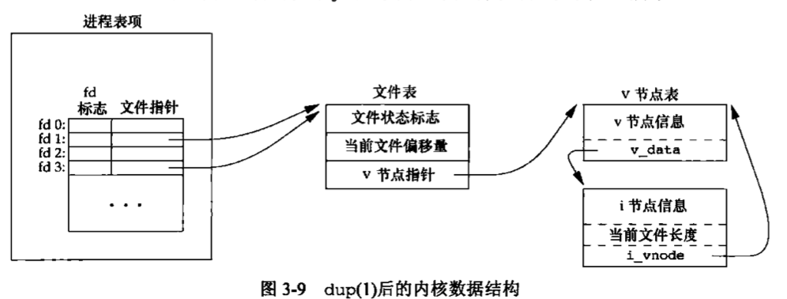

## 基础

```c
#include <stdio.h>
#include <string.h>
#include <errno.h>
#include <stdlib.h>

int main(int argc, char *argv[])
{
    /*
      1. strerror 函数将 errnum （通常就是errno值）映射为一个出错消息字符串，并且返回此字符串的指针。
        #include <string.h>
          char *strerror(int errnum);

      2. perror 函数基于 errno 的当前值，在标准错误上产生一条错误消息，然后返回。
        #include <stdio.h>
          void perror(const char *msg);
    */
    fprintf(stderr,"EACCES: %s\n",strerror(EACCES));
    errno = ENOMEM;
    perror(argv[0]);
    exit(0);
}
```

## 文件 I/O

1. 文件描述符是一个非负整数，当打开一个现有文件或创建一个新文件时，内核向进程返回一个文件描述符。
   *  0 标准输入。
   * 1 标准输出。
   * 2 标准错误。
2. `#include <unistd.h>` 
   * `0 STDIN_FILENO`
   * `1 STDOUT_FILENO` 
   * `2 STDERR_FILENO`
3.  文件描述符的变化范围是 `0 ～ OPEN_MAX-1`
   * `#include <limits.h>`

### `open` 或 `openat`

```c
#include <fcntl.h>
  int open(const char *path, int oflag, ...));
  int openat(int fd, const char *path, int oflag, ...));
/*
oflag:
  O_RDONLY 只读打开
  O_WRONLY 只写打开
  O_RDWR 读、写打开
  O_APPEND 每次写时都追加到文件的末尾。
  O_CREAT 若文件不存在则创建它，使用此选项时，open 函数需要同时说明第 3 个参数 mode（文件权限位）
  O_DIRECTORY 如果 path 引用的不是目录，则出错。
  O_TRUNC 如果此文件存在，而且为只写或读-写成功打开，则将其长度截断为 0。而原来存于该文件的资料也会消失。
区别：
   1. path 参数指定的是绝对路径名，在这种情况下，fd 参数被忽略， openat 函数就相当于 open 函数。
   2. path 参数指定的是相对路径名，fd 参数指出了相对路径名在文件系统中的开始地址。fd 参数是通过打开相对路径名所在的目录来获取。
   3. path 参数指定来了相对路径名，fd 参数具有特殊值 AT_FDCWD。在这种情况下，路径名在当前工作目录中获取，openat 函数在操作上与 open 函数类似。
*/
```

###`time-of-check-to-time-of-use` (TOCTTOU)

如果有两个基于文件的函数调用，其中第二个调用依赖于第一个调用的结果，那么程序是脆弱的。因为两个调用并不是原子操作，在两个函数调用之间文件可能改变了，这样就造成了第一个调用的结果就不再有效。使得程序最终的结果是错误的。

### 文件名和路径名截断。

```c
#include <limits.h>
  //NAME_MAX 表示在当前系统中创建一个文件名的最大字符长度。
  //PATH_MAX 表示路径名最大的长度。
```

### 函数 `creat`

```c
#include <fcntl.h>
  int creat(const char *path, mode_t mode);
                //返回值：若成功，返回为只写打开的文件描述符；若出错，返回-1；
   //此函数等效于 open(path, O_WRONLY | O_CREAT | O_TRUNC, mode);
```

### 函数 `close`

```c
#include <unistd.h>
  int close(int fd);
         //返回值：若成功，返回0；若出错返回 -1；
  //关闭一个文件时还会释放该进程加在该文件上的所有记录锁。
```

### 函数 `lseek`

函数 `lseek`，显式地为一个打开文件设置偏移量。每个打开文件都有一个与其相关联的“当前文件偏移量”。它通常是一个非负整数，用以度量从文件开始处计算的字节数。**按系统默认的情况，当打开一个文件时，除非指定了 `O_APPEND` 选项，否则该偏移量被设置为 0** 。

```c
#include <unistd.h>
   off_t lseek(int fd, off_t offset, int whence);
 					//返回值：若成功，返回新的文件偏移量；若出错，返回为-1。
   /*
    1. 对参数 offset 的解释于参数 whence 的值有关。
        若 whence 是 SEEK_SET, 则将该文件的偏移量设置为距文件开始处 offset 个字节。
        若 whence 是 SEEK_CUR，则将该文件的偏移量设置为其当前值加 offset，offset 可为正或负。
        若 whence 是 SEEK_END，则将该文件的偏移量设置为文件长度加 offset，offset 可正可负。
	  2. 确定打开文件的当前偏移量
        off_t currpos;
        currpos = lseek(fd, 0 , SEEK_CUR);
    3. lseek 仅将当前的文件偏移量记录在内核中，它并不引起任何I/O操作。然后，该偏移量用于下一个读或写操作。
    4. 文件偏移量可以大于文件的当前长度，在这种情况下对该文件的下一次写将加长才文件并在文件中构成一个空洞。位于文件中但没有写过的字节都被读为0。
    5. 文件中的空洞并不要求在磁盘上占用存储区。具体处理方式与文件系统的实现有关，当定位到超出文件尾端之后写时，对于新写的数据需要分配磁盘块，但是对于原文件尾端和新开始写位置之间的部分则不需要分配磁盘块。
   */

//例子1. 测试标准输入是否可以设置偏移量
#include <stdio.h>
#include <unistd.h>
#include <stdlib.h>
int main()
{
    if (lseek(STDIN_FILENO,0,SEEK_CUR) == -1) {
        printf("cannot seek \n");
    } else {
        printf("seek ok \n");
    }
    exit(0);
}

//例子2. 创建一个具有空洞的文件。
#include <stdlib.h>
#include <stdio.h>
#include <unistd.h>
#include <fcntl.h>

#define FILE_MODE (S_IRUSR | S_IWUSR | S_IRGRP | S_IROTH)

char buf1[] = "abcdefghij";
char buf2[] = "ABCDEFGHIJ";

int main()
{
    int fd;
    if ((fd = creat("file.hole", FILE_MODE)) < 0){
        printf("creat error");
        exit(0);
    }
    if (write(fd, buf1, 10) != 10) {
        printf("creat error");
        exit(0);
    }
    if (lseek(fd, 16384, SEEK_SET) == -1) {
        printf("lseek error");
        exit(0);
    }
    if (write(fd, buf2, 10) != 10){
        printf("buf2 write error");
    }
    exit(0);
}
```

### 函数 `read`

```c
#include <unistd.h>

  ssize_t read(int fd, void *buf, size_t nbytes);
       //返回值：读到的字节数，若已到文件尾，返回0；若出错，返回-1；
  /*
   有多种情况可使实际读到的字节数少于要求读的字节数。
      1. 读普通文件时，在读到要求字节数之前已到达了文件尾端。
      2. 当从终端设备读时，通常一次最多读一行。
      3. 当从网络读时，网络中的缓冲机制可能造成返回值小于所要求读的字节数。
      4. 当从管道或FIFO读时，如若管道包含的字节少于所需的数量，那么 read 将只返回实际可用的字节数。
      5. 当从某些面向记录的设备（如磁带）读时，一次最多返回一个记录。
      6. 当一信号造成中断，而已经读了部分数据量时。
  */
```

### 函数 `write`

```c
#include <unistd.h>
  ssize_t write(int fd, const void *buf, size_t nbytes);
       //返回值：若成功，返回已写的字节数；若出错，返回-1
  //对于普通文件，写操作从文件的当前偏移量处开始。如果在打开该文件时，指定了 O_APPEND 选项，则在每次写操作之前，将文件偏移量设置在文件的当前结尾处。在一次成功写之后，该文件偏移量增加实际写的字节数。
```

### 文件共享

内核使用3种数据结构表示打开文件，它们之间的关系决定了在文件共享方面一个进程对另一个进程可能产生的影响。

1. **描述符表** 。每个进程都有它独立的描述符表，它的表项是由进程打开的文件描述符来索引的。每个打开的描述符表项指向文件表中的一个表项。

2. **文件表** 。打开文件的集合是由一张文件表来表示的，**所有的进程共享这张表** 。

   * 文件状态标志（读、写等）。
   * 当前文件偏移量。
   * 指向该文件v节点表项的指针。

3. `v-node`  表。同文件表一样，**所有的进程共享这张 `v-node` 表** 。每个表项包含 stat 结构中的大多数信息。

   

   ​	

### 函数 `dup` 和 `dup2`

```c
#include <unistd.h>
  int dup(int fd);
  int dup2(int fd, int fd2);
        //两个函数的返回值：若成功，返回新的文件描述符；若出错，返回-1
  /*
   1. dup 返回的新文件描述符一定是当前可用文件描述符中的最小数值。
   2. dup2 可以用 fd2 参数指定新描述符的值。如果 fd2 已经打开，则先将其关闭。如若 fd 等于 fd2，则     dup2 返回 fd2，而不关闭它。
  */
```



### 函数 `sync`、`fsync` 和 `fdatasync`

传统的 UNIX 系统实现在内核中设有缓冲区高速缓存或页高速缓存，大多数磁盘 I/O 都通过缓存区进行。当我们向文件写入数据时，内核通常先将数据复制到缓冲区中，然后排入队列，晚些时候再写入磁盘。这种方式被称为**延迟写** 。

```c
#include <unistd.h>

  int fsync(int fd);
  int fdatasync(int fd);
        //若成功，返回0；若出错，返回-1
  void sync(void);
/*
    1. sync 只是将所有修改过的块缓存排入写队列，然后就返回，它并不等待实际写磁盘操作结束。通常，称为 update 的系统守护进程周期性地调用 sync 函数。这就保证了定期冲洗内核的块缓存。
    2. fsync 函数只对由文件描述符fd指定的一个文件起作用，并且等待写磁盘操作结束才返回。
    3. fdatasync 函数类似于 fsync，但它只影响文件的数据部分。而除数据外，fsync 还会同步更新文件的属性。
*/
```

## 文件和目录

### 函数 `stat`、`fstat` 、`fstatat`和`lstat` 

```c
#include <sys/stat.h>

  int stat(const char *restrict pathname, struct stat *restrict buf);
  int fstat(int fd, struct stat *buf);
  int lstat(const chat *restrict pathname, struct stat *restrict buf);
  int fstatat(int fd, const char *restrict pathname, struct stat *restrict buf, int flag);
        //所有4个函数的返回值：若成功；返回0；若出错，返回-1
/*
  1. stat 函数将返回此命名文件有关的信息结构。
  2. fstat 函数获取得已在描述符 fd 上打开文件的有关信息。
  3. lstat 函数类似于 stat，但是当命名的文件是一个符号链接时，lstat 返回该符号链接的有关信息，而不是由该符号链接引用的文件的信息。
  4. fstat 函数为一个相对于当前打开目录（由 fd 参数指向）的路径名返回文件统计信息。
     flag 参数：
       AT_SYMLINK_NOFOLLOW 标志被设置时，fstatat 不会跟随符号链接，而是返回符号链接本身信息。
       否则，在默认情况下，返回的是符号链接所指向的实际文件的信息。
     fd 参数：
       当 fd 参数的值为 AT_FDCWD ，并且 pathname 参数是一个相对路径名，fstatat会计算相对于当前目录的pathname 参数。如果pathname 是一个绝对路径，fd 参数就会被忽略。
*/
```

### 文件类型

1. **普通文件** 。
2. **目录文件** 。这种文件包含了其他文件的名字以及指向与这些文件有关信息的指针。**对一个目录文件具有读权限的任一进程都可以读该目录的内容** 。
3. **块特殊文件** 。这种类型的文件提供对设备（如磁盘）带缓冲的访问，每次访问以固定长度为单位进行。
4. **字符特殊文件** 。这种类型的文件提供对河北不缓存的访问，每次访问长度可变。系统中的所有设备要么是字符特殊文件，要么是块特殊文件。
5. **FIFO** 。这种类型的文件用于进程间通信，有时也称为命名管道。
6. **套接字** 。这种类型的文件用于进程间的网络通信。套接字也可用于在一台宿主机上进程之间的非网络通信。
7. **符号链接** 。这种类型的文件指向另一个文件。

```c
/*
  stat 结构中的 st_mode
    S_ISREG()   普通文件
    S_ISDIR()   目录文件
    S_ISCHR()   字符特殊文件
    S_ISBLK()   块特殊文件
    S_ISFIFO()  管道或FIFO
    S_ISLNK()   符号链接
    S_ISSOCK()  套接字
  stat 结构
    S_TYPEISMQ()   消息队列
    S_TYPEISSEM()  信号量
    S_TYPEISSHM()  共享存储对象
*/

//eg
#include <stdio.h>
#include <sys/stat.h>
#include <stdlib.h>

int main(int argc, char *argv[])
{
    int i;
    struct stat buf;
    char *ptr;
    for (i = 1; i < argc; i++) {
        if (lstat(argv[i], &buf) < 0) {
            printf("lstat error");
            continue;
        }
    }
    if (S_ISREG(buf.st_mode)){
        ptr = "regular";
    } else if (S_ISDIR(buf.st_mode)) {
        ptr = "directory";
    } else if (S_ISCHR(buf.st_mode)) {
        ptr = "character special";
    } else if (S_ISBLK(buf.st_mode)) {
        ptr = "block special";
    } else if (S_ISFIFO(buf.st_mode)) {
        ptr = "fifo"
    } else if (S_ISLNK(buf.st_mode)) {
        ptr = "symbolic link";
    } else if (S_ISSOCK(buf.st_mode)) {
        ptr = "socket";
    } else {
        ptr = "unknown mode";
    }
    printf("%s\n",ptr);
    exit(0);
}
```

### 设置用户ID和设置组ID。

1. 实际用户ID和实际组ID标识我们究竟是谁。这两个字段在登录时取自口令文件中的登录项。

2. 有效用户ID、有效组ID以及附属组ID决定了我们的文件访问权限。

3. 保持的设置用户ID和保持的设置组ID在执行一个程序时包含了有效用户ID和有效组ID的副本。

