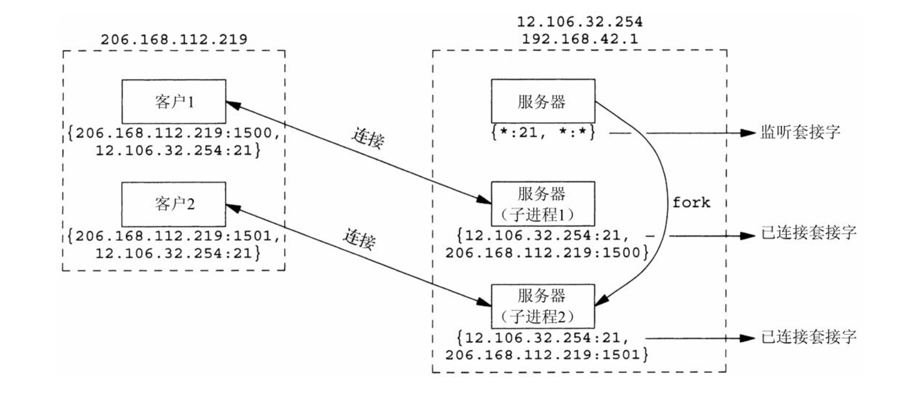

## 传输层：TCP、UDP和SCTP

### 用户数据报协议（UDP）

UDP是一个简单的传输层协议。UDP不保证UDP数据报会到达其最终目的地，不保证各个数据报的先后顺序跨网络后保持不变，也不保证每个数据报只到达一次。

### 传输控制协议（TCP）

1. TCP 提供可靠性。当TCP向另一端发送数据时，它要求对端返回一个确认。如果没有收到确认，TCP就自动重传数据并等更长时间。在数次重传失败后，TCP才放弃。
2. TCP 通过给其中每个字节关联一个序列号对所发送的数据进行排序。
3. TCP 提供流量控制（flow control）。TCP 总是告知对端在任何时刻它一次能够从对端接收多少字节的数据，这称为通告窗口（advertised window）。在任何时刻，该窗口指出接收缓冲区中当前可用的空间量，从而确保发送端发送的数据不会使接收缓存区溢出。
4. TCP 连接是全双工。这意味着在一个给定的连接上应用可以在任何时刻在进出两个方向上即发送数据又接收数据。

### TIME_WAIT 状态

执行主动关闭的那端经历这个状态。该端点停留在这个状态的持续时间是最长分节生命周期（maximum segment lifetime,MSL）的两倍。

TIME_WAIT 存在的理由：

1. 可靠地实现TCP全双工连接的终止。
2. 允许老的重复分节在网络中消逝。

### 端口号

IANA （theInternetAssignedNumbersAuthority，因特网已分配数值权威机构）维护着一个端口号分配状况的清单。

1. 0～1023，这些端口由IANA分配和控制。例如：`80 web端口` `443 https端口`
2. 1024 ～ 49151，已登机的端口，这些端口不受 IANA 控制，不过由 IANA登机并提供它们的使用情况清单，以方便整个群体。
3. 49152 ～ 65535，是动态的或私用的端口。IANA 不管这些端口。它们就是我们所称的临时端口。

Unix 系统有保留端口的概念，指的是小于1024的任何端口。

#### 套接字对

一个TCP的连接的套接字对是一个定义该连接的两个端点的四元组：本地IP地址、本地TCP端口号、远端IP地址、远端TCP端口号。

套接字对唯一标识一个网络上的每个TCP连接。

标识每个端点的两个值（IP地址和端口号）通常称为一个套接字。

### TCP端口号与并发服务器

并发服务器中主服务器循环通过派生一个子进程来处理每个新的连接。

在服务器主机上区分监听套接字和已连接套接字。注意已连接套接字使用与监听套接字相同的本地端口。

