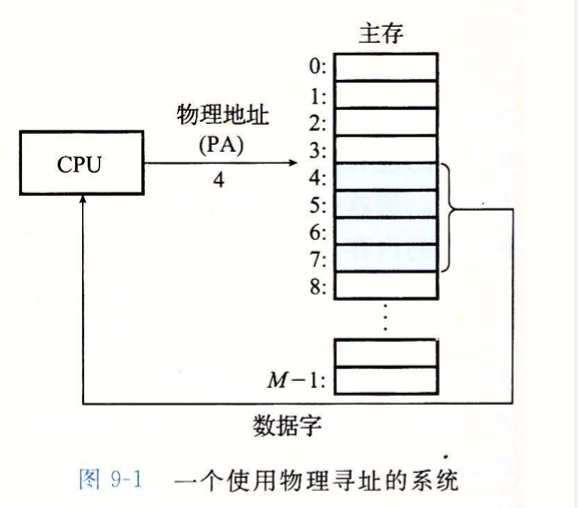
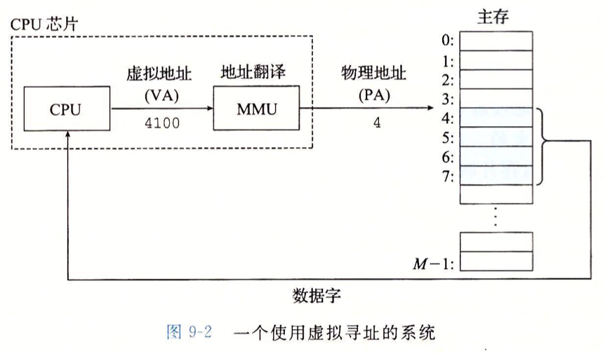
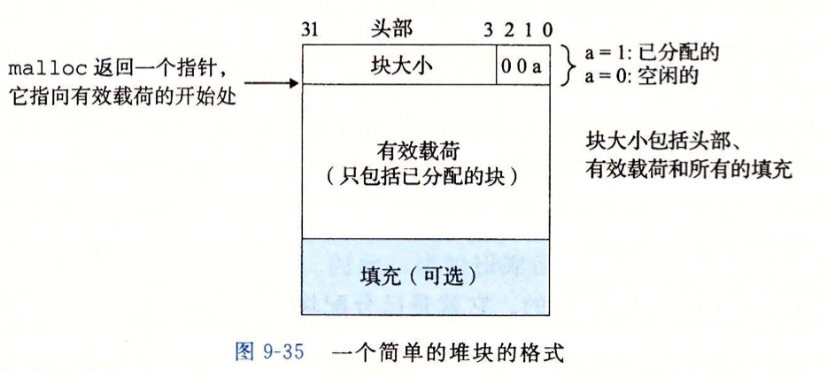

## 程序结构和执行

### 信息的表示和处理

大多数计算机使用 8 位的块，或者字节（byte），作为最小的可寻址的内存单位，而不是访问内存中单独的位。

#### 字数据大小

每台计算机都有一个**字长（word size）**，指明指针数据的标称大小。因为虚拟地址是以这样的一个字来编码的，所以字长决定的最重要的系统参数就是虚拟地址空间的最大大小。也就是说，对于一个字长为`w` 位的机器而言，虚拟地址的范围为 `0~2^w -1`，程序最多访问 `2^w` 个字节。

#### 寻址和字节顺序

3. 对于跨越多字节的程序对象，我们必须建立两个规则：这个对象的地址是什么，以及在内存中如何排列这些字节。在几乎所有的机器上，多字节对象都被存储为连续的字节序列，对象的地址为所使用字节中最小的地址。例如，假设一个类型为 int 的变量 x 的地址为 `0x100`，也就是说，地址表达式 `&x` 的值为 `0x100`。那么`x`的4个字节将被存储在内存 `0x100、0x101、0x102、0x103` 位置。

4. 某些机器选择在内存中按照从最低有效字节到最高有效字节的顺序存储对象，而另一些机器则按照最高有效字节到最低有效字节的顺序存储。前一种规则，最低有效字节在最前面的方式，称为 **小端法**。后一种规则，最高有效字节在最前面的方式，称为**大端法**。

   

3. 强制类型转换告诉编译器，程序应该把指针看成指向一个字节序列，而不是指向一个原始数据类型的对象。然后，这个指针会被看成是对像使用的最低字节地址。

   ```c
   #include <stdio.h>
   typedef unsigned char *byte_pointer;
   void show_bytes(byte_pointer start, size_t len)
   {
       size_t i;
       for (i = 0; i < len; i++)
       {
           printf("%.2x", start[i]);
       }
       printf("\n");
   }
   void show_int(int x)
   {
       show_bytes((byte_pointer)&x, sizeof(int));
   }
   void test_show_bytes(int val){
       int ival = val;
       float fval = (float) ival;
       show_int(ival); //39300000
       show_float(fval); //00e44046
   }
   int main(){
      // 12345 十六进制表示 0x00003039
       test_show_bytes(12345);
   }
   ```


#### 表示字符串

1. C 语言中字符串被编码为一个以 null（其值为0）字符结尾的字符数组。每个字符都由某个标准编码来表示，最常见的是 ASCII 字符码。

2. 统一字符集使用32位来表示字符。特别地，UTF-8 表示将每个字符编码为一个字节序列。这样标准 ASCII 字符还是使用和它们在 ASCII 中一样的单字节编码。

   ```c
   #include <stdio.h>
   typedef unsigned char *byte_pointer;
   void show_bytes(byte_pointer start, size_t len)
   {
       size_t i;
       for (i = 0; i < len; i++)
       {
           printf("%.2x", start[i]);
       }
       printf("\n");
   }
   int main(){
       char msg[] = "12345";
       show_bytes((byte_pointer)msg,6); //313233343500
       //十进制数字 x 的 ASCII 码表示正好是 0x3x。例如 1 表示为 0x31
   }
   ```

#### 位级运算

```c
/*
    ｜ 或      0110 ｜ 1100 = 1110
    &  与      0110 ｜ 1100 = 0100
    ～ 取反     ～ 1100 = 0011
    ^ 异或     0110 ｜ 1100 = 1010
*/
```

## 程序的机器级表示


## 异常控制流

### 进程

1. 一个逻辑流的执行在时间上与另一个流重叠，称为**并发流** 。
2. 多个流并发地执行的一般现象称为**并发** 。
3. 一个进程和其他进程轮流运行的概念称为**多任务** 。
4. 一个进程执行它的控制流的一部分的每一时间段叫做**时间片** 。
5. 当两个流并发地运行在不同的处理器或者计算机上，那么我们称它们为**并行流**。
6. 在进程执行的某些时刻，内核可以决定抢占当前进程，并重新开始一个先前被抢占了的进程。这种决策就叫做**调度** 。
7. 上下文切换
   * 保存当前进程的上下文
   * 恢复某个先前被抢占的进程被保存的是上下文。
   * 将控制传递给这个新恢复的进程。


## 虚拟内存

1. 将主存看成了一个存储在磁盘上的地址空间的高速缓存，在主存中只保存活动区域，并根据需要在磁盘和主存之间来回传送数据。

2. 它为每个进程提供了一致的地址空间，从而简化了内存管理。
3. 它保护了每个进程的地址空间不被其他进程破坏。

### 物理和虚拟寻址

1. 计算机系统的主存被组织成一个由 M 个连续的字节大小的单元组成的数组。

2. 每字节都有一个唯一的物理地址。

3. CPU 访问内存的最自然的方式就是使用物理地址。这种方式称为 **物理寻址**。

   

4. 虚拟寻址。CPU 通过生成一个虚拟地址来访问主存，这个虚拟地址在被送到内存之前先转换成适当的物理地址。将一个虚拟地址转换为物理地址的任务叫做**地址翻译**。

   

5. CPU 芯片上叫做 **内存管理单元** 的专用硬件，利用存放在主存中的查询表来动态翻译虚拟地址，该表的内容由操作系统管理。

### 地址空间

1. 在一个带虚拟内存的系统中，CPU 从一个有 `N=2^n` 个地址的地址空间中生成虚拟地址，这个地址空间称为**虚拟地址空间**。
2. 一个地址空间的大小是由表示最大地址所需要的位数来描述的。例如，一个包含 `N=2^n` 个地址的虚拟地址空间就叫做一个 `n` 位地址空间。现代系统通常支持 32 位或者64位虚拟地址空间。
3. 地址空间的概念清楚地区分了数据对象（字节）和它们的属性（地址）。

### 虚拟内存作为缓存的工具

概念上而言，虚拟内存被组织为一个由存放在磁盘上的 N 个连续的字节大小的单元组成的数组。每字节都有一个唯一的虚拟地址，作为到数组的索引。磁盘上数组的内容被缓存在主存中。和存储器层次结构中其他缓存一样，磁盘（较低层）上的数据被分割成块，这些块作为磁盘和主存（较高层）之间的传输单元。

VM 系统通过将虚拟内存分割为称为 **虚拟页** 的大小固定的块来处理这个问题。每个虚拟页的大小为 `P=2^p` 字节。

物理内存被分割为 **物理页** ，也叫页帧；大小也为 P 字节。

任意时刻，虚拟页面的集合都分为三个不相交的子集。

1. **未分配的：** VM 系统还未分配（或者创建）的页。未分配的块没有任何数据和它们相关联，因此也就不占用任何磁盘空间。
2. **缓存的：** 当前已缓存在物理内存中的已分配页。
3. **未缓存的：** 未缓存在物理内存中的已分配页。

#### 页表

**页表：**一个存放在物理内存中的数据结构，它将虚拟页映射到物理页。每次地址翻译硬件将一个虚拟地址转换为物理地址时，都会读取页表。操作系统负责维护页表的内容，以及在磁盘与 DRAM 之间来回传送页。

### 动态内存分配

1. 动态内存分配器维护着一个进程的虚拟内存区域，称为**堆** 。对于每个进程，内核维护着一个变量 `brk` ，它指向堆的顶部。
2. 分配器将堆视为一组不同大小的块的集合来维护。每个块就是一个连续的虚拟内存片。要么是已分配的，要么是空闲的。已分配的块显式地保留为供应用程序使用。空闲块可用来分配。空闲块保持空闲，直到它显式地被应用所分配。一个已分配的块保持已分配状态，直到它被释放，这种释放要么是应用程序显式执行的，要么是内存分配器自身隐式执行的。

#### 分配器类型

1. 显示分配器，要求应用显式释放任何已分配的块。（eg. C 中的 malloc 程序包）
2. 隐式分配器，自动释放未使用的已分配的块的过程叫做**垃圾收集** 。

#### 涉及函数

```c
#include <stdlib.h>
  //返回一个指针，指向大小为至少 size 字节的内存块。
  void *malloc(size_t size);
  //释放已分配的堆块
  void free(void *ptr);

#include <unistd.h>
  //将内核的 brk 指针增加 incr 来扩展和收缩堆。返回值为 brk 的旧值。当为零时，返回当前值。
  void *sbrk(intptr_t incr);
```

#### 使用动态内存分配原因

程序使用动态内存分配的最重要的原因是经常直到程序实际运行时，才知道某些数据结构的大小。

```c
#include <stdio.h>
#define MAIN 15213

//这种硬编码的大小来分配数组通常不是一种好想法，应该动态分配这个数组，用完就释放。
int array[MAIN]; 
int main()
{
  int i,n;
  scanf("%d",&n);
  if(n > MAIN){
    printf("Input file too big");
    return 1;
  }
  for (i = 0; i < n; i++){
    scanf("%d",&array[i]);
  }
  return 0;
}

//优化例子
#include <stdio.h>
#include <stdlib.h>

int main()
{
  int *array, i,n;
  scanf("%d",&n);
  array = (int *)malloc(n * sizeof(int));
  for (i = 0; i < n; i++){
    scanf("%d",&array[i]);
  }
  free(array);
  return 0;
}
```

#### 分配器的要求和目标

1. 处理任意请求序列。
2. 立即响应请求。
3. 只使用堆。
4. 对齐块。
5. 不修改已分配的块。

####碎片

当虽然有未使用的内存但不能用来满足分配请求时，就发生这种现象。

1. **内部碎片** 是在以一个已分配块比有效荷载大时发生的。
2. **外部碎片** 是当空闲内存合计起来足够满足一个分配请求，但是没有一个单独的空闲块足够大可以来处理这个请求时发生的。

#### 隐式空闲链表

1. 任何实际的分配器都需要一些数据结构，允许它来区分块边界，以及区别已分配块和空闲块。大多数分配器将这些信息嵌入块本身。



2. 在这种情况中，一个块是由一个字的头部、有效载荷，以及可能的一些额外的填充组成。头部编码了这个块的大小（包括头部和所有填充），以及这个块是已分配的还是空闲的。如果我们强加一个双字对齐约束条件，那么块大小就总是8的倍数，且块大小的最低3位总是零。

### 其他概念

1. 页表：将虚拟页映射到物理页。每次地址翻译硬件将一个虚拟地址转换为物理地址时，都会读取页表。操作系统负责维护页表的内容，以及在磁盘与 DRAM 之间来回传送页。
2. 在磁盘和内存之间传送页的活动叫做交换或者页面调度。

## 系统 I/O

### 系统级 I/O

1. 输入/输出（I/O）是在主存和外部设备（例如磁盘驱动器、终端和网络）之间复制数据的过程。输入操作是从 I/O 设备复制数据到主存，而输出操作是从主存复制数据到 I/O 设备。

#### Unix I/O

1. 所有的 I/O 设备（例如网络、磁盘和终端）都被模型化为文件，而所有的输入和输出都被当作对相应文件的读和写来执行。
2. **打开文件** 。一个应用程序通过要求内核打开相应的文件，来宣告它想要访问一个 I/O 设备。内核返回一个小的非负整数，叫做**描述符**。
3. Linux shell 创建的每个进程开始时都有三个打开的文件：标准输入（描述符为0）、标准输出（描述符1）和标准错误（描述符为2）。头文件 `<unistd.h>` 定一个了常量 `STDIN_FILENO（0）` 、`STDOUT_FILENO（1）` 、`STDERR_FILENO（2）` ，它们可用代替显式的描述符值。
4. **改变当前的文件位置。** 对于每个打开的文件，内核保持着一个文件位置 k，初始为0。这个文件位置是从文件开头起始的字节偏移量。
5. **读写文件。** 一个读操作就是从文件复制 n > 0 个字节到内存，从当前文件位置 k 开始，然后将 k 增加到 k + n。给定一个大小为 m 字节的文件，当 k >= m 时执行读操作会触发一个称为 end-of-file（EOF）的条件，应用能检测到这个条件。在文件结尾处并没有明确的 "EOF符号"。
6. **关闭文件。** 当应用完成了对文件的访问之后，它就通知内核关闭这个文件。作为响应，内核释放文件打开时创建的数据结构，并将这个描述符恢复到可用的描述符池中。无论一个进程因为何种原因终止时，内核都会关闭所有打开的文件并释放它们的内存资源。

#### 共享文件

1. **描述符表。**每个进程都有它独立的描述符表，它的表项是由进程打开的文件描述符来索引的。每个打开的描述符表项指向**文件表**中的一个表项。
2. **文件表。** 打开文件的集合是有一张文件表来表示的。所有的进程共享这张表。每个文件表的表项组成包括当前的文件位置、引用计数 （即当前指向该表项的描述符表项数），以及一个指向 v-node 表中对应表项的指针。关闭一个描述符会减少相应的文件表表项中引用计数。内核不回删除这个文件表表项，直到它的引用计数为零。
3. `V-node ` 表。所有的进程共享这张 v-node 表。每个表项包含 stat 结构中的大多数信息，包括 st_mode 和 st_size 成员。
4. **父子进程共享文件** ，父进程调用了 fork 后，子进程有一个父进程描述符表的副本。父子进程共享相同的打开文件表集合，因此共享相同的文件位置。在内核删除相应文件表表项之前，父子进程必须都关闭了它们的描述符。

#### I/O 重定向

一种方式是使用 dup2 函数。

```c
#include <unistd.h>
int dup2(int oldfd, int newfd);
/*
	dup2 函数复制描述符表表项 oldfd 到描述符表表项 newfd，覆盖描述符表表项 newfd 以前的内容。如果 newfd 已经打开了，dup2 会在复制 oldfd 之前关闭 newfd。
*/
```

#### 标准 I/O

1. 标准 I/O 库将一个打开的文件模型化为一个流。一个流就是一个指向 FILE 类型的结构和指针。每个 c 程序开始时都有三个打开的流 stdin、stdout 和 stderr。
2. 类型为 FILE 的流是对文件描述符 和 流缓冲区 的抽象。流缓冲区的目的：就是使开销较高的 Linux I/O 系统调用的数量尽可能得小。例如，假设我们有一个程序，它反复调用标准 I/O 的 getc 函数，每次调用返回文件的下一个字符。当第一次调用 getc 时，库通过调用一次 read 函数来填充流缓冲区，然后将缓冲区中的第一个字节返回给应用程序。只要缓冲区中还有未读的字节，接下来对 getc 的调用就能直接从流缓冲区得到数据。

### 网络编程

1. 当客户端发起一个连接请求时，客户端套接字地址中的端口是由内核自动分配的，称为临时端口。服务端套接字地址中的端口通常是某个知名端口。
2. 一个连接是由它两端的套接字地址唯一确定的。这对套接字地址叫做套接字对。

#### 套接字接口

1. 从 Linux 内核的角度来看，一个套接字就是通信的一个端点。从 Linux 程序的角度来看，套接字就是一个有相应描述符的打开文件。

2. `socket` 函数，客户端和服务端使用 socket 函数来创建一个套接字描述符。

   ```c
   #include <sys/types.h>
   #include <sys/socket.h>
   
   int socket(int domain, int type, int protocol);
   ```

3. `connect` 函数，客户端通过调用 `connect` 函数来建立和服务器的连接。

   ```c
   #include <sys/socket.h>
   
   int connect(int clientfd,const struct sockaddr *addr, socklen_t addrlen);
   ```

4. `bind` 函数告诉内核将 addr 中的服务器套接字地址和套接字描述符 sockfd 联系起来。

   ```c
   #include <sys/socket.h>
   
   int bind(int sockfd, const struct sockaddr *addr, socklen_t addrlen);
   ```

5. `listen` 函数，客户端是发起连接请求的主动实体。服务器是等待来自客户端的连接请求的被动实体。默认情况下，内核会认为 socket 函数创建的描述符对应于 **主动套接字**，它存在于一个连接的客户端。服务器调用 listen 函数告诉内核，描述符是被服务器而不是客户端使用。

   ```c
   #include <sys/socket.h>
   
   int listen(int sockfd, int backlog);
   ```

6. `accept` 函数，服务器通过调用 `accept` 函数来等待来自客户端的连接请求。

   ```c
   #include <sys/socket.h>
   
   int accept(int listenfd, struct sockaddr *addr, int *addrlen);
   ```

   `accept` 函数等待来自客户端的连接请求到达侦听描述符 listenfd, 然后在 addr 中填写客户端的套接字地址，并返回一个 **已连接描述符**，这个描述符可被用来利用 `Unix I/O` 函数与客户端通信。


