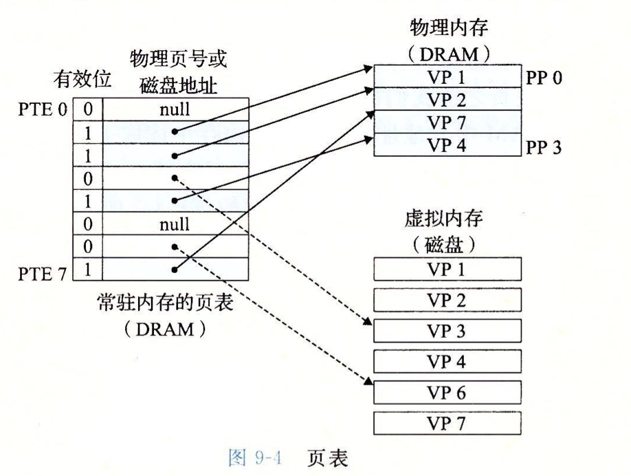
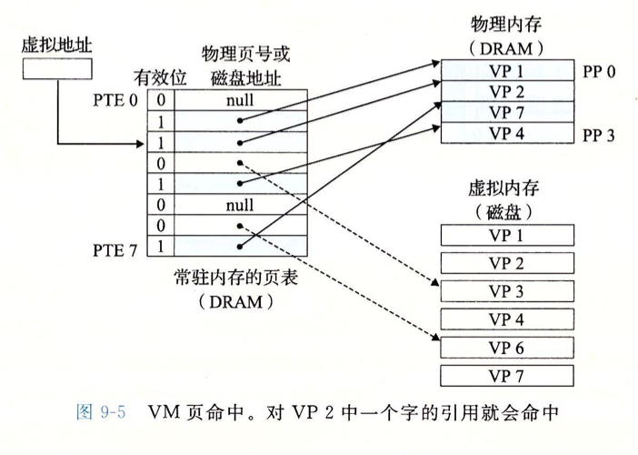
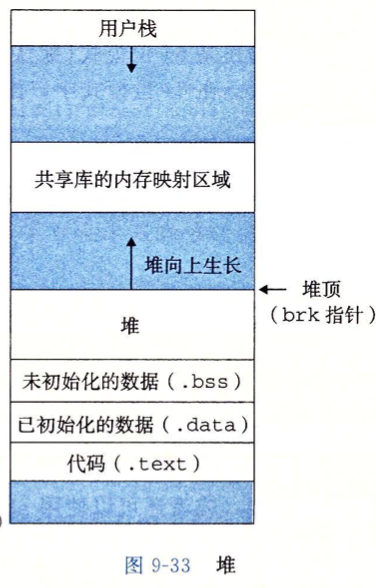
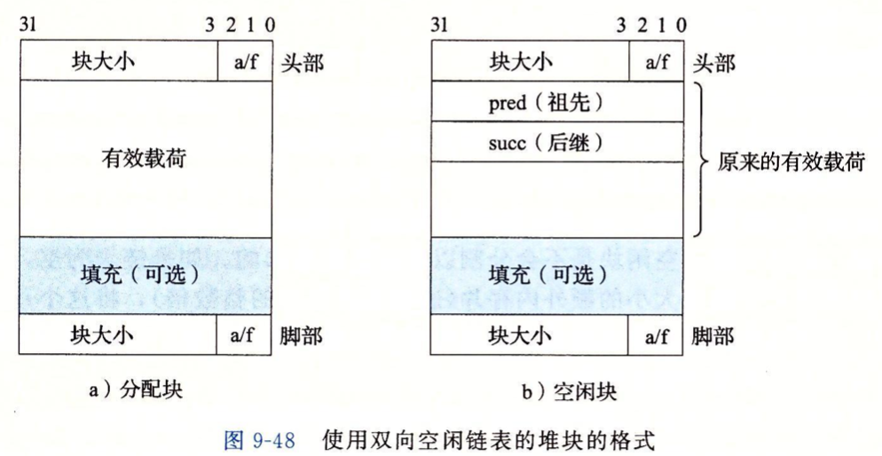

为了更加有效地管理内存并且少出错，现代系统提供了一种对主存的抽象概念，叫作**虚拟内存**。虚拟内存是硬件异常、硬件地址翻译、主存、磁盘文件和内核软件的完美交互，它为每个进程提供了一个大的、一致的和私有的地址空间。

虚拟内存提供了三个重要的能力：

1. 它将主存看成是一个存储在磁盘上的地址空间的高速缓存，在主存中保存活动区域，并根据需要在磁盘和主存之间来回传送数据。
2. 它为每个进程提供了一致的地址空间，从而简化了内存管理。
3. 它保护了每个进程的地址空间不被其他进程破坏。

## 物理和虚拟寻址

1. 计算机系统的主存被组织成一个由M个连续的字节大小的单元组成的数组。每字节都有一个唯一的**物理地址**。CPU 访问内存的最自然的方式就是使用**物理地址** 。这种方式称为**物理寻址**。


2. 虚拟寻址。CPU 通过生成一个**虚拟地址** 来访问主存，这个虚拟地址在被送到内存之前先转换成适当的物理地址。将一个虚拟地址转换为物理地址的任务叫做**地址翻译**。CPU 芯片上叫做内存**管理单元（MMU）** 的专用硬件，利用存放在主存中的查询表来动态翻译虚拟地址，该表的内容由操作系统管理。


## 地址空间

1. **地址空间（address space）** 是一个非负整数地址的有序集合：`{0,1,2,...}`。如果地址空间中的整数是连续的，那么我们说它是一个线性地址空间。为了简化讨论，我们总是假设使用的是线性地址空间。在一个带虚拟内存的系统中，CPU 从一个有 `N=2^n` 个地址的地址空间中生成虚拟地址，这个地址空间称为**虚拟地址空间**。  

2. 一个地址空间的大小是由表示最大地址所需要的位数来描述的。例如，一个包含 `N=2^n` 个地址的虚拟地址空间就叫做一个 `n` 位地址空间。现代系统通常支持 32 位或者64位虚拟地址空间。
3. 一个系统还有一个物理地址空间，对应于系统物理内存的M个字节。
4. 地址空间的概念清楚地区分了数据对象（字节）和它们的属性（地址）。主存中的每个字节都有一个选自虚拟地址空间的虚拟地址和一个选自物理地址空间的物理地址。

## 虚拟内存作为缓存的工具

概念上而言，虚拟内存被组织为一个由存放在磁盘上的 N 个连续的字节大小的单元组成的数组。每字节都有一个唯一的虚拟地址，作为到数组的索引。磁盘上数组的内容被缓存在主存中。和存储器层次结构中其他缓存一样，磁盘（较低层）上的数据被分割成块，这些块作为磁盘和主存（较高层）之间的传输单元。VM 系统通过将虚拟内存分割为称为 **虚拟页（VP）** 的大小固定的块来处理这个问题。每个虚拟页的大小为 `P=2^p` 字节。物理内存被分割为 **物理页(PP)** ，也叫页帧；大小也为 P 字节。

任意时刻，虚拟页面的集合都分为三个不相交的子集。

1. **未分配的：** VM 系统还未分配（或者创建）的页。未分配的块没有任何数据和它们相关联，因此也就不占用任何磁盘空间。
2. **缓存的：** 当前已缓存在物理内存中的已分配页。
3. **未缓存的：** 未缓存在物理内存中的已分配页。

### 页表

同任何缓存一样，虚拟内存系统必须有某种方法来判定一个虚拟页是否存在DRAM中的某个地方。如果是，系统还必须确定这个虚拟页存放在哪个物理页中。如果不命中，系统必须判断这个虚拟页存放在磁盘的哪个位置，在物理内存中选择一个牺牲页，并将虚拟页从磁盘复制到DRAM中，替换这个牺牲页。

**页表：** 一个存放在物理内存中的数据结构，它将虚拟页映射到物理页。每次地址翻译硬件将一个虚拟地址转换为物理地址时，都会读取页表。操作系统负责维护页表的内容，以及在磁盘与 DRAM 之间来回传送页。



### 页命中



### 局部性

尽管在整个运行过程中程序引用的不同页面的总数可能超出物理内存总的大小，但是局部性原则保证了在任意时刻，程序趋向于在一个较小的**活动页面（active page）** 集合上工作，这个集合叫做**工作集**。在初始开销，也就是将工作集页面调度内存中之后，接下来对这个工作集的引用将导致命中，而不会产生额外的磁盘流量。

**抖动** 在工作集的大小超出了物理内存的大小，这时页面将不断低换入换出。

## 地址翻译


## 内存映射

Linux 通过将一个虚拟内存区域与一个磁盘上的对象关联起来，以初始化这个虚拟内存区域的内容，这个过程称为**内存映射** 。虚拟内存区域可以映射到两个类型的对象中的一种。

## 动态内存分配

动态内存分配器维护着一个进程的虚拟内存区域，称为**堆** 。对于每个进程，内核维护着一个变量 `brk` ，它指向堆的顶部。



### 分配器类型

1. 显示分配器，要求应用显式释放任何已分配的块。（eg. C 中的 malloc 程序包）
2. 隐式分配器，自动释放未使用的已分配的块的过程叫做**垃圾收集** 。

### 涉及函数

```c
#include <stdlib.h>
  //返回一个指针，指向大小为至少 size 字节的内存块。
  void *malloc(size_t size);
  //释放已分配的堆块
  void free(void *ptr);

#include <unistd.h>
  //将内核的 brk 指针增加 incr 来扩展和收缩堆。返回值为 brk 的旧值。当为零时，返回当前值。
  void *sbrk(intptr_t incr);
```

### 使用动态内存分配原因

程序使用动态内存分配的最重要的原因是经常直到程序实际运行时，才知道某些数据结构的大小。

```c
#include <stdio.h>
#define MAIN 15213

//这种硬编码的大小来分配数组通常不是一种好想法，应该动态分配这个数组，用完就释放。
int array[MAIN]; 
int main()
{
  int i,n;
  scanf("%d",&n);
  if(n > MAIN){
    printf("Input file too big");
    return 1;
  }
  for (i = 0; i < n; i++){
    scanf("%d",&array[i]);
  }
  return 0;
}

//优化例子
#include <stdio.h>
#include <stdlib.h>

int main()
{
  int *array, i,n;
  scanf("%d",&n);
  array = (int *)malloc(n * sizeof(int));
  for (i = 0; i < n; i++){
    scanf("%d",&array[i]);
  }
  free(array);
  return 0;
}
```

### 分配器的要求和目标

1. **处理任意请求序列**。一个应用可以有任何的分配请求和释放请求序列，只要满足约束条件：每个释放请求必须对应于一个当前已分配块，这个块是由一个以前的分配请求获得的。因此，分配器不可以假设分配和释放请求的顺序。
2. **立即响应请求** 。分配器必须立即响应分配请求。因此，不允许分配器为了提高性能重新排列或者缓存请求。
3. **只使用堆** 。为了使分配器是可扩展的，分配器使用的任何非标量数据结构都必须保存在堆里。
4. **对齐块** 。分配器必须对齐块，使得它们可以保存任何类型的数据对象。
5. **不修改已分配的块** 。分配器只能操作或者改变空闲块。特别是，一旦块被分配了，就不允许修改或者移动它了。

### 碎片

当虽然有未使用的内存但不能用来满足分配请求时，就发生这种现象。

1. **内部碎片** 是在以一个已分配块比有效荷载大时发生的。
2. **外部碎片** 是当空闲内存合计起来足够满足一个分配请求，但是没有一个单独的空闲块足够大可以来处理这个请求时发生的。

### 隐式空闲链表

任何实际的分配器都需要一些数据结构，允许它来区分块边界，以及区别已分配块和空闲块。大多数分配器将这些信息嵌入块本身。


### 显式空闲链表

将空闲块组织为某种形式的显式数据结构。因为根据定义，程序不需要一个空闲块的主体，所以实现这个数据结构的指针可以存放在这些空闲块的主体里。例如，堆可以组织成一个双向的空闲链表。



缺点：一般而言，显式链表的缺点是空闲块必须足够大，以包含所有需要的指针，以及头部和可能的脚部。这就导致了更大的最小块大小，也浅在地提高了内部碎片的程度。

