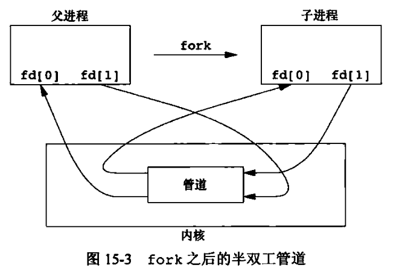
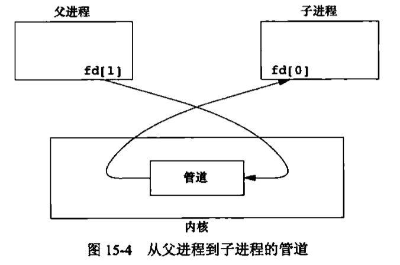

## 简介

### 名字空间

当两个或多个无亲缘关系的进程使用某种类型的 IPC 对象来彼此交换信息时，该 IPC 对象必须有一个某种形式的名字或标识符，这样其中一个进程可以创建该 IPC 对象，其余进程则可以指定同一个 IPC 对象。的

### IPC的主要领域

1. 消息传递（管道、FIFO、消息队列）
2. 同步（互斥锁、条件变量、读写锁、信号量）
3. 共享内存区（匿名共享内存区、有名共享内存区）
4. 过程调用（Solaris 门，Sun RPC）


## 进程间通信

### 管道

管道有以下两种局限性。

1. 历史上，它们是半双工的（即数据只能在一个方向上流动）。现在，某些系统提供全双工管道，但是为了最佳的可移植性，我们决不应预先假定系统支持全双工管道。
2. 管道只能在具有公共祖先的两个进程之间使用。通常，一个管道由一个进程创建，在进程调用 fork 之后，这个管道就能在父进程和子进程之间使用了。

```c
#include <unistd.h>
  int pipe(int fd[2]);
        //返回值：若成功，返回0，若出错，返回-1；
	/*
	  1. 经由参数 fd 返回两个文件描述符：fd[0] 为读而打开，fd[1] 为写而打开。fd[1]的输出是fd[0]的输入。
	  2. fstat 函数对管道的每一端都返回一个 FIFO 类型的文件描述符。可以用 S_ISFIFO 宏来测试管道。
	*/
```

通常，进程会先调用 pipe，接着调用 fork，从而创建从父进程到子进程的 IPC 通道。

'

fork 之后做什么取决于我们想要的数据流的方向。

1. 对于从父进程到子进程的管道，父进程关闭管道的读端（fd[0]），子进程关闭写端（fd[1]）。
2. 对于一个从子进程到父进程的管道，父进程关闭 fd[1]，子进程关闭 fd[0]。



当管道一端被关闭后，下列两条规则起作用：

1. 当读（read）一个写端已被关闭的管道时，在所有数据都被读取后，read 返回0，表示文件结束。
2. 如果写（write）一个读端已被关闭的管道，则产生信号 `SIGPIPE` 。如果忽略该信号或者捕捉该信号并从其他处理程序返回，则 write 返回-1，errno 设置为 EPIPE。

在写管道（或FIFO）时，常量 PIPE_BUF 规定了内核的管道缓存区大小。

```c
//创建了一个从父进程到子进程的管道，并且父进程经由该管道向子进程传送数据。
#include <unistd.h>
#include <stdio.h>
#include <stdlib.h>

#define MAXLINE 4096

void err_sys(char *err)
{
    perror(err);
    exit(EXIT_FAILURE);
}

int main(void)
{
    int n;
    int fd[2];
    pid_t pid;
    char line[MAXLINE];

    if (pipe(fd) < 0) {
        err_sys("pipe error");
    }
    if ((pid = fork()) < 0) {
        err_sys("fork_error");
    } else if (pid > 0) {
        close(fd[0]);
        write(fd[1], "hello world\n", 12);
    } else {
        close(fd[1]);
        n = read(fd[0], line, MAXLINE);
        write(STDOUT_FILENO, line, n);
    }
    exit(0);
}
```

### 函数 popen 和 pclose

常见的操作是创建一个连接到另一进程的管道，然后读其输出或向其输入端发送数据。**标准 I/O库** 提供了两个函数。

```c
#include <stdio.h>
  FILE *popen(const char *cmdstring, const char *type);
        //返回值：若成功，返回文件指针；若出错，返回NULL；

  int pclose(FILE *fp);
        //返回值：若成功，返回cmdstring的终止状态；若出错，返回-1；
  /*
    函数 popen 先执行 fork，然后调用 exec 执行 cmdstring，并且返回一个标准 I/O 文件指针。
      如果 type 是 r，则文件指针连接到 cmdstring 的标准输出。
      如果 type 是 w，则文件指针连接到 cmdstring 的标准输入。
  */

//eg:myuclc
  #include <ctype.h>
  #include <stdio.h>
  #include <string.h>
  #include <stdlib.h>

  void err_sys(char *err)
  {
      perror(err);
      exit(EXIT_FAILURE);
  }

  int main(void)
  {
      int c;
      while ((c = getchar()) != EOF)
      {
          if (isupper(c)) {
              c = tolower(c);
          }
          if (putchar(c) == EOF) {
              err_sys("output error");
          }
          if (c == '\n') {
              fflush(stdout);
          }
      }
      exit(0);
  }

//eg:
  #include <sys/wait.h>
  #include <stdio.h>
  #include <stdlib.h>

  #define MAXLINE 4096

  void err_sys(char *err)
  {
      perror(err);
      exit(EXIT_FAILURE);
  }

  int main(void)
  {
      char line[MAXLINE];
      FILE *fpin;

      if ((fpin = popen("./myuclc","r")) == NULL) {
          err_sys("popen error");
      }
      for(;;){
          fputs("prompt> ",stdout);
          fflush(stdout);
          if (fgets(line,MAXLINE,fpin) == NULL) {
              break;
          }
          if (fputs(line,stdout) == EOF) {
              err_sys("fputs error to pipe");
          }
      }
      if (pclose(fpin) == -1) {
          err_sys("pclose error");
      }
      putchar('\n');
      exit(0);
  }
```

### 协同进程

UNIX 系统过滤程序从标准输入读取数据，向标准输出写数据。几个过滤程序通常在 shell 管道中线性连接。当一个过滤程序即产生某个过滤程序的输入，又读取该过滤程序的输出时，它就变成了**协同进程** 。

### FIFO

FIFO 有时被称为命名管道。未命名的管道只能在两个相关的进程之间使用，而且这两个相关的进程还要有一个共同的创建了它们的祖先进程。但是，通过FIFO，不相关的进程也能交换数据。

FIFO是一种文件类型，通过 `stat` 结构的 st_mode 成员的编码可以知道文件是不是 FIFO类型。可以用 `S_ISFIFO` 宏对此进行测试。

```c
#include <sys/stat.h>
  int mkfifo(const char *path, mode_t mode);
  int mkfifoat(int fd, const char *path, mode_t mode);
        //两个函数的返回值：若成功，返回0；若出错，返回-1
```

### XSI IPC

消息队列、信号量以及共享存储器。

#### 标识符和键

每个内核中的 IPC 结构（消息队列、信号量以及共享存储段）都用一个非负整数的标识符加以引用。例如，要向一个消息队列发送消息或者从一个消息队列取消息，只需要知道其队列标识符。与文件描述符不同，IPC 标识符不是小的整数。当一个IPC结构被创建，然后又被删除时，与这种结构相关的标识符连续加1，直至达到一个整型数的最大正值，然后又回转到0。

标识符是 IPC 对象的内部名，为使多个合作进程能够在同一 IPC 对象上汇聚，需要提供一个外部命名方案。为此，每个 IPC 对像都与一个键相关联，将这个键作为该对象的外部名。

### 消息队列

消息队列是消息的链接表，存储在内核中，由消息队列标识符标识。