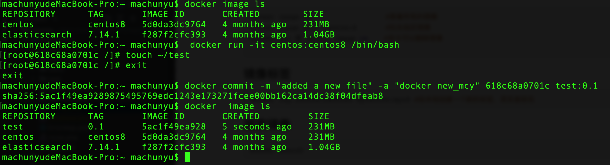
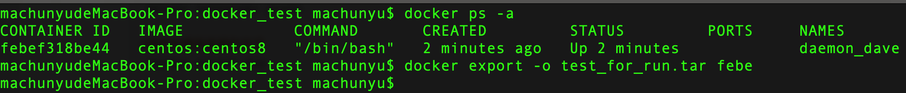
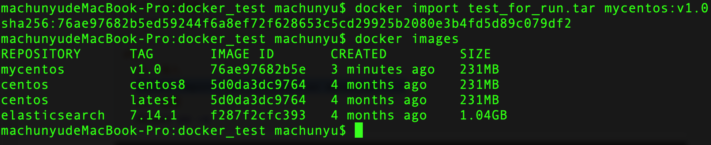

## 核心概念

1. 镜像：镜像是创建 Docker容器的基础。
2. 容器：容器是镜像的一个运行实例，Docker 利用容器来运行和隔离应用。
3. 仓库：是 Docker 集中存放镜像文件的场所。

## 概括

```html
create
start
run
wait
logs

停止容器
  pause
  stop

启动容器
  start
  restart

查看容器
	ps
  ps -a
  ps -q

进入容器
	attach
	exec

删除容器
  docker rm

导出与导入
	docker export -o test_for_run.tar study
```

## 镜像命令

### 镜像命令

```shell
# docker image
  docker image ls                  #查看所有的镜像
  docker images                    #查看所有的镜像
  docker image pull centos:8       #拉去指定镜像
  docker rmi 或 docker image rm    #命令可以删除镜像

# docker tag 给本地创建一个新的标签，其实是别名
  docker tag centos:centos8 mycentos:myc8

# 搜索镜像
  docker search centos

# docker push 上传镜像到仓库
  #1. 先添加新的标签 machunyugo/centos:centos8。
    docker tag centos:centos8 machunyugo/centos:centos8
  #2. 用户 machunyugo 上传本地 centos:centos8 镜像。
    docker push machunyugo/centos:centos8
```

### 本地备份

```shell
# 1. 导出镜像 
  save -o centos8.tar centos:centos8
# 2. 本地导出 centos8.tar
# 3. 导入镜像
  docker load -i centos8.tar
```

### 创建镜像

#### commit 基于已有的镜像

```shell
# 1. 在镜像上创建修改文件
  docker run -it centos:centos8 /bin/bash
  touch test #创建一个修改
# 2. 本地提交镜像
  docker commit -m "added a new file" -a "docker new_mcy" d89bdb3ad7fa test:0.1
```



#### 基于本地模版导入

#### 基于 Docker 创建

## Docker 容器

1. 当 Docker 容器中指定的应用终极时，容器也会自动终止。
2. 容器是镜像的一个运行实例。所不同的是，镜像是静态的只读文件，而容器带有运行时需要的可写文件层。

```shell
# 创建
 docker create -it centos:centos8

# 运行
 docker start c79

# docker run 合并上述命令
  # 运行并未容器命名, -d 参数是以守护态运行
    docker run -it centos:centos8 /bin/bash
  # 命令从镜像启动一个容器时，如果该镜像不在本地，Docker 会先从 Docker Hub 下载该镜像。如果没有指定具体的镜像标签，那么Docker 会自动下载 latest 标签的镜像。
    docker run --name mcy -itd centos:centos8 /bin/bash # 如果本地不存在，先docker pull 再 run
  # 自动重启容器
    docker run --restart=always --name daemon_dave -d centos /bin/sh -c "while true; do echo hello world; sleep 1; done"
      # --restart 标志被设置为 always。无论容器的退出代码是什么，Docker 都会自动重启该容器。
      # 还可以将这个标志设为 on-failure ，这样，只有当容器的退出代码为非 0 值的时候，才会自动重启。
      # 接受一个可选的重启次数参数。
      --restart=on-failure:5

# 重新附着到容器的会话
  docker attach mcy

# docker stop 停止容器
  docker stop d46ad28248e7
 # 自动清除掉所有处于停止状态的容器
  docker container prune

# docker rm 删除容器
    docker rm 050e65747307
  # 删除所有容器
    docker rm `docker ps -aq`

# docker ps
  # 会列出所有容器，包括正在运行的和已经停止的
    docker ps -a
  # 列出最后一个运行的容器，无论其正在运行还是已经停止
    docker ps -l
  # 查看最后 x 个容器，不论这些容器正在运行还是已经停止。
    docker ps -n x

# docker logs 查看某容器的输出可以使用如下命令
  docker logs d46ad28248e7
 	docker logs daemon_dave
 	# tail 形式查看log
	  docker logs --tail 10 -f daemon_dave

# docker exec
  # 在容器内部运行进程，可以在容器内运行的进程有两种类型：后台任务和交互式任务。
	  docker exec -d daemon_dave touch /root/test

  # 该命令会在 daemon_dave 容器内创建一个新的 bash 会话。
	  docker exec -ti daemon_dave /bin/bash
```

### 备份容器

```shell
#导出
 # 1. 查看容器
  docker ps -a
 # 2. 导出容器
  docker export -o test_for_run.tar febe

#导入
  #1. 从上述命令导出的文件恢复成镜像
	docker import test_for_run.tar mycentos:v1.0
	#2. 查看
	docker ps -a
```





### 查看容器

查看容器的命令主要是`inspect` ，`top` 和 `stats` 子命令。

```shell
#1. 查看容器内进程
  docker top name_or_id

#2. 查看统计信息，用来显示一个或多个容器的统计信息。
	docker stats name_or_id

#3. 查看容器详情
  docker container inspect name_or_id
```

### 其他容器命令

```shell
#1. 在容器和主机之间复制文件。
  docker cp ./dump.rdb febef318be44:/tmp/
  # 查看复制的文件
  docker exec febef318be44 ls /tmp

#2. 查看容器文件系统的变更
  docker [container] diff febef318be44

#3. 查看端口映射
  docker port febef318be44

#4. docker update 更新配置
```

## 仓库

1. 注册服务器（registry）是存放仓库的具体服务器。
2. 仓库是集中存放镜像的地方，又分公共仓库和私有仓库。
3. 一个注册服务器上可以有多个仓库，而每个仓库下面可以有多个镜像。

```shell
# docker login 来注册和登录，登录完成以后会在本地用户目录下自动创建 .docker/config.json 文件
  docker login
```

### 本地私有仓库

## 数据管理

容器中的管理数据主要有两种方式

1. 数据卷（Data Volumes）：容器内数据直接映射到本地主机环境；

2. 数据卷容器（Data Volume Containers）: 使用特定容器维护数据卷。

### 数据卷

1. 数据卷是一个可供容器使用的特殊目录，它将主机操作系统目录直接映射进容器。
2. 数据卷是被设计用来持久化数据的，它的生命周期独立于容器，Docker 不会在容器被删除后自动删除数据卷，并且也不存在垃圾回收这样的机制来处理没有任何容器引用的数据卷。
3. **优点**
   * 数据卷可以在容器之间共享和重用，容器间传递数据将变得高效于方便。
   * 对数据卷内数据的修改会立马生效，无论是容器内操作还是本地操作。
   * 对数据卷的更新不会影响镜像，解耦开应用和数据。
   * 卷会一直存在，直到没有容器使用，可以安全地卸载。

3. 命令以及操作

   ```shell
   # 创建数据卷
     docker volume create -d local container_name
   
   # 查看所有的 volume
     docker volume ls
   # 查看详细情况
     docker volume inspect container_name
   # 清理无用的数据卷 
     docker volume prune
   # 删除数据卷
     docker volume rm
   ```

### 绑定数据卷

在用 `docker [container] run` 命令的时候，可以使用 `-mount` 选项来使用数据卷。`-mount` 又三个 参数。

1. `volume`：普通数据卷，映射到主机 `/var/lib/docker/volumes` 路径下。

2. `bind` : 绑定数据卷，映射到主机指定路径下；

3. `tmpfs` ：临时数据卷，只存在于内存中。

```shell
# 绑定目录
  docker run -itd --name study --mount type=bind,source=/Users/machunyu/docker_dir,destination=/data centos:centos8 /bin/bash

  docker run --name study2 -itd --mount type=bind,src=/Users/machunyu/docker_dir,dst=/data centos:centos8 /bin/bash

# 和上面的命令等效
  docker run --name study3 -itd -v /Users/machunyu/docker_dir:/data centos:centos8 /bin/bash
```

**注意**

1. 本地目录的路径必须是绝对路径，容器内路径可以为相对路径。如果目录不存在，Docker 会自动创建。

2. 默认挂载的数据卷的权限是读写（rw），可以通过 ro 指定为只读。

   ```shell
   docker run --name study4 -itd -v /Users/machunyu/docker_dir:/data:ro centos:centos8 /bin/bash
   ```

### 数据卷容器

1. 如果需要在多个容器之间共享一些持续更新的数据，最简单的方式是使用数据卷容器。
2. 数据卷容器是一个容器，它的目的是专门提供数据卷给其他容器挂载。
3. **删除了挂载的容器，数据卷并不会被自动删除。如果要删除一个数据卷，必须在删除最后一个还挂载着他的容器时显式使用 `docker rm -v` 命令来指定同时删除关联的容器。** 

```shell
# 1. 创建数据卷容器 dbdata
  docker run -it -v /dbdata --name dbdata centos:centos8

# 2. 在其他容器中使用 --volumes-from 来挂载 dbdata 容器中的数据卷
  docker run -it --volumes-from dbdata --name db1 centos:centos8
  docker run -it --volumes-from dbdata --name db2 centos:centos8
  
# 3. 三个容器任何一方在该目录下的写入，其他容器都可以看到。
  
# 4. 支持多次使用 --volumes-from 参数来从多个容器挂载多个数据卷，还可以从其他已经挂载了容器卷的容器来挂载数据卷
```

### 利用数据卷容器来迁移数据

```shell
# 1. 备份
  docker run --volumes-from dbdata -v /Users/machunyu/docker_back:/backup --name worker centos:centos8 tar cvf /backup/backup.tar /dbdata
  #说明，首先利用镜像创建一个容器 worker。使用 --volumes-from dbdata 参数让 worker 容器挂载 dbdata 容器的数据卷；使用 -v /Users/machunyu/docker_back:/backup 参数来挂载本地的目录到 worker 容器的 /backup 目录。
  
# 2. 恢复
   # 创建一个带有数据卷的容器 dbdata2
   docker run -it -v /dbdata --name dbdata2 centos:centos8 /bin/bash
   # 创建另一个
   docker run --volumes-from dbdata2 -v /Users/machunyu/docker_back:/backup --name worker centos:centos8 tar xvf /backup/backup.tar
```

## 端口映射与容器互联

1. 允许映射容器内应用的服务端口到本地宿主主机。
2. 互联机制实现多个容器间通过容器名来快速访问。
3. -p (小写的)则可以指定要映射的端口，并且，在一 个 指定端口上只可以绑定 一 个容器。 支持的格式有 `IP:HosPort:ConainerPort` I` IP::ContainerPort` I `HostPort:ContainerPort`。

### 映射地址

```html
1. 映射所有接口地址
		docker run -d -p 5000:5000 raining/webapp py七hon app.py
		此时默认会绑定本地所有接口上的 所有地址。多次使用-p标记可以绑定多个端口。例如:
		docker run -d -p 5000:5000 -p 3000:80 training/webapp python app.py

2. 映射到指定地址的指定端口
		docker run -d -p 127.0.0.1:5000:5000 raining/webapp python app.py

3. 映射到指定地址的任意端口
		docker run -d -p 127.0.0.1::5000 training/webapp pyhon app.py
```

