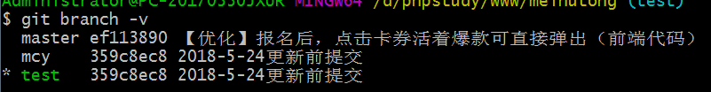

# 手册

## Git 快速入门

### 入门概念

1. 对于任何一个文件, Git内部的三种状态: 已提交( committed ), 已修改( modified ) 和 已暂存( staged);

   - __已提交__ , 表示该文件已经被安全地保存在本地数据库中
   - __已修改__ 表示修改了某个文件, 但是还没有提交保存
   - __已暂存__ 表示把已经修改的文件放在下次提交时要保存的清单中

2. 文件流转的三个工作区域: git的工作目录, 暂存区域, 以及本地仓库

   

### 初始化项目

`git init`  通过`git init`命令把当前目录变成Git可以管理的仓库

```shell
cd project_dir 
git init
#or
git init project_dir #创建新目录
```

### 从现有仓库克隆

```shell
git clone https://github.com/laravel/laravel.git  #克隆不创建新目录 使用原来的目录
git clone https://github.com/laravel/laravel.git laravelTest #克隆并创建新目录
```

## 基础

### 配置

1. 配置 `user.name` 和 `user.email`

   ```shell
   # 项目配置，只对某个仓库有效	
   	git config --local user.name 'your_name'
   	git config --local user.email 'your_email@domain.com'
   # 全局配置，对当前所有仓库有效
       git config --global user.name 'your_name'
       git config --global user.email 'your_email@domain.com'
   # 系统配置，对系统所有登录的用户有效
   	git config --system user.name 'your_name'
   	git config --system user.email 'your_email@domain.com'
   ```

### 基础命令

1. 查看当前状态

   ```shell
   git status
   ```

2. 跟踪新文件

   ```shell
   git add file
   git add ./*
   ```

3. 查看已暂存和未暂存的修改

   ```shell
   git diff file 		#未暂存的修改
   git diff --cached 	#已经暂存的修改
   ```

4. 提交更新

   ```shell
   git commit -m 'describe'
   git commit -am 'describe' #跳过使用暂存区域
   ```

5. 移除文件

   * `git rm filename` 从已跟踪文件清单中移除，并把工作目录中的文件也删除。
   * 如果删除之前修改过并且已经放到暂存区域的话，则必须要用强制删除选项 `-f`（译注：即 force 的首字母）。 这是一种安全特性，用于防止误删还没有添加到快照的数据，这样的数据不能被 Git 恢复。
   * `git rm --cached` 从暂存区域移除。

6. 重命名或者移动文件

   ```shell
   git mv file_from file_to
   
   #上述命令相当于
   mv file_from file_to
   git rm file_from
   git add file_to
   ```

7. git命令行没有颜色 `git config --global color.ui true`

### 查看历史

1. `git log` 					会按提交时间列出所有的更新。
2. `git log -p -2`                           显示最近两次提交。
3. `git log --grep kewWord`         查询指定关键字的提交。
4. `git log -g`                                  输出格式的引用日志信息。
5. `git log --all --graph`            图型化查看分支的演变历史。

### 撤销操作 

1. 提交完了才发现漏掉了几个文件没有添加，或者提交信息写错了。

   ```shell
   git commit -amend
   ```

2. 取消暂存文件。

   ```shell
   git reset HEAD file_name
   ```

3. 撤销对文件的修改。

   ```shell
   git checkout -- file_name
   ```

4. 撤销未提交的 `commit`。

   ```shell
   git reset HEAD^  #撤销最近一次的commit
   ```

## 对比差异

1. 查看未加入暂存区和暂存区的差异

   ```shell
   git diff 1.css
   ```

2. 查看加暂存区和提交的差异

   ```shell
   git diff --cached 1.css
   ```

3. 不同提交的指定文件的差异

   ```shell
   #查看最近2条提交历史
   git log -n2
   git diff commit-id1 commit-id2 path-to-file
   ```

## 远程仓库

1. 列出远程服务器的简写。

   ```shell
   git remote #origin 这是 Git 给你克隆的仓库服务器的默认名字：
   ```

2. 显示需要读写远程仓库使用的 Git 保存的简写与其对应的 URL。

   ```shell
   git remote -v
   ```

3. 添加远程仓库。（将本地仓库和远程仓库建立关联）

   ```shell
   #git remote add <shortname> <url> 添加一个新的远程 Git 仓库，同时指定一个你可以轻松引用的简写
   ```

4. 查看远程仓库。

   ```shell
   git remote show origin
   ```

5. 推送到远程服务器。

   ```shell
   git push origin master
   ```

6. 远程仓库的移除和重命名。

   ```shell
   git remote rename pb paul 	# 重命名
   git remote rm paul			# 移除
   ```

7. 示例

   ```shell
   # 1. 创建本地目录
   mkdir test
   # 2. 初始化本地
   git init
   # 3. 添加远程仓库，即本地和远程建立关联
   cd test
   git remote add origin git@bitbucket.org:machunyu/test.git
   # 4. 拉取本地远程代码
   git pull origin master
   # 5. 设置本地 master 分支跟踪远程 master 分支，这样设置以后直接 git pull 就可以拉取代码
   git branch --set-upstream-to=origin/remote_branch  your_branch
   ```

8. 添加多个远程仓库

   ```shell
   配置远程仓库
   git remote add origin https://url
   再添加一个远程仓库
   git remote set-url --add origin https://url
   一次提交到所有远程仓库
   git push --all
   ```

### 别名

```shell
git config --global alias.st status
```

## 分支

### [应用场景](<https://git-scm.com/book/zh/v1/Git-%E5%88%86%E6%94%AF-%E5%88%A9%E7%94%A8%E5%88%86%E6%94%AF%E8%BF%9B%E8%A1%8C%E5%BC%80%E5%8F%91%E7%9A%84%E5%B7%A5%E4%BD%9C%E6%B5%81%E7%A8%8B>)

- 长期分支: 同时拥有多个开放的分支, 每个分支用于完成特定的任务, 随着开发的推进, 你可以随时把某个特性分支的成果并到其他分支中。**master分支中保留完全稳定的代码, develop 或者 next 平行分支, 专门用于后续的开发。**
- 特性分支: 一个特性分支是指一个短期的, 用来实现单一特性或与其相关工作的分支, 在提交了若干更新后, 把它们合并到主干分支, 然后删除.  ( 前提是分支的代码已经比较成熟了)。
- 远程分支 : 是对远程仓库中的分支的索引, 它们是一些无法移动的本地分支; 只有在Git进行网络交互是才会更新. 远程分支就像书签, 提醒着你上次连接远程仓库是上面个分支的位置。

### 远程分支

> 远程分支（remote branch）是对远程仓库中的分支的索引。它们是一些无法移动的本地分支；只有在 Git 进行网络交互时才会更新。远程分支就像是书签，提醒着你上次连接远程仓库时上面各分支的位置。
>
> 我们用 `(远程仓库名)/(分支名)` 这样的形式表示远程分支。比如我们想看看上次同 `origin` 仓库通讯时 `master` 分支的样子，就应该查看 `origin/master` 分支。

### 命令

1. 创建分支

   ```shell
   git branch testing
   ```

2. 切换分支

   ```shell
   git checkout testing
   ```

3. `git checkout -b branchname` 这个命令相当于运行了

   ```shell
   git branch testing   # 创建
   git checkout testing # 切入
   ```

4. `git branch -d branchname`  删除某个无用的分支

5. 合并某个分支

   ```shell
   git checkout master
   git merge branchname
   ```

6. 列出分支的清单

   ```shell
   git branch
   ```

7. 查看各个分支最后一个提交对象的信息

   ```shell
   git branch -v
   ```

   

8. 从该清单中筛选出你已经( 或者尚未) 与当期分支合并的分支

   ```shell
   git branch --merged  #查看哪些分支已经被并入当前分支
   git branch --no-merged #查看哪些分支尚未和当前分支合并
   ```

9. 推送本地分支

   ```shell
   # git push (远程仓库名) (分支名)
   git push origin sereverfix  #推送本地到远程
   ```

10. [远程分支示例](<https://git-scm.com/book/zh/v1/Git-%E5%88%86%E6%94%AF-%E8%BF%9C%E7%A8%8B%E5%88%86%E6%94%AF>)

   ```shell
   #1. 推送远程分支。  other1
   	# 语意：取出我在本地的 serverfix 分支，推送到远程仓库的 serverfix 分支中去
   	git push origin fix
   	# 语意：上传我本地的 serverfix 分支到远程仓库中去，仍旧称它为 serverfix 分支
   	git push origin fix:fix
   #2. 拉取远程分支。	other2
   	git fetch origin
   #3. 创建本地分支或者合并远程分支到工作目录中。other2
   	# 值得注意的是，在 fetch 操作下载好新的远程分支之后，你仍然无法在本地编辑该远程仓库中的分支。换句话说，在本例中，你不会有一个新的 serverfix 分支，有的只是一个你无法移动的 origin/serverfix 指针。
   	#如果要把该远程分支的内容合并到当前分支，可以运行。
   	git merge origin/fix。
   	#如果想要一份自己的 serverfix 来开发，可以在远程分支的基础上分化出一个新的分支来：
   	git checkout -b fix origin/fix
   ```

11. 跟踪远程分支

    ```shell
    # git checkout -b [分支名] [远程名]/[分支名]
    ```

12. 删除远程分支

    ```shell
    # git push [远程名] :[分支名]，该处必须保留空格。
    git push origin :fix
    ```

### [分支的基变](<https://git-scm.com/book/zh/v2/Git-%E5%88%86%E6%94%AF-%E5%8F%98%E5%9F%BA>)

## 版本回退

1. 使用 `git log` 查看实际工作中历史记录

   

2. Git必须知道当前版本是哪个版本，在Git中，用`HEAD`表示当前版本，也就是最新的提交34aca0...`（注意我的提交ID和你的肯定不一样），上一个版本就是`HEAD^`，上上一个版本就是`HEAD^^`，当然往上100个版本写100个`^`比较容易数不过来，所以写成`HEAD~100`。 

   ```html
   #回退上一个版本
   git reset --hard HEAD^
   git reset --hard HEAD～1
   #回退到指定版本
   git reset --hard 34aca0a6e4670b882
   ```

3. Git提供了一个命令`git reflog`用来记录你的每一次命令： 

   

4. 撤销修改

   - 命令`git checkout -- readme.txt`意思就是，把`readme.txt`文件在工作区的修改全部撤销，这里有两种情况：
   - 一种是`readme.txt`自修改后还没有被放到暂存区，现在，撤销修改就回到和版本库一模一样的状态；
   - 一种是`readme.txt`已经添加到暂存区后，又作了修改，现在，撤销修改就回到添加到暂存区后的状态。
   - 总之，就是让这个文件回到最近一次`git commit`或`git add`时的状态。
   - `git checkout -- file`命令中的`-- `很重要，没有`--`，就变成了“切换到另一个分支”的命令，我们在后面的分支管理中会再次遇到`git checkout`命令。 


## git 工具

### 储藏（Stashing）

“‘储藏”“可以获取你工作目录的中间状态——**修改过的被追踪的文件**和**暂存的变更**——并将它保存到一个未完结变更的堆栈中，随时可以重新应用。

1. 存储

   ```shell
   git stash
   ```

2. 查看现有的存储。

   ```shell
   git stash list
   #stash@{0}: WIP on master: 330e68b test
   ```

3. 重新应用存储。**apply 选项只尝试应用储藏的工作——储藏的内容仍然在栈上。**

   ```shell
   git stash apply					#默认最新的一条
   git stash apply stash@{0}		#任意存储
   git stash pop 					#来重新应用储藏，并将储藏删掉
   ```

4. 删除存储。

   ```shell
   git stash drop
   ```

## [配置 git](<https://git-scm.com/book/zh/v1/%E8%87%AA%E5%AE%9A%E4%B9%89-Git-%E9%85%8D%E7%BD%AE-Git>)

## [数据恢复](<https://git-scm.com/book/zh/v1/Git-%E5%86%85%E9%83%A8%E5%8E%9F%E7%90%86-%E7%BB%B4%E6%8A%A4%E5%8F%8A%E6%95%B0%E6%8D%AE%E6%81%A2%E5%A4%8D>)

## 其他命令

1. 查看 git 使用的空间

   ```shell
   git count-objects -v
   ```

