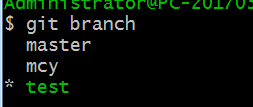

#### 分支 (Git保存的不是文件差异或者变化量, 而只是一系列文件快照)

1. 创建分支

   ```shell
   git branch testing
   ```

2. 切换分支

   ```shell
   git checkout testing
   ```

3. 分支的新建与合并

   * 流程

     >实际工作中大体的流程
     >
     >1. 开发某个网站
     >2. 为实现某个新的需求, 创建一个分支
     >3. 在这个分支上开展工作
     >
     >假设此时, 有一个很严重的问题需要紧急修补,
     >
     >1. 返回到原先已经发布到生产服务器上的分支
     >2. 为这次紧急修补建立一个新分支, 并在其中修复问题
     >3. 通过测试后, 回到生产服务器所在的分支, 将修补分支合并进来, 然后推送到生产服务器上
     >4. 切换到之前实现新需求的分支, 继续工作

   * 命令

     1. `git checkout -b branchname`

        ```shell
        # 这个命令相当于运行了
        git branch testing   # 创建
        git checkout testing # 切入
        ```

     2. `git branch -d branchname` 删除某个无用的分支

     3. 合并某个分支

        ```shell
        git checkout master
        git merge branchname
        ```

4. 分支的管理

   * 列出分支的清单

     ```shell
     git branch
     ```

     

     __注意看 test分支前的 * 的字符: 它表示当前所在的分支__

   * 查看各个分支最后一个提交对象的信息

     ```shell
     git branch -v
     ```

     

   * 从该清单中筛选出你已经( 或者尚未) 与当期分支合并的分支, 

     ```shell
     git branch --merged  #查看哪些分支已经被并入当前分支
     git branch --no-merged #查看哪些分支尚未和当前分支合并
     ```

5. 利用分支进行开发的工作流程

   * 长期分支: 同时拥有多个开放的分支, 每个分支用于完成特定的任务, 随着开发的推进, 你可以随时把某个特性分支的成果并到其他分支中. 

     * master分支中保留完全稳定的代码, develop 或者 next 平行分支, 专门用于后续的开发

   * 特性分支: 一个特性分支是指一个短期的, 用来实现单一特性或与其相关工作的分支, 在提交了若干更新后, 把它们合并到主干分支, 然后删除.  ( 前提是分支的代码已经比较成熟了)

   * 远程分支 : 是对远程仓库中的分支的索引, 它们是一些无法移动的本地分支; 只有在Git进行网络交互是才会更新. 远程分支就像书签, 提醒着你上次连接远程仓库是上面个分支的位置

     __假设有一个地址`git.ourcompany.com` 的Git服务器. 如果你从这里克隆, Git会自动为你将此远程仓库命名为origin, 并下载其中所有的数据, 建立一个指向他的master分支的指针, 在本地命名为`origin/master` , 但你无法在本地更改远程的数据, Git建立的本地`master`和origin上的master分支相同的位置, __

6. 推送本地分支

   ```shell
   # git push (远程仓库名) (分支名)
   git push origin sereverfix  #推送本地到远程
   git fetch origin
   ```

   