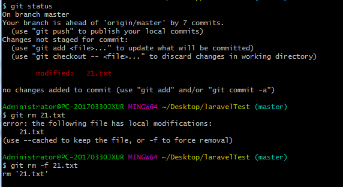
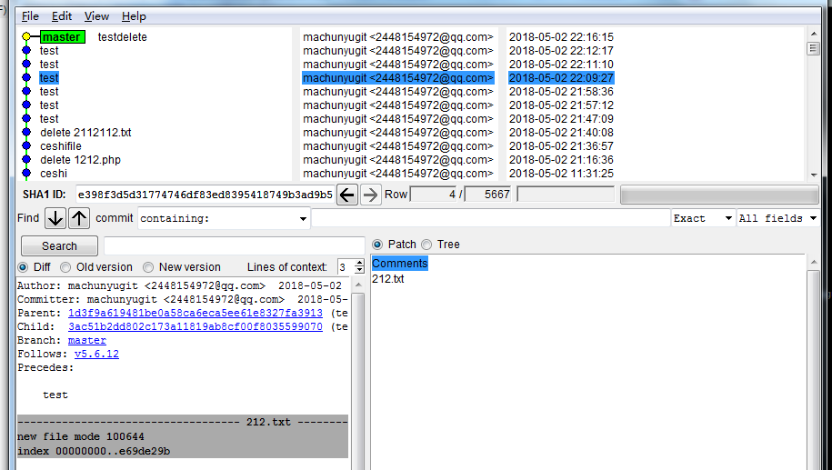
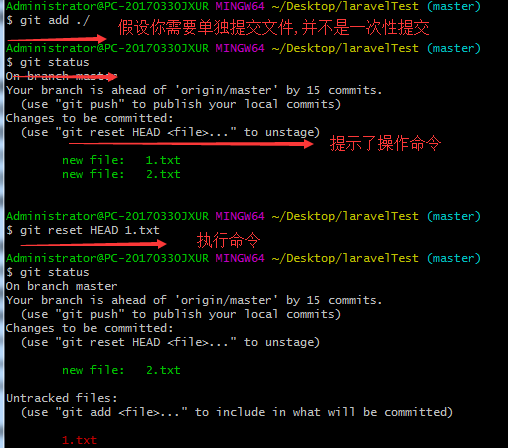

#### Git

1. 对于任何一个文件, Git内部的三种状态: 已提交( committed ), 已修改( modified ) 和 已暂存( staged);

   * __已提交__ , 表示该文件已经被安全地保存在本地数据库中
   * __已修改__ 表示修改了某个文件, 但是还没有提交保存
   * __已暂存__ 表示把已经修改的文件放在下次提交时要保存的清单中

2. 文件流转的三个工作区域: git的工作目录, 暂存区域, 以及本地仓库

   

   ​

3. 查看配置信息

   ```html
   git config --list
   ```

4. `git init`  通过`git init`命令把当前目录变成Git可以管理的仓库

5. 从现有仓库克隆 `git clone`

   - git 获取的是项目历史的所有数据( 每一个文件的每一个版本 ), 服务器上有的数据克隆之后本地也都有了.  实际上, 即使服务器的磁盘发生故障, 用任何一个克隆出来的客户端都可以重建服务器上的仓库, 回到当初克隆时的状态 

     ```shell
     git clone https://github.com/laravel/laravel.git  #克隆不创建新目录 使用原来的目录
     git clone https://github.com/laravel/laravel.git laravelTest #克隆并创建新目录
     ```

6. `git status`  检查当前文件状态

   ```shell
   $ git status
   On branch master
   Your branch is up-to-date with 'origin/master'.
   nothing to commit, working tree clean
   #所有已跟踪文件在上次提交后都未被更改过；当前目录下没有出现任何未跟踪的新文件。

   $ git status
   On branch master
   Your branch is up-to-date with 'origin/master'.
   Untracked files:
     (use "git add <file>..." to include in what will be committed)

           composer.lock
           readme1.md

   nothing added to commit but untracked files present (use "git add" to track)
   #Untracked files 未跟踪的文件意味着GIt在之前的快照(提交)中没有这些文件;
   ```

7. `git add` 

   * 跟踪新文件

     ```html
     #使用git add 开始跟踪一个新文件, 执行完以后会看到文件已被跟踪, 并处于暂存状态
     #git add 就是把目标文件快照放入暂存区域, 同时未曾跟踪过的文件标记为需要跟踪.
     $ git add readme1.md
     $ git status
     On branch master
     Your branch is up-to-date with 'origin/master'.
     Changes to be committed:
       (use "git reset HEAD <file>..." to unstage)

             new file:   readme1.md
     ```
     * git add 后面可以指明目录下的文件, 在git add 后面可以指明要跟踪的目录或者文件, 如果是目录就说明要递归跟踪目录下的所有文件

   * 暂存已修改文件

     ```shell
     $git status
     #下面, 说明已跟踪的内容发生了变化, 但还没有放到暂存区。要暂存这次更新需要运行git add
     Changes not staged for commit:
       (use "git add <file>..." to update what will be committed)
       (use "git checkout -- <file>..." to discard changes in working directory)

             modified:   server.php
     ```

   * 其他作用， 在合并时把有冲突的文件标记为已解决状态

8. 忽略某些文件 , 将需要忽略的文件加入`.gitignore` 

   ```html
   $ cat .gitignore
   /vendor
   Homestead.json
   Homestead.yaml
   npm-debug.log
   yarn-error.log
   .env
   ```

   * 文件`.gitignore`的格式规范

     * 所有空行或者以注释符号#开头的行都会被Git忽略。
     * 匹配模式最后跟反斜`/`说明要忽略的是目录
     * 要忽略指定模式以为的文件或者目录, 可以在模式前加上叹号`!` 取反

   * 实例

     ```shell
     #忽略所有 .a 结尾的文件
     *.a
     #但是lib.a除外
     !lib.a
     #忽略vendor目录
     /vendor
     ```

9. `git diff`查看已暂存和未暂存的更新

   * 直接`git add `, 此命令比较的是工作目录中当前文件和暂存区域快照之间的差异, 也就是修改之后还没有暂存起来的变化内容. __单单`git diff`  命令只是显示还没有暂存起来的改动__ 

     ```shell
     $ git diff
     diff --git a/server.php b/server.php
     index e7bb1dd9..c0bfe5f6 100644
     --- a/server.php
     +++ b/server.php
     @@ -20,3 +20,4 @@ if ($uri !== '/' && file_exists(__DIR__.'/public'.$uri)) {

      require_once __DIR__.'/public/index.php';
      'dddd';
     +'dddd';
     ```

   * `git diff --cached` 查看已经暂存起来的文件和上次提交时的快照之间的差异(  `git diff --staged` 高版本也可以使用这个命令, 效果是一样的 )

10. git commit

    * 直接执行 `git commit`

      

      __标注的地方用来写说明__

    * git commit -m '2018-5-1 update' 可以使用 -m 参数后跟提交说明

11. 跳过使用暂存区域 `git commit -a ` 自动把所有__已经跟踪过的文件暂存起来一并提交__  

12. 移除文件 (`git rm` )

    1. 直接删除仓库里面的文件，文件在暂存区里面无变化

       

       * `git rm` 从暂存区域移除, 然后提交

    2. 删除仓库里面的文件，但文件已经被修改，还没有被暂存

       

       * `git rm -f`  如果删除之前修改过或者已经放到暂存区域的话, 则必须要用强制删除选项 -f 

       * `git rm --cahed` 的意思是会删除暂存区域里面的文件，但工作目录下的对应的文件会保留。

         __执行问`git rm -f` 需要重新提交__

    3. 移动文件__git并不跟踪文件移动操作__

       ```shell
       #运行git mv 其实是相当于运行了下面三条命令
       # mv 211.txt 21.txt
       # git rm 211.txt
       # git add 21.txt
       git mv 211.txt 21.txt
       ```

    4. 查看提交历史

       * `git log` 列出所有的更新, 最近的更新排在最上面

       * `git log -p 2`  显示最近提交的两次的差异

       *  `git log --stat` 仅仅显示简要的增改行数统计

       * `gitk`

         

         __说明 :__ 上半个窗口显示的是历次提交的分支祖先图谱, 下半个窗口显示当前点选的提交对应的具体差异

    5. 撤销操作    __有些撤销操作是不可逆的__

       * `git commit --amend`  修改最后一次提交

         * 此命令将使用当前的暂存区域快照提交, 如果刚才提交完没有作任何改动, 直接运行此命令的话, 相当于有机会重新编辑提交说明, 但是将要提交的文件快照和之前的一样, 启动文本编辑器后, 会看到上次提交时的说明, 编辑它确认没问题后保存退出, 就会使用新的提交说明覆盖刚才失误的提交

         * 如果刚才提交忘了暂存某些修改, 可以先补上暂存操作, 然后再运行 `--amend` 提交

           ```shell
           git commit -m 'initial commit'; # 出错
           git add forgotten_file
           git commit --amend
           ```

       * 取消已经暂存的文件

         * 取消暂存区的文件

           

         * 取消对文件的修改  __这个命令执行了将所有对文件的修改都没了__ 

           

           ​	

    6. 远程仓库的使用

       * 查看当前配置有哪些远程仓库 `git remote -v` 显示对应的克隆地址

       * 添加远程仓库

         ```shell
          #git remote add [shortname] [url]
          git remote add origin git@github.com:machunyugit/testgit.git
          git remote -v
          origin git@github.com:machunyugit/testgit.git (fetch)
          origin git@github.com:machunyugit/testgit.git (push)
         ```

    7. 从远程仓库抓取数据

       * `git clone` 命令本质上就是自动创建了本地的master 分支用于跟踪远程仓库中的master分支, 
       * `git fetch [remote-name]` 此命令会自动将远程仓库归于origin名下, 所有的`git fetch origin` 会抓取从你上次克隆以来别人上传到此远程仓库中的所有更新
       * ` git pull url`  设置了某个分支用于跟踪某个远端仓库的分支 , 可以使用`git pull` 命令自动抓取数据下来, 然后将__远端分支自动合并到本地仓库中当前分支__ 

    8. 推送数据到远程仓库

       * git push origin master

         __只要在所克隆的服务器上有写权限, 或者同一时刻没有其他人在推数据, 这条命令才会如期完成任务. 如果在你推数据前已经有其他人推送了若干更新, 那你的推送操作就会被驳回. 你必须先把他们的更新抓取到本地, 合并到自己的项目中, 然后才可以再次推送 __

    9. 查看远程仓库信息

       ```shell
       #git remote show [remote-name]
       git remote show origin
       ```

    10. 远程仓库的删除和重命名

       * 重命名

         ```shell
         git remote rename origin paul
         ```

         __注意, 对远程仓库的重命名, 也会使对应的分支名称发生变化, 原来的origin/master 变成了 paul/mater__

       * 删除

         ```shell
         git remote rm paul
         ```

         __碰到远端参考服务器迁移, 或者原来的克隆镜像不再使用, 又或者某个参与者不再贡献代码, 那么需要移除对应的远端仓库__

    11. 打标签

        * 列出已有的标签

          ```shell
          git tag
          git tag -l 'v3.1.*' #可以查看v3.1系列的版本
          ```

        * 新建标签

          * 含附注的标签

            ```shell
            #创建一个含附注类型的标签非常简单, 用 -a ( annotated 的首字母)
            git tag -a v1.0 -m 'my version 1.0'
            ```

            __`-m` 选项是指定了对应的标签说明, git 会将此说明一同保存在标签对象中. 如果没有给出该选项, git 会启动文本编辑软件供你输入标签说明__

            __可以使用git show 命令查看相应标签的版本信息, 并连同显示打标签时的提交对象__

             ```shell
            git show v1.0
             ```

          * 签署标签

    12. 添加多个远程仓库

        ```shell
        配置远程仓库
        git remote add origin https://url
        再添加一个远程仓库
        git remote set-url --add origin https://url
        一次提交到所有远程仓库
        git push --all
        ```

        ​
