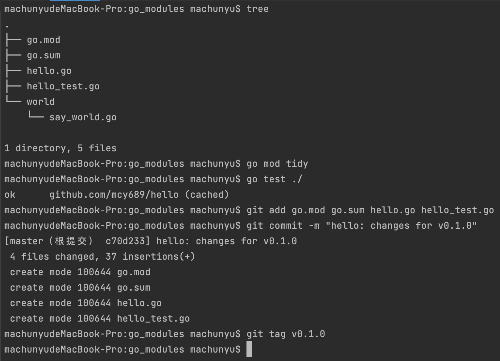

## 环境

### golang 版本

1. `Go 1.11` 开始对模块支持。
2. `Go 1.13`  开始默认开启对模块的支持。

### GO111MODULE设置

`GO111MODULE` 有三个值：`off`，`on` 和 `auto（默认值）`

1. `GO111MODULE=off` ，go 命令行将不会支持 `module` 功能，寻找依赖包的方式将会沿用旧版本 `GOPATH` 模式来查找。

2. `GO111MODULE=on` ，go 命令行会使用 `modules`。

3. `GO111MODULE=auto` ，默认值，在`$GOPATH/src` 之外的目录中调用 go 命令，且当前目录或其任何父目录中使用有效的 `go.mod` 文件，go命令会启动 `modules`。

### 代理配置

```html
GOPROXY=https://goproxy.io,direct
```

### 命令行配置

1. 当前终端生效

   ```shell
   # mac or linux
    export GOPROXY=https://goproxy.io,direct
   ```

2. 长期生效

   ```shell
   # mac
    echo "export GOPROXY=https://goproxy.io,direct" >> ~/.profile && source ~/.profile
   
   # linux
   	echo "export GOPROXY=https://goproxy.io,direct" >> ~/.bashrc && source ~/.bashrc
   	
   # 或者直接修改 go 环境变量
     go env -w GO111MODULE=on
     go env -w GOPROXY=https://goproxy.io,direct
   ```

### 校验 module 安全

环境变量 `GOSUMDB` 可以用来配置你使用哪个校验服务器和公钥来做依赖包的校验。[相关文章](https://goproxy.io/zh/docs/GOSUMDB-env.html)

```shell
GOSUMDB="gosum.io+ce6e7565+AY5qEHUk/qmHc5btzW45JVoENfazw8LielDsaI+lEbq6"
```

## go mod

#### 命令行

| 命令            | 作用                                           |
| --------------- | ---------------------------------------------- |
| go mod download | 下载依赖包到本地（默认为 GOPATH/pkg/mod 目录） |
| go mod edit     | 编辑 go.mod 文件                               |
| go mod graph    | 打印模块依赖图                                 |
| go mod init     | 初始化当前文件夹，创建 go.mod 文件             |
| go mod tidy     | 增加缺少的包，删除无用的包                     |
| go mod vendor   | 将依赖复制到 vendor 目录下                     |
| go mod verify   | 校验依赖                                       |
| go mod why      | 解释为什么需要依赖                             |

#### `go.mod` 文件

go.mod 提供了`module`、` require`、`replace` 和 `exclude` 四个命令。

1. `module` 语句指定包的名字
2. `require` 语句指定依赖项模块
3. `replace` 语句可以替换依赖项模块
4. `exclude` 语句可以忽略依赖项模块

```go
module testModule

go 1.15

require (
	github.com/go-redis/redis/v8 v8.11.4
)

//引入本地模块
replace (
	send => ./send
)
```

## 使用 `module`

### 例子

1. 文件目录

   

2. 文件内容

   ```go
   //go.mod
     module github.com/mcy689/hello
     go 1.15
   
   //hello.go
     package hello
     import "github.com/mcy689/hello/world"
     func Hello() string {
       return "Hello, world."
     }
     func CallWorld() string {
   	  return world.SayWorld()
     }
   
   //say_world.go
     package world
   
     func SayWorld() string {
    return "world"
     }
   
   //say_world.go
     package world
   
     func SayWorld() string {
   	  return "world"
     }
   ```
   

### 知识点

1. `go.mod` 文件仅出现在模块的根目录中。子目录中的程序包具有由模块路径以及子目录路径组成的导入路径。例如，创建一个子目录 `world` ，则无需运行 `go mod init` 。该软件包将自动识别为 `github.com/mcy689/hello` 模块的一部分。
2. `go` 命令维护了一个名为 `go.sum` 的文件，文件内容为指定版本的模块内容。
3. `go` 命令通过 `go.sum` 文件来保证未来下载模块依赖时，依然使用的相同的内容，保证你的项目依赖的模块不会遇到恶意代码、随机异常等原因导致的异常变化。**`go.mod` 和 `go.sum` 两个文件，应该都需要被版本控制系统管理起来** 。

## 依赖

### 添加依赖

```go
package hello

import "github.com/mcy689/hello/world"
import "rsc.io/quote" //添加的新依赖

func Hello() string {
	return quote.Hello()
}

func CallWorld() string {
	return world.SayWorld()
}
```

运行`go test` 


`go` 命令通过 `go.mod` 中列出的指定模块版本来解析依赖。当遇到 `import` 了一个没有在 `go.mod` 中提供的模块中包含的包时，`go` 命令会自动搜索包含这个包的模块，并将其添加到 `go.mod` 中。

```html
machunyudeMacBook-Pro:go_modules machunyu$ cat go.mod 
module github.com/mcy689/hello

go 1.15

require rsc.io/quote v1.5.2
```

### 更新依赖

`go get` 命令更改依赖项的所需版本 (或添加一个新的依赖项)。

### 移除未使用的依赖

`go mod tidy` 命令来清除这些未使用的依赖。

## 发布 go 模块

### 语义版本

`go.mod` 中的每个必需模块都有一个语义版本，这是用于构建模块的依赖项的最低版本。

语义版本的形式为 `vMAJOR.MINOR.PATCH` 。

1. 对模块的公共 API 进行向后不兼容更改时，请增加 `MAJOR` 版本。
2. 对 API 进行向后兼容的更改时，请增加 `MINOR` 版本，例如更改依赖关系或添加新的函数，方法，结构字段或类型。
3. 在进行不影响模块公共 API 或依赖项的细微更改后，增加 `PATCH` 版本，例如修复 bug。

可以通过添加连字符和点分隔的标识符来指定预发行版本 (例如，`v1.0.1-alpha` 或 `v2.2.2-beta.2`)。

`go` 命令优先于普通版本而不是预发行版本，因此用户必须明确要求预发行版本 (例如，`go get example.com/hello@v1.0.1-alpha`)(如果您的模块具有任何的正常版本)。

`v0` 主要版本和预发行版本不保证向后兼容。它们使您可以在对用户做出稳定性承诺之前优化 API。但是，`v1` 主要版本及更高版本要求在该主要版本内向后兼容。

不要从您的仓库中删除版本标签。如果发现某个版本的错误或安全问题，请发布新版本。如果人们依赖于您已删除的版本，则其构建可能会失败。同样，发布版本后，请勿更改或覆盖版本。

### 发布一个模块

1. 项目设置，上面：使用`module` 中的例子。
2. 创建一个 git 存储库，并添加初始提交。最后将模块推送到远程仓库 `git push origin v0.1.0`



## 其他命令

列出当前模块的所有依赖。

```shell
go list -m all
```


---

参考文件

1. [代理配置](https://goproxy.io/zh/docs/getting-started.html)
2. [模块的介绍](https://learnku.com/docs/go-blog/using-go-modules)
3. [发布go模块](https://learnku.com/docs/go-blog/publishing-go-modules)

