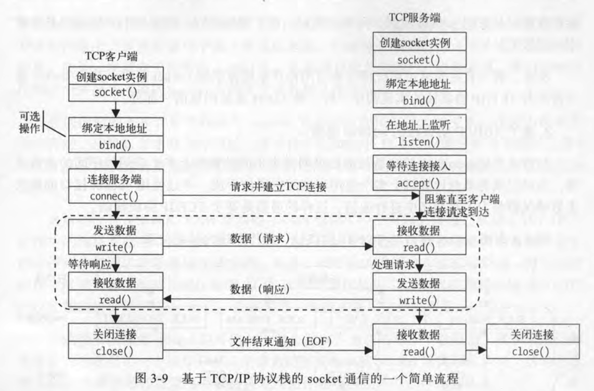
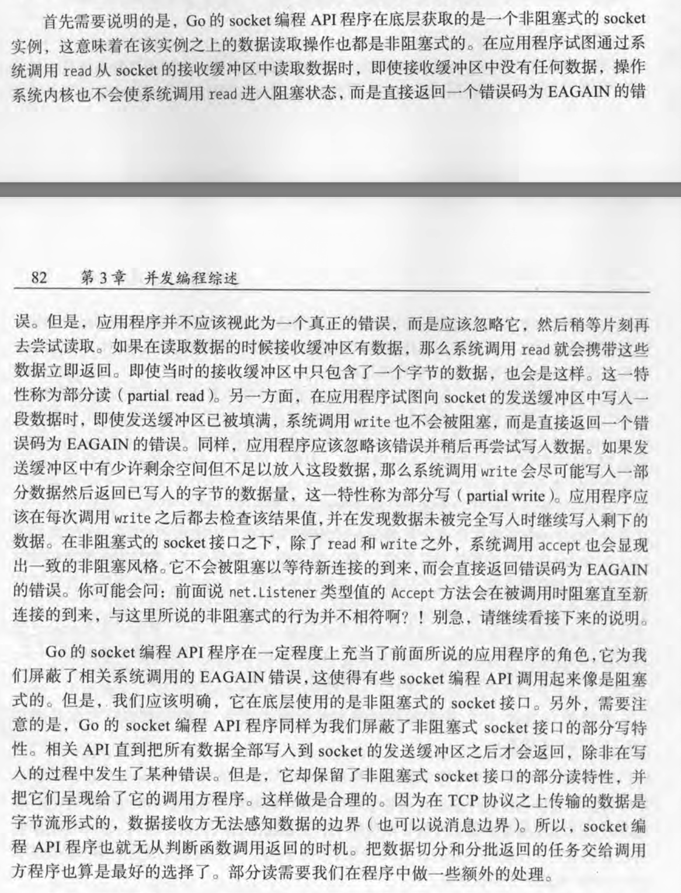
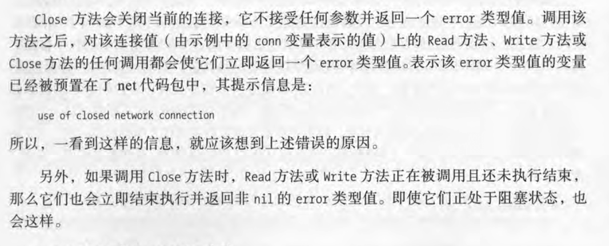
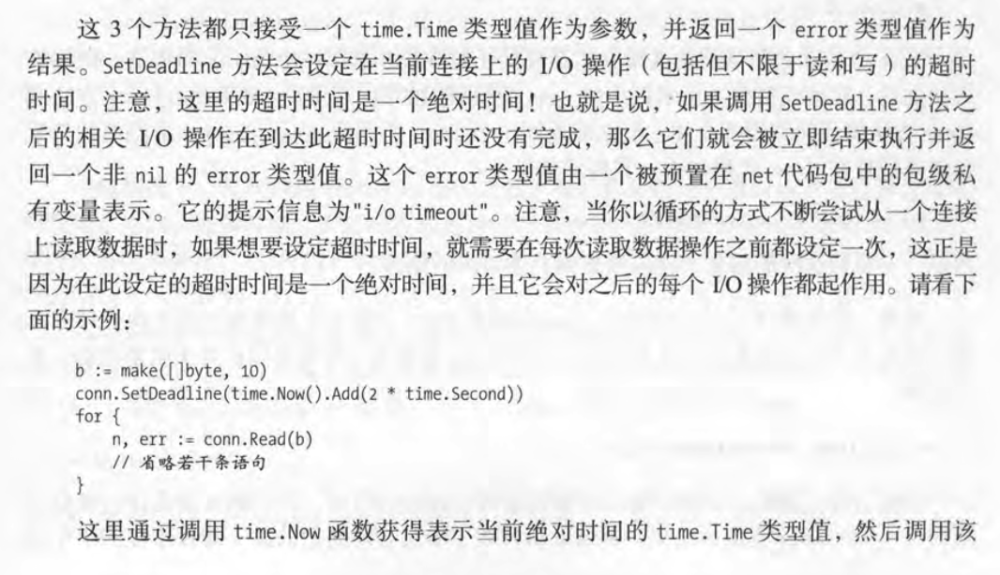
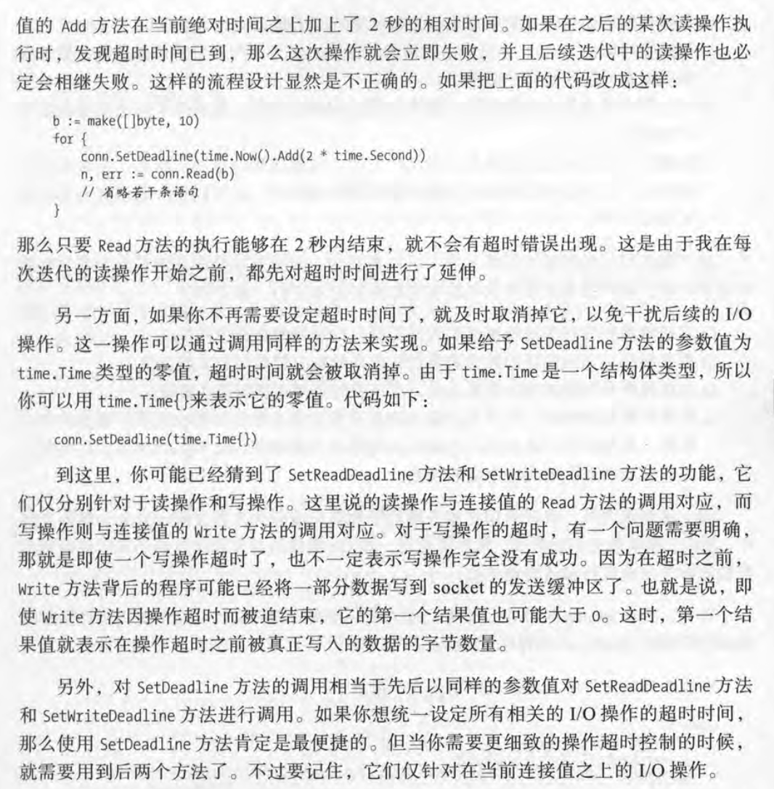

## 概览

`socket`  数据形式有两种：数据报和字节流。

1. 以数据报为数据形式意味着数据接收方的 socket 接口程序可以意识到数据的边界并会对它们进行切分，这样就省去了接受方的应用程序寻找数据边界和切分数据的工作量。
2. 以字节流为数据形式的数据传输实际上传输的是一个字节接着一个字节的串，我们可以把它想象成一个很长的字节数组。一般情况下，字节流并不能体现出那些字节属于哪个数据包。因此，socket 接口程序是无法从中分离出独立的数据包的，这一工作只能由应用程序去完成。



## net.Listen

```go
func Listen(network, address string) (Listener, error)
```

用于获取监听器，他接受两个 `string` 类型的参数。第一个参数的含义是以何种协议监听给定的地址。

`net.Listen` 函数的第一个参数的值必须是 tcp、tcp4、tcp6、unix 和 unixpacket 中的一个。

address 它的格式是 `host:port`

```go
listener, err := net.Listen("tcp", "127.0.0.1:8888")
```

`net.Listen` 函数被调用之后，会返回两个结果值：第一个结果值是 `net.Listener` 类型的，它代表的就是接听器；第二个结果值是一个 `error` 类型的值，记得一定要先判断该值是否为`nil`。在进行必要的检查之后，就可以开始等待客户端的连接请求了。

```go
conn, err := listener.Accept()
```

当调用监听器的 `Accept` 方法时，流程会被阻塞，直到某个客户端程序与当前程序建立 TCP 连接。Accept 方法会返回两个结果值：1. 代表了当前 TCP 连接的 `net.Conn` 类型值，2. 结果值依然是一个 `error` 类型的值。

在创建监听器并开始等待连接请求之后，一旦收到客户端的连接请求，服务端就会与客户建立 TCP 连接（三次握手）。当然，这个连接的建立过程使两端的操作系统内核共同协调完成的。当成功建立连接之后，不论服务端程序还是客户端程序，都会得到一个 `net.Conn` 类型的值。在这之后，通信两端就可以分别利用各自的 `net.Conn` 类型值交换数据了。

## net.Dial

```go
func Dial(network, address string) (Conn, error)
```

`net.Dial` 用于向指定的网络地址发送连接建立申请。

```go
conn,err := net.Dial("tcp","127.0.0.1:8888")
```

函数 `net.Dial` 在调用后也返回两个结果值：一个是 `net.Conn` 类型的值，另一个是 `error` 类型的值。若参数值不合法，则第二个结果值一定会是非 `nil` 的。对基于 TCP 协议的连接请求来说，当远程地址上没有正在监听的程序时，会使 `net.Dial` 函数返回一个非`nil`  的 `error`  类型的值。

## net.DialTimeout

网络中存在延时现象，因此，在收到另一方的有效回应（无论连接成功或失败）之前，发送连接请求的一方会等待一段时间。表现为流程在调用 `net.Dial` 函数的那行代码上一直阻塞。在超过这个等待时间之后，函数的执行就会结束返回相应的 `error` 的值。

```go
func DialTimeout(network, address string, timeout time.Duration) (Conn, error)
```

如果想把请求 tcp 连接的同时把超时时间设定为 2 秒。

```go
conn, err := net.DialTimeout("tcp","127.0.0.1:8888",time.Second*2)
```

## net.Conn



### Read 方法

`Read` 方法用于从 socket 的接收缓冲区中读取数据。

```go
Read(b []byte) (n int, err error)
```


### write 方法

`write`  方法用于向 socket 的发送缓冲区写入数据。

```go
Write(b []byte) (n int, err error)
```


### Close 方法



### LocalAddr 和 RemoteAddr 方法

它们返回一个 `net.Addr` 类型的结果。其结果值代表了参与当前通信的某一端程序在网络中的地址。`LocalAddr` 方法返回的结果值代表本地地址，而 `RemoteAddr` 方法返回的结果值则代表了远程地址。

```go
type Addr interface {
	Network() string // name of the network (for example, "tcp", "udp")
	String() string  // string form of address (for example, "192.0.2.1:25", "[2001:db8::1]:80")
}
```

### SetDeadline、SetReadDeadline、SetWriteDeadline





## 例子

### 代码

```go
package http_server

import (
	"bytes"
	"fmt"
	"io"
	"math/rand"
	"net"
	"strconv"
	"strings"
	"sync"
	"time"
)

var Wg sync.WaitGroup

const (
	SERVER_NETWORK = "tcp"
	SERVER_ADDRESS = "127.0.0.1:8888"
	DELIMITER      = '\t' //作为数据边界
)

func printLog(role string, sn int, format string, args ...interface{}) {
	if !strings.HasPrefix(format, "\n") {
		format += "\n"
	}
	fmt.Printf("%s[%d]:%s", role, sn, fmt.Sprintf(format, args...))
}

func printServerLog(format string, args ...interface{}) {
	printLog("Server", 0, format, args...)
}

func printClientLog(sn int, format string, args ...interface{}) {
	printLog("Client", sn, format, args...)
}

func ServerGo() {
	defer Wg.Done()
	//1.创建监听
	listener, err := net.Listen(SERVER_NETWORK, SERVER_ADDRESS)
	if err != nil {
		printServerLog("Listen Error:%s", err)
		return
	}
	defer listener.Close()
	printServerLog("Got listener for the server.(local address:%s)", listener.Addr())
	//2. 等待客户端的连接请求
	for {
		//阻塞直至新连接到来
		conn, err := listener.Accept()
		if err != nil {
			printServerLog("Accept Error %s", err)
		}
		printServerLog("Established a connection with a client application.(remote address:%s)", conn.RemoteAddr())
		//处理连接
		go handleConn(conn)
	}
}

func handleConn(conn net.Conn) {
	//保证连接及时关闭
	defer conn.Close()
	//服务器程序需要不断尝试从已建立的连接中读取数据，这样才能保证尽量及时地处理和响应请求。
	for {
		conn.SetReadDeadline(time.Now().Add(10 * time.Second))
		strReq, err := read(conn)
		if err != nil {
			//连接关闭，返回 io.EOF
			if err == io.EOF {
				printServerLog("The connection is closed by another side.")
			} else {
				printServerLog("Read Error %s", err)
			}
			break
		}
		printServerLog("Received request:%s.", strReq)
		//处理请求的业务逻辑
		intReq, err := strToInt32(strReq)
		if err != nil {
			n, err := write(conn, err.Error())
			printServerLog("Send error message (written %d bytes): %s.", n, err)
			continue
		}
		floatReq := intReq * intReq * intReq
		respMsg := fmt.Sprintf("The cube root of %d is %d.", intReq, floatReq)
		n, err := write(conn, respMsg)
		if err != nil {
			printServerLog("Write Error: %s", err)
			continue
		}
		printServerLog("Sent response (written %d bytes): %s", n, respMsg)
	}
}

func strToInt32(req string) (int32, error) {
	i64, err := strconv.ParseInt(req, 10, 32)
	if err != nil {
		return 0, err
	}
	return int32(i64), nil
}

func write(conn net.Conn, content string) (int, error) {
	var buffer bytes.Buffer
	buffer.WriteString(content)
	//在每次发送的数据后面，都要追加一个数据分隔符，这样才能形成一个两端程序均可识别的数据块。
	buffer.WriteByte(DELIMITER)
	return conn.Write(buffer.Bytes())
}

func read(conn net.Conn) (string, error) {
	// readBytes 初始化长度为1的原因是，防止从连接值中读出多余的数据从而对后续的读取操作造成影响
	readBytes := make([]byte, 1)
	// 为了暂存当前数据块中的字节，用 bytes.Buffer 类型值来存储。
	var buffer bytes.Buffer
	for {
		_, err := conn.Read(readBytes)
		if err != nil {
			return "", err
		}
		// 每次读取一个字节的数据，都要检查是否是数据分隔符。如果不是，就继续读取下一个字节。否则就停止读取返回结果
		readByte := readBytes[0]
		if readByte == DELIMITER {
			break
		}
		buffer.WriteByte(readByte)
	}
	return buffer.String(), nil
}

func ClientGo(id int) {
	defer Wg.Done()
	// 首先试图与服务端程序建立连接。
	conn, err := net.DialTimeout(SERVER_NETWORK, SERVER_ADDRESS, 2*time.Second)
	if err != nil {
		printClientLog(id, "Dial Error:%s", err)
		return
	}
	defer conn.Close()
	printClientLog(id, "Connected to server.(remote address:%s,local address: %s)", conn.RemoteAddr(), conn.LocalAddr())
	time.Sleep(200 * time.Millisecond)
	// 发送的数据
	requestNumber := 5
	conn.SetWriteDeadline(time.Now().Add(5 * time.Millisecond))
	for i := 0; i < requestNumber; i++ {
		req := rand.Intn(20)
		n, err := write(conn, fmt.Sprintf("%d", req))
		if err != nil {
			printClientLog(id, "Write Error: %s", err)
			continue
		}
		printClientLog(id, "Sent request (written %d bytes): %d.", n, req)
	}
	for j := 0; j < requestNumber; j++ {
		strResp, err := read(conn)
		if err != nil {
			if err == io.EOF {
				printClientLog(id, "The connection is closed by another side.")
			} else {
				printClientLog(id, "Read Error: %s", err)
			}
			break
		}
		printClientLog(id, "Received response. %s.", strResp)
	}
}
```


