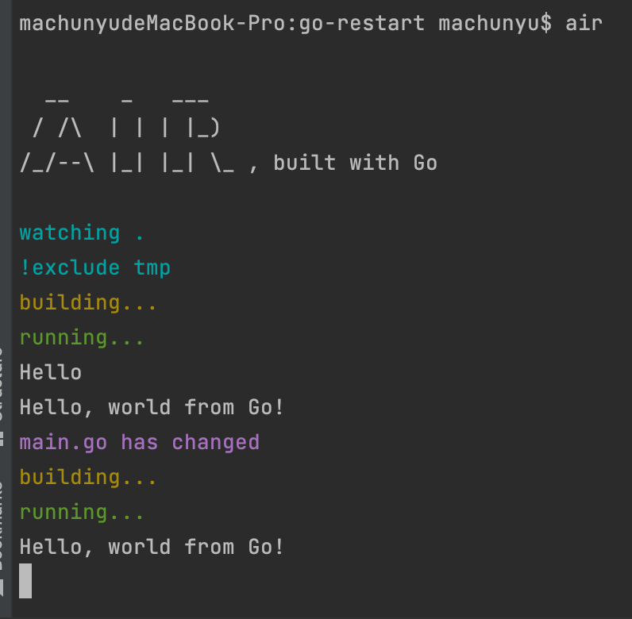

## 交叉编译

查看支持的系统和cpu架构，下面的命令会列出所有 go 语言支持的操作系统和 cpu 架构。

```shell
go tool dist list
```

### Mac 中设置

```shell
go env -w GOARCH="amd64"
go env -w GOOS="linux"
go env -w CGO_ENABLED=0
```

### windows

```shell
set GOOS=linux #具体设置 linux darwin windows 等
set GOARCH=amd64 #具体设置还是要看目标系统 cpu 架构
set CGO_ENABLED=0 #
```

### 实例

```go
// demo.go 
package main

import "fmt"

func main() {
    fmt.Println("hello world")
}
```

### 编译 linux 环境 amd64 

```shell
go env -w GOARCH="amd64"
go env -w GOOS="linux"
go env -w CGO_ENABLED=0

go build -o demo demo.go

# 将当前 demo 运行程序放到 linux 服务器上运行
```

## 多个版本安装

官方维护了一个 [软件包](https://github.com/golang/dl) ，我们可以通过安装普通软件包的方式来获取具体版本的安装工具。

1. 使用 `go get` 命令指定安装的 Golang 版本的下载地址，执行该命令后，会下载到目录 `$GOPATH/bin` 中一个可执行文件，比如 `go1.17`。
2. 执行命令 `go1.17 download`，下载 sdk，下载目录为 `$HOME/sdk/`，查看该目录，我们可以发现该目录中有一个目录名为 `go1.17` 的目录。
3. 验证是否安装成功

```shell
go get golang.org/dl/go1.17
go1.17 download
go1.17 version
```

## 使用 air 热重启

### 初始化项目

```shell
go mod init github.com/mcy689/go_restart
```

### 安装 [air](https://github.com/cosmtrek/air)

```shell
go get -v -u github.com/cosmtrek/air@v1.27.8
```

### 示例

