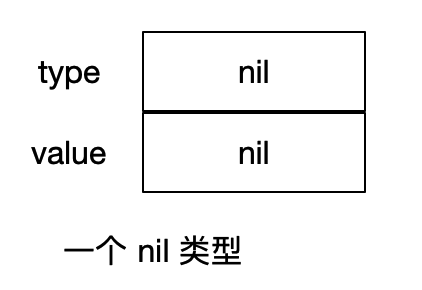
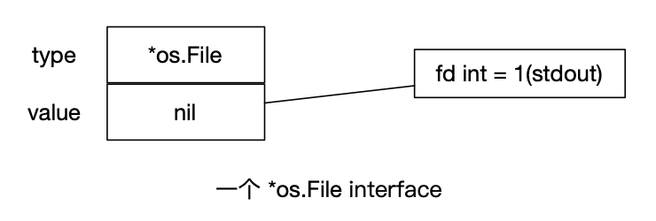

## 接口

1. **数据类型的意义** ：可以准确描述它所代表的值，并且展示出对类型本身的一些操作方式。也就是说，当你拿到一个具体的类型时就知道它的本身是什么和你可以用它来做什么。
2. **接口类型** 接口类型是一种抽象的类型。它不会暴露出它所代表的对象的内部值的结构和这个对象支持的基础操作的集合。它们只会表现出它们自己的方法。也就是说唯一知道的就是可以通过它的方法来做什么。

## 接口命名

单个函数的结构名以 `er` 作为后缀，例如 Reader，Writer。

## 接口的零值

接口的零值是`nil` 。一个 `nil` 接口的底层类型和值都是`nil` 。

## 空接口

一个没有声明任何方法的接口称为空接口。`interface{}` 表示空接口。因为空接口没有方法，因此所有类型都实现了空接口。

```go
func describe(i interface{}) {
	fmt.Printf("Type = %T,value = %v\n", i, i)
}

func TestEmptyInterface(t *testing.T) {
	sString := "hello world"
	describe(sString)  //Type = string,value = hello world
	iInt := 90         //Type = int,value = 90
	describe(iInt)
}
```

由于上面程序中方法 `describe(i interface{})` 参数为空接口值，所以任何参数都可以传递给它。

## 实现接口的条件

**实现** 一个类型如果拥有一个接口需要的所有方法，那么这个类型就实现了这个接口。

**接口指定的规则：** 表达一个类型属于某个接口只要这个类型实现这个接口。

```go
var w io.Writer
w = os.Stdout  //ok: *os.File has Write method
w = new(bytes.Buffer) //ok: *bytes.Buffer has Write method
w = time.Second //compile error: time.Duration lacks Write method
```

## 接口完整性检查

go 语言的编程器并没有严格检查一个对象是否实现了某接口所有的接口方法。

```go
type Shape interface {
	Sides() int
	Area() int
}

type Square struct {
	len int
}

func (s *Square) Sides() int {
	return s.len * 2
}

func TestComplete(t *testing.T){
	s := Square{len: 2}
	fmt.Printf("%d\n",s.Sides())
}
```

这段代码虽然 `Square` 实现了 `Shape` 接口的部分方法，程序虽然可以跑通，但是这样编程的方式并不严谨。下面这种方式强制约束要实现接口的所有方法。

```go
var _ Shape = (*Square)(nil)
```

 **规则** ：等号左侧声明一个 `_` 变量，其类型为接口 `Shape` 。右侧对应类型的零值，强制转换。（`*Square` 的零值为nil）

## 组合接口类型

```go
//源码文件中io包
  package io

  type Reader interface {
    Read(p []byte) (n int, err error)
  }

  type ReadWriter interface {
    Reader
    Writer
  }
```

## 方法集规则

### 调用者来看

```html
Values             methods reveiver

---------------------------------------

值类型：T           (T type)
指针类型：*T        (T Type) 或（T *Type） 
```

1. T 类型的值的方法集只包含值接收者声明的方法。
2. 指向 T 类型的指针的方法集既包含值接受者声明的方法，也包含指针接受者声明的方法。

### 接受者来看

```html
methods Receivers               values

-----------------------------------------

(t T)                           T and *T
(t *T)                          *T
```

1. 使用指针接收者来实现一个接口，那么只有指向那个类型的指针才能够实现对应的接口。
2. 使用值接收者来实现一个接口，那么那个类型的值和指针都能够实现对应的接口。

3. 例子

   ```go
   package code
   
   import (
   	"fmt"
   	"testing"
   )
   
   type notifier interface {
   	notify()
   }
   
   type user struct {
   	name  string
   	email string
   }
   
   //使用指针接收者实现的方法
   func (u *user) notify() {
   	fmt.Printf("Sending user email to %s<%s>\n", u.name, u.email)
   }
   
   //接收一个实现了 notifier 接口的值
   func sendNotification(n notifier){
   	n.notify()
   }
   
   func TestInterface(t *testing.T) {
   	u := user{"Bill","bill@email.com"}
   	//sendNotification(u)     //报错
     sendNotification(&u)    //通过
   }
   ```

## 接口值

1. 概念上讲一个接口的值即接口值。有两部分组成，一个具体的类型和那个类型的值。`(type,value)` 它们被称为接口的动态类型和动态值。

2. 在Go语言中，变量总是被一个定义明确的值初始化，即使接口类型也不例外。对于一个接口的零值就是它的类型和值的部分都是nil。

  

### 判断接口值为空

可以通过使用 `w == nil` 或者 `w != nil` 来判断接口值是否为空。调用一个空接口值上的任意方法都会产生panic。

```go
var w io.Writer
w = os.Stdout
w.Write([]byte("hello world")) //通过
fmt.Printf("%v",w == nil) //true

w = nil
w.Write([]byte("hello world")) //panic
```

### 赋值过程

```go
w = os.Stdout
```

这个赋值过程调用了一个具体类型到接口类型的隐式转换，这和显式的使用 `io.Writer(os.Stdout)` 等价。



## 接口型函数

### 使用场景

1. 接口型函数：指的是函数实现接口，这样在调用的时候就会非常简便。
2. 限制：接口型函数只能应用于接口内部只定义了一个方法的情况。
3. 这样，既能够将普通的函数类型（需类型转换）作为参数，也可以将结构体作为参数，使用更为灵活，可读性也更好，这就是接口型函数的价值。

### 示例

定义一个接口 Handler，只包含一个方法 `Do(k string, v int)` ，紧接着定一个函数类型 `HandleFunc` ，`HandleFunc` 参数和返回值与 `Handler` 中 `Do` 方法是一致的。而且 `HandleFunc` 还定义了 `Do` 方法，并在 `Do` 方法中调用自己，这样就实现了接口 `Handler` 。

```go
type Handler interface{
  Do(k string, v int)
}

type HandleFunc func(k string, v int)

func (f HandleFunc) Do(k string, v int) {
  f(k, v)
}
```

## 类型断言

类型断言用来提取接口的实际类型的值。

```go
var testInt interface{} = 56
v, ok := i.(int)
fmt.Printf("%T,%v\n",v, ok) //int,true
```

### Type Switch

类型分支用来将一个接口的具体类型与多个`case` 语句指定的类型进行比较。

```go
func assertType(i interface{}){
	switch i.(type) {
	case string:
		fmt.Printf("I am a string and my value is %s\n", i.(string))
	case int:
		fmt.Printf("I am an int and my value is %d\n", i.(int))
	default:
		fmt.Printf("Unknown type\n")
	}
}
```

