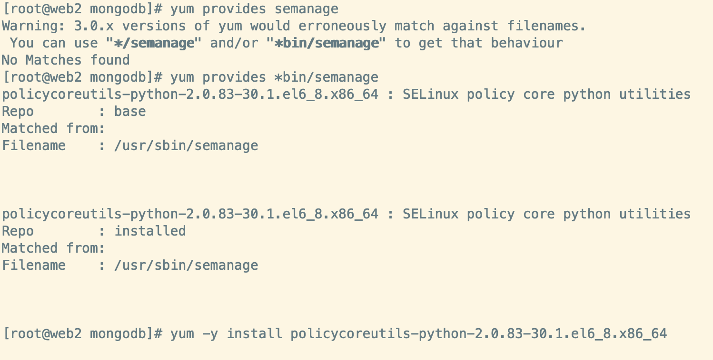

## logrotate 切割日志配置

### 配置 logrotate

1. 配置目录 `/etc/logrotate.d/` 

2. mognodb

   ```html
   /mongodb_path/run.log
   {
      daily
      rotate 7
      missingok
      olddir /mongodb_path/log/log_rotate
      create 0644 root root
      notifempty
      nocompress
      sharedscripts
      postrotate
        /bin/kill -SIGUSR1 $(cat /mongodb_path/mongod.pid)
      endscript
   }
   ```

3. nginx

   ```html
   /nginx_path/logs/*.log
   {
       daily
       rotate 7
       olddir /nginx_path/logs/log_rotate
       missingok
       notifempty
       nocompress
       dateext
       create 0644 root root
       sharedscripts
       postrotate
           locate nginx.pid | xargs cat | xargs kill -USR1
       endscript
   }
   ```

### selinux 特殊处理

1. 检查新增的配置文件的权限，是否跟原有的配置文件一致。如不一致，需修正。

   ```shell
   ls -Zalh /etc/logrotate.d/
   ```

2. 把需要切割的日志文件以及日志文件所在的目录，都设置 SELinux 的 `var_log_t` 类型权限（注意 `mongodb` 路径需改为实际路径），就解决权限的问题了：

   ```shell
   chcon -t var_log_t /usr/local/mongodb/logs
   chcon -t var_log_t /usr/local/mongodb/logs/*
   ```

3. 如果配置以后查看 `cat /var/log/messages | grep logrotate` 发现 `logrotate: ALERT exited abnormally with [1]` 错误。[参看这篇文章](https://access.redhat.com/solutions/39006)

   

   ```shell
   1. yum provides semanage 
   2. yum provides *bin/semanage
   3. yum -y install policycoreutils-python-2.0.83-30.1.el6_8.x86_64
   ```

4. 设置上下文

   ```shell
   semanage fcontext -a -t var_log_t '/usr/local/mongodb/logs(/.*)?'
   ```

   查看设置的上下文

   ```shell
   cat /etc/selinux/targeted/contexts/files/file_contexts.local
   ```

### 注意

遇到 Logrotate 不能正常工作时，可以按照以下步骤排错：

1. Logrotate以Debug模式（只显示执行结果，不进行实际操作）执行一下，测试配置文件是否有误

   ```shell
   /usr/sbin/logrotate -dv /etc/logrotate.conf
   ```

2. 检查日志文件`/var/log/messages`，看 Logrotate 执行时是否有报错

   ```shell
   cat /var/log/messages | grep logrotate
   ```

3. Logrotate每日操作的操作日志，会记录在`/var/spool/mail/root`，从该文件可以查看更详细的错误。

4. 如第3点有权限相关的报错，检查权限记录日志`/var/log/audit/audit.log`，看有没有Logrotate的权限错误日志。通常会提示哪些日志文件是否存在权限不足导致不能访问。

   ```shell
   cat /var/log/audit/audit.log | grep logrotate
   ```

