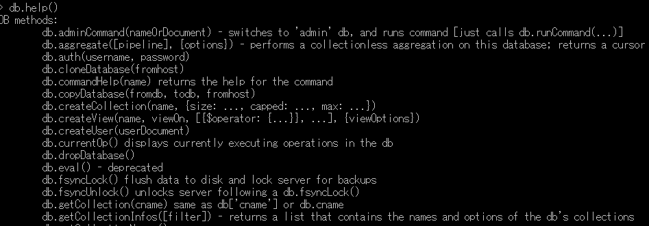

### MongoDB

####MongoDB 启动配置说明

```html
mongod --help 查看启动详细参数
mongodb的参数说明：  
--dbpath 数据库路径(数据文件)  
--logpath 日志文件路径  
--master 指定为主机器

--slave 指定为从机器  
--source 指定主机器的IP地址  
--pologSize 指定日志文件大小不超过64M.因为resync是非常操作量大且耗时，最好通过设置一个足够大的oplogSize来避免resync(默认的 oplog大小是空闲磁盘大小的5%)。  
--logappend 日志文件末尾添加  
--port 启用端口号   默认 27017 端口
--fork 在后台运行  
--only 指定只复制哪一个数据库  
--slavedelay 指从复制检测的时间间隔  
--auth 是否需要验证权限登录(用户名和密码)
```
#### 启动MongoDB

```html
windows 环境启动 mongodb 数据库的
mongod.exe --storageEngine mmapv1 --dbpath D:\MongoDBDATA
mongod.exe --dbpath D:\MongoDBDATA
```
* 看到这个说明数据库启动成功

  

 #### Mongodb和关系型数据库

|    对比项    |      mongoDB      |     mysql      |
| :----------: | :---------------: | :------------: |
|      表      | 集合(Collection ) |     table      |
| 表的一行数据 |   文档Document    | 一条记录record |
|    表字段    |      键 key       |   字段 field   |
|    字段值    |     值 value      |    值value     |
|    主外键    |        无         |     pk,fk      |
| 灵活度扩展性 |       极高        |       差       |

#### Mongodb客户端

* 默认是用test用户启动mongodb客户端 , 使用超级管理员启动 `mongo 127.0.0.1/admin`

#### 数据库操作命令

1. 使用use关键字创建数据库

   `use foobar` 

2. 插入一条数据 ` 语法结构 db.documentName.insert({})`

    ` db.persons.insert({"name":"测试"})` 

3. 查看全部数据
     `show dbs` 

4. 查询数据库中的文档
     `show collections` 

5. 查看文档(document中的内容)

   ```html
   db.persons.find()
   { "_id" : ObjectId("5b12ba34ea0972c724e10b5d"), "name" : "测试" }
   
   查看一条数据
   db.persons.findOne()
   { "_id" : ObjectId("5b12ba34ea0972c724e10b5d"), "name" : "测试" }
   ```

6. 删除数据

   1. 删除文档的数据

      ```html
      > db.persons.remove({"name":"测试"})
      WriteResult({ "nRemoved" : 1 })
      > db.persons.find()
      { "_id" : ObjectId("5b12bbe6ea0972c724e10b5e"), "name" : "测试第二条数据" }
      ```

      - remove() 方法已经过时了，现在官方推荐使用 `deleteOne()` 和 `deleteMany()` 方法。

        如删除集合下全部文档：

        ```
        db.inventory.deleteMany({})
        ```

        删除 status 等于 A 的全部文档：

        ```
        db.inventory.deleteMany({ status : "A" })
        ```

        删除 status 等于 D 的一个文档：

        ```
        db.inventory.deleteOne( { status: "D" })
        ```

   2. 删除集合

      * 删除集合  `db.persons.drop()`

   3. 删除数据库  ` db.dropDatabase()`

#### 查看帮助文档

1. 数据库级别的帮助 `db.help()` 

2. 查看集合的帮助 ` db.person.help()`

   

#### 数据库和集合命名规范

1. 数据库名可以是满足以下条件的任意UTF-8字符串。
   - 不能是空字符串（"")。
   - 不得含有' '（空格)、.、$、/、\和\0 (空字符)。
   - 应全部小写。
   - 最多64字节。
2. 有一些数据库名是保留的，可以直接访问这些有特殊作用的数据库。
   - **admin**： 从权限的角度来看，这是"root"数据库。要是将一个用户添加到这个数据库，这个用户自动继承所有数据库的权限。一些特定的服务器端命令也只能从这个数据库运行，比如列出所有的数据库或者关闭服务器。
   - **local:** 这个数据永远不会被复制，可以用来存储限于本地单台服务器的任意集合
   - **config**: 当Mongo用于分片设置时，config数据库在内部使用，用于保存分片的相关信息。
3. 文档键命名规范：
   - 键不能含有`\0` (空字符)。这个字符用来表示键的结尾。
   - `.`和`$`有特别的意义，只有在特定环境下才能使用。
   - 以下划线"_"开头的键是保留的(不是严格要求的)。
   - 需要注意的是：
     1. 文档中的键/值对是有序的。
     2. 文档中的值不仅可以是在双引号里面的字符串，还可以是其他几种数据类型（甚至可以是整个嵌入的文档)。
     3. MongoDB区分类型和大小写。
     4. MongoDB的文档不能有重复的键。
     5. 文档的键是字符串。除了少数例外情况，键可以使用任意`UTF-8`字符。

#### MongoDB支持的数据类型

1. String：字符串。存储数据常用的数据类型。在 MongoDB 中，UTF-8 编码的字符串才是合法的。 
2. Integer：整型数值。用于存储数值。根据你所采用的服务器，可分为 32 位或 64 位。  
3. Boolean：布尔值。用于存储布尔值（真/假）。 
4.  Double：双精度浮点值。用于存储浮点值。 
5.  Min/Max keys：将一个值与 `BSON`（二进制的 JSON）元素的最低值和最高值相对比。 
6.  Arrays：用于将数组或列表或多个值存储为一个键。  
7. Timestamp：时间戳。记录文档修改或添加的具体时间。  
8. Object：用于内嵌文档。  
9. Null：用于创建空值。 
10. Symbol：符号。该数据类型基本上等同于字符串类型，但不同的是，它一般用于采用特殊符号类型的语言。
11.  Date：日期时间。用 UNIX 时间格式来存储当前日期或时间。你可以指定自己的日期时间：创建 Date 对象，传入年月日信息。  
12. Object ID：对象 ID。用于创建文档的 ID。  
13. Binary Data：二进制数据。用于存储二进制数据。
14. Code：代码类型。用于在文档中存储 JavaScript 代码。  
15. Regular expression：正则表达式类型。用于存储正则表达式。

####MongoDB视图工具 mongodbVUE 破解

* windows  ---->  运行  ----> regedit  -----> 查找`4FF78130` ----> 将其中的东西删除

