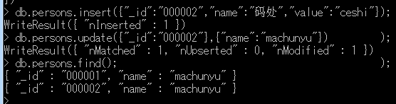

### Mongodb(版本 3.6)

#### Mongodb插入数据

1. 插入单条数据

   ```html
    db.persons.insert({"name":"用户名","sex":"男","phone":"18335187448","level":"等级"})
   ```

2. save操作 

   * 如果`_id` 相同会变成更新操作, 而insert是有插入错误的提示

   ```html
   db.persons.save({"_id":"0001","name":"用户昵称"})
   ```

#### Mongodb删除数据

1. 删除列表中所有数据

   ```html
   remove() 方法已经过时了，现在官方推荐使用 deleteOne() 和 deleteMany() 方法。
   如删除集合下全部文档：
     db.inventory.deleteMany({})
   删除 status 等于 A 的全部文档：
     db.inventory.deleteMany({ status : "A" })
   删除 status 等于 D 的一个文档：
     db.inventory.deleteOne( { status: "D" })
   ```

2. 删除指定条件的数据

   ```html
   db.persons.remove({"_id":1})
   ```

3. 删除较大数据量的数据, 直接删除该集合并且重新建立索引的办法比直接使用remove的效率高

   ```html
    db.persons.drop()
   ```

#### Mongodb更新数据

1. 强硬的文档替换式更新操作

   * db.documentName.updated({查询器},{修改器}), __其实是一个替换操作__

   

   * 主键冲突的时候会报错并且停止更新的操作, __其实这个操作更像是将数据删除后又添加的做法__ 

     

   * db.documentName.updated({查询器},{修改器},true) 如果存在就更新, 如果不存在就插入

     ```html
     db.persons.update({"_id":5},{"name":"ceshi","_id":5},true)
     ```

   * 批量更新

     ```html
     使用了修改器
     db.persons.update({"name":"ceshi"},{"$set":{"name":"ceshi4"}},false,true);
     ```

     

   	​		

2. 更新器

   1. $inc   修改器$inc可以对文档的某个值为数字型（只能为满足要求的数字）的键进行增减的操作。 

      * id的自动增长

      ```html
      增加
          > db.persons.update({"_id":5},{$inc:{"age":1}})
          WriteResult({ "nMatched" : 1, "nUpserted" : 0, "nModified" : 1 })
          > db.persons.find();
          { "_id" : "1", "name" : "码处", "value" : "测试" }
          { "_id" : "2", "name" : "码处2", "value" : "测试2" }
          { "_id" : "3", "name" : "码处3", "value" : "测试3" }
          { "_id" : 4, "name" : "ceshi5" }
          { "_id" : 5, "name" : "ceshi5", "age" : 11 }
          >
      减少
      	> db.persons.update({"_id":5},{$inc:{"age":-2}})
          WriteResult({ "nMatched" : 1, "nUpserted" : 0, "nModified" : 1 })
          > db.persons.find();
          { "_id" : "1", "name" : "码处", "value" : "测试" }
          { "_id" : "2", "name" : "码处2", "value" : "测试2" }
          { "_id" : "3", "name" : "码处3", "value" : "测试3" }
          { "_id" : 4, "name" : "ceshi5" }
          { "_id" : 5, "name" : "ceshi5", "age" : 9 }
          >
      ```

   2. $set    用来指定一个键并更新键值，若键不存在并创建 

      * 对于没有存在的就在这数据后面追加

        ```html
        > db.persons.update({"_id":5},{"$set":{"age":10}})
        WriteResult({ "nMatched" : 1, "nUpserted" : 0, "nModified" : 1 })
        > db.persons.find();
        { "_id" : "1", "name" : "码处", "value" : "测试" }
        { "_id" : "2", "name" : "码处2", "value" : "测试2" }
        { "_id" : "3", "name" : "码处3", "value" : "测试3" }
        { "_id" : 4, "name" : "ceshi5" }
        { "_id" : 5, "name" : "ceshi5", "age" : 10 }
        ```

   3. $unset   主要是用来删除键。 

      ```html
      > db.persons.update({"_id":5},{$unset:{"age":1}})
      WriteResult({ "nMatched" : 1, "nUpserted" : 0, "nModified" : 1 })
      > db.persons.find()
      { "_id" : "1", "name" : "码处", "value" : "测试" }
      { "_id" : "2", "name" : "码处2", "value" : "测试2" }
      { "_id" : "3", "name" : "码处3", "value" : "测试3" }
      { "_id" : 4, "name" : "ceshi5" }
      { "_id" : 5, "name" : "ceshi5" }
      ```

   4. $push 数组修改器 (`https://docs.mongodb.com/v3.2/reference/operator/update/addToSet/`)

      * 如果指定的键是数组, 则追加新的数组
      * 如果指定的键不是数组则中断当前操作
      * 如果不存在指定的键, 则创建数组类型的键值对

      ```html
      追加新的数组    
      	> db.persons.insert({"_id":6,"books":[]})
          WriteResult({ "nInserted" : 1 })
          > db.persons.find();
          { "_id" : "1", "name" : "码处", "value" : "测试" }
          { "_id" : "2", "name" : "码处2", "value" : "测试2" }
          { "_id" : "3", "name" : "码处3", "value" : "测试3" }
          { "_id" : 4, "name" : "ceshi5" }
          { "_id" : 5, "name" : "ceshi5" }
          { "_id" : 6, "books" : [ ] }
          > db.persons.update({"_id":6},{$push:{"books":"js"}})
          WriteResult({ "nMatched" : 1, "nUpserted" : 0, "nModified" : 1 })
          > db.persons.find();
          { "_id" : "1", "name" : "码处", "value" : "测试" }
          { "_id" : "2", "name" : "码处2", "value" : "测试2" }
          { "_id" : "3", "name" : "码处3", "value" : "测试3" }
          { "_id" : 4, "name" : "ceshi5" }
          { "_id" : 5, "name" : "ceshi5" }
          { "_id" : 6, "books" : [ "js" ] }
          > db.persons.update({"_id":6},{$push:{"books":"php"}})
          WriteResult({ "nMatched" : 1, "nUpserted" : 0, "nModified" : 1 })
          > db.persons.find();
          { "_id" : "1", "name" : "码处", "value" : "测试" }
          { "_id" : "2", "name" : "码处2", "value" : "测试2" }
          { "_id" : "3", "name" : "码处3", "value" : "测试3" }
          { "_id" : 4, "name" : "ceshi5" }
          { "_id" : 5, "name" : "ceshi5" }
          { "_id" : 6, "books" : [ "js", "php" ] }
      
      不存在则新加
      	> db.persons.update({"_id":6},{$push:{"class":"01"}})
          WriteResult({ "nMatched" : 1, "nUpserted" : 0, "nModified" : 1 })
          > db.persons.find()
          { "_id" : "1", "name" : "码处", "value" : "测试" }
          { "_id" : "2", "name" : "码处2", "value" : "测试2" }
          { "_id" : "3", "name" : "码处3", "value" : "测试3" }
          { "_id" : 4, "name" : "ceshi5" }
          { "_id" : 5, "name" : "ceshi5" }
          { "_id" : 6, "books" : [ "js", "php" ], "class" : [ "01" ] }
      批量添加数据
      	db.persons.update(
      		{"_id":6},
      		{$push:{class:{$each:[2,3,4]}}}
      	)
      ```

   5. $ addToSet操作符为数组添加一个值，如果该值已经存在$ addToSet对该数组不做任何操作。 

      ```html
      db.persons.update({"_id":6},{$addToSet:{"class":js}})
      ```

      * 可以实现如果存在js,就不会写入js了, 只会将db写入, 批量判断式的导入

        ```html
        db.persons.update({"_id":6},{$addToSet:{class:{$each:["js","db"]}}})
        ```

   6. $ pop操作符删除数组的第一个或最后一个元素。

      ```html
      //删除数组的第一个元素 
      db.persons.update({"_id":6},{$pop:{"class":-1}}); 
      //删除数组的最后一个元素
       db.persons.update({"_id":6},{$pop:{"class":1}});
      ```

   7. $ pull操作符从现有数组中删除与指定条件匹配的一个或多个值

      ```html
      > db.persons.find();
      { "_id" : "1", "name" : "码处", "value" : "测试" }
      { "_id" : "2", "name" : "码处2", "value" : "测试2" }
      { "_id" : "3", "name" : "码处3", "value" : "测试3" }
      { "_id" : 4, "name" : "ceshi5" }
      { "_id" : 5, "name" : "ceshi5" }
      { "_id" : 6, "books" : [ "php" ], "class" : [ 3, 4, 8, 9 ] }
      > db.persons.update({"_id":6},{$pull:{"class":8}})
      WriteResult({ "nMatched" : 1, "nUpserted" : 0, "nModified" : 1 })
      > db.persons.find();
      { "_id" : "1", "name" : "码处", "value" : "测试" }
      { "_id" : "2", "name" : "码处2", "value" : "测试2" }
      { "_id" : "3", "name" : "码处3", "value" : "测试3" }
      { "_id" : 4, "name" : "ceshi5" }
      { "_id" : 5, "name" : "ceshi5" }
      { "_id" : 6, "books" : [ "php" ], "class" : [ 3, 4, 9 ] }
      ```

   8. $pullAll() 批量删除数据

      ```html
      > db.persons.find();
      { "_id" : "1", "name" : "码处", "value" : "测试" }
      { "_id" : "2", "name" : "码处2", "value" : "测试2" }
      { "_id" : "3", "name" : "码处3", "value" : "测试3" }
      { "_id" : 4, "name" : "ceshi5" }
      { "_id" : 5, "name" : "ceshi5" }
      { "_id" : 6, "books" : [ "php" ], "class" : [ 3, 4, 9 ] }
      > db.persons.update({"_id":6},{$pullAll:{"class":[3,4]}});
      WriteResult({ "nMatched" : 1, "nUpserted" : 0, "nModified" : 1 })
      > db.persons.find();
      { "_id" : "1", "name" : "码处", "value" : "测试" }
      { "_id" : "2", "name" : "码处2", "value" : "测试2" }
      { "_id" : "3", "name" : "码处3", "value" : "测试3" }
      { "_id" : 4, "name" : "ceshi5" }
      { "_id" : 5, "name" : "ceshi5" }
      { "_id" : 6, "books" : [ "php" ], "class" : [ 9 ] }
      >
      ```

   9. `$` 请记住位置$运算符充当更新查询文档的第一个匹配的占位符 

      ```html
      //可以用来为某个元素添加字段 
      db.persons.update({"books.name":"ajl.js"},{$set:{"books.$.author":"mcy"}})
      ```

   10. runCommand() 用来执行数据操作语句

       ```html
       > db.runCommand({
       ... "findAndModify":"persons",
       ... "query":{"name" :"码处"},
       ... "update":{"$set":{"age":100}},
       ... "new":true   //返回更新前的还是更新后的文档
       ... })
       {
               "lastErrorObject" : {
                       "n" : 1,
                       "updatedExisting" : true
               },
               "value" : {
                       "_id" : "1",
                       "name" : "码处",
                       "value" : "测试",
                       "age" : 100
               },
               "ok" : 1
       }
       > db.persons.find();
       { "_id" : "1", "name" : "码处", "value" : "测试", "age" : 100 }
       { "_id" : "2", "name" : "码处2", "value" : "测试2" }
       { "_id" : "3", "name" : "码处3", "value" : "测试3" }
       { "_id" : 4, "name" : "ceshi5" }
       { "_id" : 5, "name" : "ceshi5" }
       { "_id" : 6, "books" : [ "php" ], "class" : [ "js", "db" ] }
       >
       ```

#### Mongodb查询数据

1. 指定返回的键

   * db.documentName.find({条件},{需要返回的键});

   ```html
   > db.persons.find({},{"email":1});
   { "_id" : ObjectId("5b13a92ca37be50e60cb406b"), "email" : "2442@qq.com" }
   { "_id" : ObjectId("5b13a954a37be50e60cb406c"), "email" : "2442@qq.com" }
   { "_id" : ObjectId("5b13a976a37be50e60cb406d"), "email" : "2442@qq.com" }
   { "_id" : ObjectId("5b13a9a4a37be50e60cb406e"), "email" : "2442@qq.com" }
   { "_id" : ObjectId("5b13a9b1a37be50e60cb406f"), "email" : "2442@qq.com" }
   > db.persons.find({},{"email":1,"_id":0});
   { "email" : "2442@qq.com" }
   { "email" : "2442@qq.com" }
   { "email" : "2442@qq.com" }
   { "email" : "2442@qq.com" }
   { "email" : "2442@qq.com" }
   ```

2. 查询条件

   * 小于("$lt")、小于等于("$lte")、大于("$gt")、大于等于("$gte")、不等于("$ne") 。

     ```html
     #查询年龄大于20且小于30的用户  
     db.users.find({"age":{$gt:20,"$lte":23}})
     ```

   * `$in`和`$or`  。对单一键有多个值与其匹配的话就用"$in"，后面跟一个条件数组。

     ```html
     查询在一个范围
     > db.users.find({"age":{$in:[23,24]}})
     { "_id" : 2, "name" : "brob", "age" : 23, "friends" : 4 }
     { "_id" : 3, "name" : "robin", "age" : 24, "friends" : 23 }
     查询不在一个范围
     > db.users.find({"age":{$nin:[23]}})
     { "_id" : 3, "name" : "robin", "age" : 24, "friends" : 23 }
     查询或者这个或者那个
     > db.users.find({"$or":[{"age":23},{"name":"robin"}]});
     { "_id" : 2, "name" : "brob", "age" : 23, "friends" : 4 }
     { "_id" : 3, "name" : "robin", "age" : 24, "friends" : 23 }
     >
     ```

   * Null的用法

     ```html
     > db.users.find();
     { "_id" : 2, "name" : "brob", "age" : 23, "friends" : 4, "sex" : "n" }
     { "_id" : 3, "name" : "robin", "age" : 24, "friends" : 23 }
     > db.users.find({"sex":{"$in":[null]}});
     { "_id" : 3, "name" : "robin", "age" : 24, "friends" : 23 }
     >
     ```

3. 数组查询 

   * `$all`

     ```html
     查询全部字段
     > db.users.find({booke:{"$all":["JS"]}});
     { "_id" : 3, "name" : "robin", "age" : 24, "friends" : 23, "booke" : [ "JS", "Mongodb", "PHP" ] }
     { "_id" : 2, "name" : "brob", "age" : 23, "friends" : 4, "sex" : "n", "booke" : [ "JS", "PHP", "JAVA" ] }
     
     > db.users.find({booke:{"$all":["Mongodb"]}});
     { "_id" : 3, "name" : "robin", "age" : 24, "friends" : 23, "booke" : [ "JS", "Mongodb", "PHP" ] }
     查询指定字段
     > db.users.find({booke:{"$all":["Mongodb"]}},{"booke":1});
     { "_id" : 3, "booke" : [ "JS", "Mongodb", "PHP" ] }
     ```

   * 查询数组中第几个值

     ```html
     查询第一本书是JS的人
     > db.users.find({"booke.0":"JS"},{"booke":1,"_id":0});
     { "booke" : [ "JS", "Mongodb", "PHP" ] }
     { "booke" : [ "JS", "PHP", "JAVA" ] }
     查询用户第二本书是Mongodb的人
     > db.users.find({"booke.1":"Mongodb"},{"booke":1,"_id":0});
     { "booke" : [ "JS", "Mongodb", "PHP" ] }
     ```

   * $size 查询数组中的长度 

     __这个查询器不能与比较查询符一块使用__

     ```html
     查询用户的书是4本的
     
     > db.users.find();
     { "_id" : 3, "name" : "robin", "age" : 24, "friends" : 23, "booke" : [ "JS", "Mongodb", "PHP" ] }
     { "_id" : 2, "name" : "brob", "age" : 23, "friends" : 4, "sex" : "n", "booke" : [ "JS", "PHP", "JAVA", "MySQL" ] }
     > db.users.find({"booke":{$size:4}},{"booke":1,"_id":0});
     { "booke" : [ "JS", "PHP", "JAVA", "MySQL" ] }
     ```

   * 查询书籍数量大于3本的学生

     * 第一步添加一个size字段

     * 第二部在每次添加或者删除同时将size字段修改

     * 使用字段size来查询大于或者小于

       ```html
       > db.users.find();
       { "_id" : 2, "name" : "brob", "age" : 23, "friends" : 4, "sex" : "n", "booke" : [ "JS", "PHP", "JAVA", "MySQL" ], "size" : 4 }
       { "_id" : 3, "name" : "robin", "age" : 24, "friends" : 23, "booke" : [ "JS", "Mongodb", "PHP" ], "size" : 3 }
       ```

   * $slice 操作返回文档中指定数组的内部值

     ```html
     返回第二本和第三本书
     > db.users.find({"name":"robin"},{"booke":{"$slice":[1,2]},"_id":0})
     { "name" : "robin", "age" : 24, "friends" : 23, "booke" : [ "Mongodb", "PHP" ], "size" : 3 }
     
     返回最后一本书
     > db.users.find({"name":"robin"},{"booke":{"$slice":-1},"_id":0})
     { "name" : "robin", "age" : 24, "friends" : 23, "booke" : [ "PHP" ], "size" : 3 }
     ```

4. 对嵌套文档的查询(对象数组查询`$elemMatch`)

   ```html
   db.users.find(school:{$elemMatch:{"school":"k","score":"A"}});
   ```

5. 分页

   ```html
   //查询一条数据
   db.users.find().limit(1) 
   
   //查询一条数据 跳过一条数据
   > db.users.find().limit(1).skip(1)
   { "_id" : 3, "name" : "robin", "age" : 24, "friends" : 23, "booke" : [ "JS", "Mongodb", "PHP" ], "size" : 3 }
   ```

6. 排序

   ```html
   
   > db.users.find().limit(2).sort({"age":1});
   { "_id" : 2, "name" : "brob", "age" : 23, "friends" : 4, "sex" : "n", "booke" : [ "JS", "PHP", "JAVA", "MySQL" ], "size" : 4 }
   { "_id" : 3, "name" : "robin", "age" : 24, "friends" : 23, "booke" : [ "JS", "Mongodb", "PHP" ], "size" : 3 }
   
   > db.users.find().limit(2).sort({"age":-1});
   { "_id" : 3, "name" : "robin", "age" : 24, "friends" : 23, "booke" : [ "JS", "Mongodb", "PHP" ], "size" : 3 }
   { "_id" : 2, "name" : "brob", "age" : 23, "friends" : 4, "sex" : "n", "booke" : [ "JS", "PHP", "JAVA", "MySQL" ], "size" : 4 }
   ```

__后期需要补充的知识点 , 游标 和快照的作用__ 