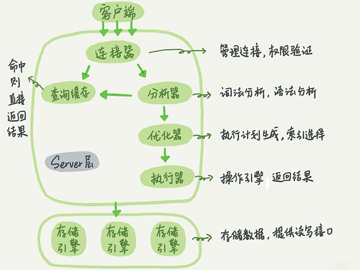
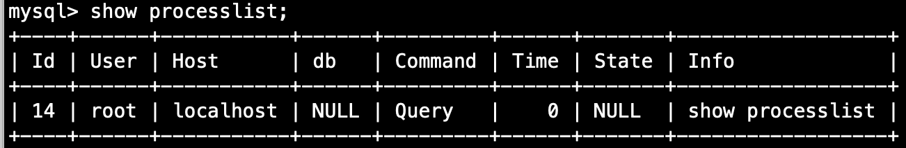
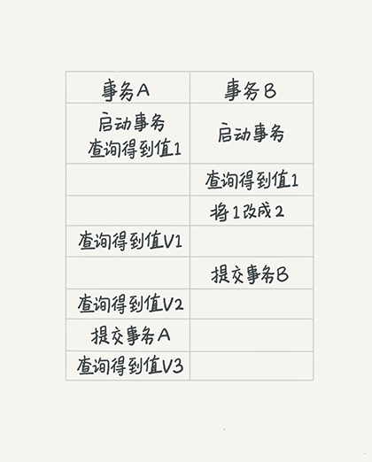
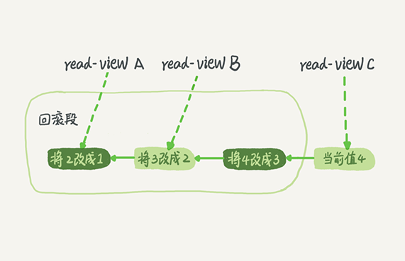
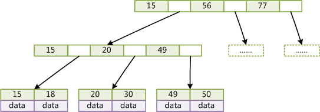
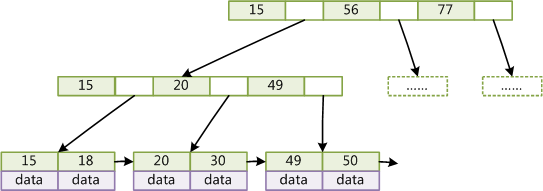
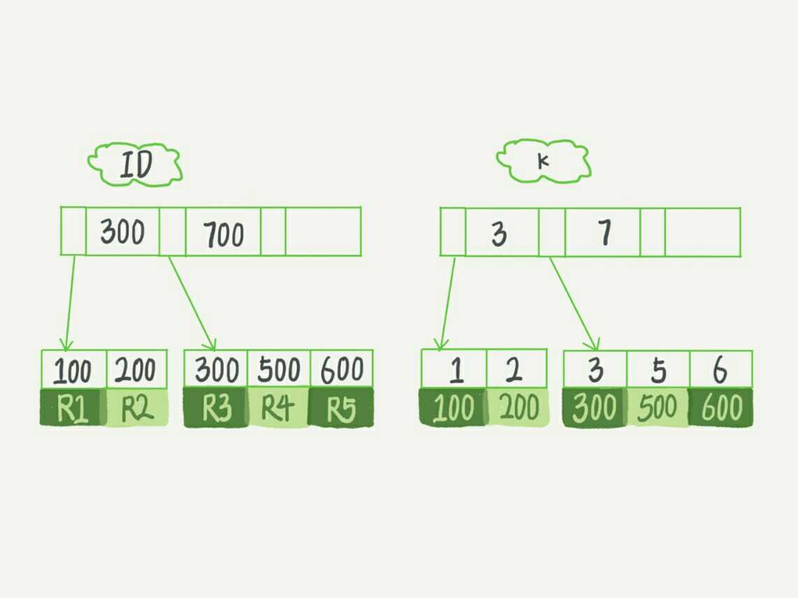
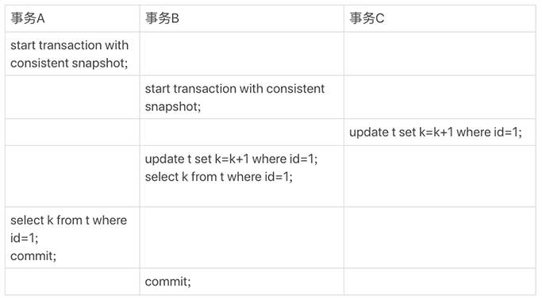
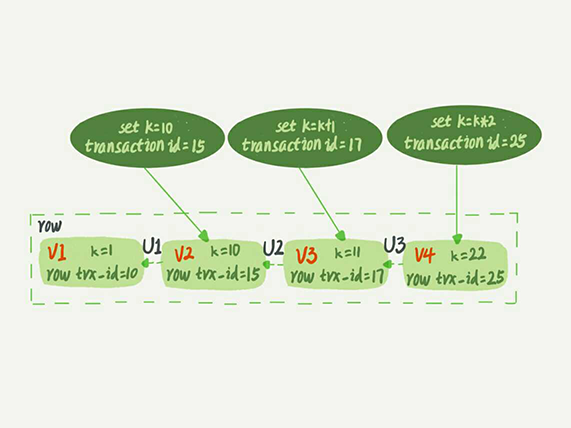
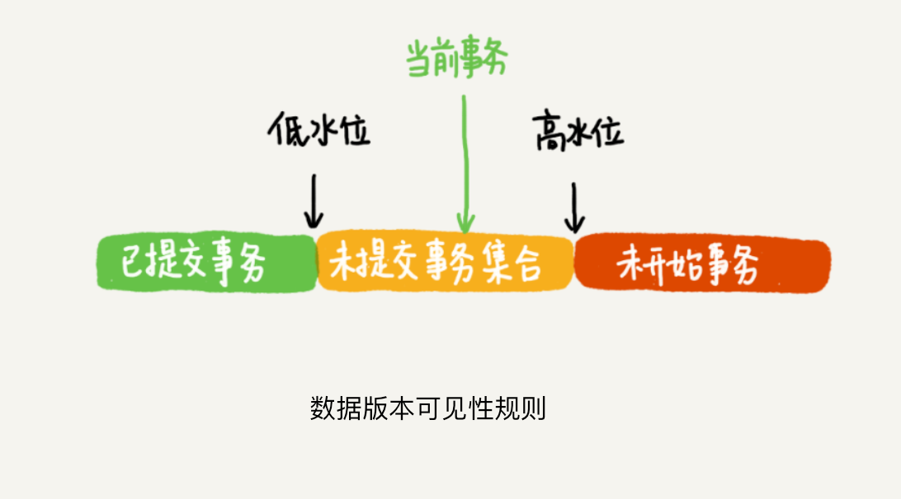

## 架构概括



1. Server 层包括连接器、查询缓存、分析器、优化器、执行器等，涵盖 MySQL 的大多数核心服务功能，以及所有的内置函数（如日期、数学和加密函数等），所有跨存储引擎的功能都在这一层实现，比如存储过程、触发器、视图。
2. 存储引擎层。

### 连接器

连接器负责跟客户端建立连接、获取权限、维持和管理连接。

```mysql
mysql -h $ip -P $port -u $user -p
```

1. 查看连接状态 `show processlist` 

   

2. 客户端如果太长时间没动静，连接器就会自动将它断开。这个时间是由参数 `wait_timeout` 控制的，默认值是 8 小时。

   ```mysql
   #connect_timeout 指的是“连接过程中”的等待时间
   #wait_timeout 指的是“连接过程完成，使用过程中”的等待时间
   
   show global variables like 'wait_timeout';
   ```

#### 连接效率

1. 数据库中，长连接是指连接成功后，如果客户端持续有请求，则一直使用同一个连接。短连接则是指每次执行完很少的几次查询就断开连接，下次查询重新建立。
2. 如果全部使用长连接后，你可能会发现，有些时候 MySQL 占用内存涨得特别快，**这是因为 MySQL 在执行过程中临时使用的内存是管理在连接对象里面的。这些资源会在连接断开的时候才释放。**所以如果长连接累积下来，可能导致内存占用太大，被系统强行杀掉，从现象看就是 MySQL 异常重启。

#### 解决思路

1. 定期断开长连接。使用一段时间，或者程序里面判断执行过一个占用内存的大查询后，断开连接，之后要查询再重连。
2. 如果用的是 MySQL 5.7+ 版本，可以在每次执行一个比较大的操作后，通过执行 `mysql_reset_connection` 来重新初始化连接资源。这个过程不需要重连和重新做权限验证，会将连接恢复到刚刚创建完成时的状态。

### 查询缓存

MySQL 8.0 版本移除了整块功能。

### 分析器

分析阶段判断语句是否正确，表是否存在，列是否存在等。

### 优化器

优化器是在表里面有多个索引的时候，决定使用哪个索引；或者在一个语句有多表关联（join）的时候，决定各个表的连接顺序。

### 执行器

1. 开始执行的时候，要先判断一下对执行操作的表有没有执行权限。如果没有，就会返回没有权限的错误。

   ```mysql
   select * from user where id=10
   ```

2. 如果有权限，打开表的时候，执行器就会根据表的引擎定义，去使用这个引擎提供的接口。

3. 慢查询日志中， `rows_examined` 字段，表示这个语句执行过程中扫描了多少行。

#### 执行流程

1. 调用 InnoDB 引擎接口取这个表的第一行，判断 ID 值是不是 10，如果不是则跳过，如果是则将这行存在结果集中。
2. 调用引擎接口取下一行。重复相同的判断逻辑，直到取到这个表的最后一行。
3. 执行器将遍历过程中所有满足条件的行组成的记录集作为结果集返回给客户端。

## 日志系统

### redo log（InnoDB特有的日志）

1. 在 MySQL 里，如果每一次的更新操作都需要写进磁盘，然后磁盘也要找到对应的那条记录，然后再更新，整个过程 IO 成本、查找成本都很高。为了解决这个问题， MySQL 引入了 WAL 技术，WAL 的全称是 Write-Ahead Logging，它的关键点就是先写日志，再写磁盘。
2. 当有一条记录需要更新的时候，InnoDB 引擎就会先把记录写到 redo log 里面，并更新内存，这个时候更新就算完成了。同时，InnoDB 引擎会在适当的时候，将这个操作记录更新到磁盘里面，而这个更新往往是在系统比较空闲的时候做。

### binlog（Sever 层的日志）

### 两个日志区别

1. redo log 是 InnoDB 引擎特有的；binlog 是 MySQL 的 Server 层实现的，所有引擎都可以使用。
2. redo log 是物理日志，记录的是“在某个数据页上做了什么修改”；binlog 是逻辑日志，记录的是这个语句的原始逻辑，比如“给 ID=2 这一行的 c 字段加 1 ”。
3. redo log 是循环写的，空间固定会用完；binlog 是可以追加写入的。“追加写”是指 binlog 文件写到一定大小后会切换到下一个，并不会覆盖以前的日志。

### 两阶段提交

1. 写入 redo log 处于 prepare 阶段。
2. 写入 binlog。
3. 提交（commit）。

####  异常恢复

1. 当在2之前崩溃时，重启恢复：发现没有 commit，回滚。备份恢复：没有 binlog。（数据一致）
2. 当在3之前奔溃时，重启恢复：虽没有 commit，但满足 prepare 和 binlog 完整，所以重启后会自动 commit。备份恢复：有binlog。（数据一致）

## 事务隔离

ACID（Atomicity、Consistency、Isolation、Durability，即原子性、一致性、隔离性、持久性）

### 隔离级别

1. 读未提交（read uncommitted）是指，一个事务还没有提交时，它做的变更就能被别的事务看到。

2. 读提交（read committed）是指，一个事务提交之后，它做的变更才会被其他事务看到。

3. 可重复读（repeatable read）是指，一个事务执行过程中看到的数据，总是跟这个事务在启动时看到的数据时一致的。当然在可重复读隔离级别下，未提交变更对其他事务也是不可见的。

4. 串行化（serializable），是对于同一行记录，“写”会加“写锁”，“读”会加“读锁”。当出现读写锁冲突的时候，后访问的事务必须等前一个事务执行完成，才能继续执行。

### 说明



1. 若隔离级别是“读未提交”， 则 V1 的值就是 2。这时候事务 B 虽然还没有提交，但是结果已经被 A 看到了。因此，V2、V3 也都是 2。
2. 若隔离级别是“读提交”，则 V1 是 1，V2 的值是 2。事务 B 的更新在提交后才能被 A 看到。所以， V3 的值也是 2。
3. 若隔离级别是“可重复读”，则 V1、V2 是 1，V3 是 2。之所以 V2 还是 1，遵循的就是这个要求：事务在执行期间看到的数据前后必须是一致的。
4. 若隔离级别是“串行化”，则在事务 B 执行“将 1 改成 2”的时候，会被锁住。直到事务 A 提交后，事务 B 才可以继续执行。所以从 A 的角度看， V1、V2 值是 1，V3 的值是 2。

### 查看

1. 查看当前会话隔离级别

   ```mysql
   select@@tx_isolation;
   ```

2. 查看系统当前隔离级别

   ```mysql
   select @@global.tx_isolation;
   ```

3. 设置当前会话隔离级别

   ```mysql
   set session transaction isolation level repeatable read;
   ```

4. 设置系统当前隔离级别

   ```mysql
   set global transaction isolation level repeatable read;
   ```

### 实现（可重复读）

1. 在 MySQL 中，实际上每条记录在更新的时候都会同时记录一条回滚操作。记录上的最新值，通过回滚操作，都可以得到前一个状态的值。

2. 假设一个值从 1 被按顺序改成了 2、3、4，在回滚日志里面就会有类似下面的记录。

   

## 索引

MySQL 中，索引是在存储引擎层实现的，所以没有统一的索引标准，不同存储引擎的索引的工作方式并不一样。

### **B+Tree** [引用](https://www.jianshu.com/p/486a514b0ded)

- 与B-Tree相比，B+Tree有以下不同点：非叶子节点不存储data，只存储索引key；只有叶子节点才存储data。结构如下图：

  

- Mysql中B+Tree**：在经典B+Tree的基础上进行了优化，增加了顺序访问指针。在B+Tree的每个叶子节点增加一个指向相邻叶子节点的指针，就形成了**带有顺序访问指针的B+Tree**。这样就**提高了区间访问性能**：如果要查询key为从18到49的所有数据记录，当找到18后，只需顺着节点和指针顺序遍历就可以一次性访问到所有数据节点，极大提到了区间查询效率(**无需返回上层父节点重复遍历查找减少IO操作)。

  

### 回表



1. 主键索引的叶子节点存的是整行数据。在 InnoDB 里，主键索引也被称为聚簇索引。
2. 非主键索引的叶子节点内容是主键的值。在 InnoDB 里，非主键索引也被称为二级索引。
3. 基于主键索引和普通索引的查询区别。
   - 如果语句是 `select * from t where id = 500` ,即主键查询方式，则只需要搜索主键那棵 B+ 树。
   - 如果语句是 `select * from t where k = 5` , 即普通索引查询方式，则需要先搜索 k 索引树，得到 ID 的值为 500，再到 ID索引树搜索一次，这个过程称为 **回表**。

### 索引维护

1. 如果插入新的行 ID 值为700，则只需要在 R5 的记录后面插入一个新纪录。
2. 如果新插入的 ID 值为400，需要逻辑上挪动后面的数据，空出位置。（当前页没有满的情况下）
3. 如果 R5 所在的数据页已经满了，这个时候要申请一个新的数据页，然后挪动部分数据过去。这个过程称为**页分裂**。
4. 当相邻两个页由于删除了数据，利用率很低之后，会将数据页做合并。合并的过程，可以认为是分裂过程的逆过程。

### 自增主键

1. **主键长度越小，普通索引的叶子节点就越小，普通索引占用的空间也就越小。**
2. **直接删掉主键索引是不好的，它会使得所有的二级索引都失效，并且会用ROWID来作主键索引；**
3. 自增主键的插入数据模式，正符合了递增插入的场景。每次插入一条新纪录，都是追加操作，都不涉及到挪动其他记录，也不触发叶子节点的分裂。
4. 有业务逻辑的字段做主键，则往往不容易保证有序插入，这样写数据成本相对较高。**在特殊情况下，也是可以使用业务字段直接做主键的**：表中只有一个业务字段一个索引，并且该索引必须是唯一索引。这样就可以避免每次查询需要搜索两棵树。

### 为什么要重建索引。

索引可能因为删除，或者页分裂等原因，导致数据页有空洞，重建索引的过程会创建一个新的索引，把数据按顺序插入，这样页面的利用率最高，也就是索引更紧凑、更省空间。

不论是删除主键还是创建主键，都会将整个表索引重建。`alter table T engine=InnoDB` 

### 覆盖索引 (k字段有索引)

1. `select ID from T where k between 3 and 5` ，这时只需要查 ID 的值，而 ID 的值已经在 k 索引树上了。因此可以直接提供查询结果，不需要回表。这样的查询称为 **覆盖查询** 
2. 覆盖索引可以减少树的搜索次数，显著提升查询性能。
3. 覆盖索引的目的就是”不回表“，所以只有索引包含了where条件部分和select返回部分的所有字段，才能实现这个目的。

### 最左前缀

1. 联合索引是可以利用最左前缀的规则的。
2. 在建立联合索引的时候，如何安排索引内的字段顺序：第一原则是，如果通过调整顺序，可以少维护一个索引，那么这个顺序往往就是需要优先考虑采用的。
3. 如果即有联合查询（a,b），又有基于 a、b各自的查询，这时候查询条件只有 b 的语句，是无法使用（a，b）这个联合索引的。这时候不得不维护另外一个索引，也就是说需要同时维护（a，b）、（b）这两个索引。这时候需要**考虑的原则就是空间，将占用字节小得设置为单字段索引** 。

### 索引下推

1. 假设用户表的联合索引（name,age），如果执行 `select * from user where name like '张%' and  age = 10` ,这个语句在搜索索引树的时候，利用**最左前缀** 找到第一个满足条件的记录。然后呢？

2. 在 MySQL5.6 之前，只能从找到主键开始一个个回表。到主键索引上找出数据行，再对比字段值。而 MySQL5.6 引入的索引下推优化，可以在索引便利过程中，对索引中包含的字段先做判断，直接过滤掉不满足条件的记录，减少回表次数。

## MySQL 的锁

根据加锁的范围，MySQL 里面的锁大致可以分成全局锁、表级锁和行锁三类。

### 全局锁

1. 命令： `flush tables with read lock` 简称 FTWRL。
2. 作用：让整个库处于只读状态，使其他线程的以下语句会被阻塞：数据更新语句（数据的增删改）、数据定义语句（包括建表、修改表结构）和更新类事务的提交语句。
3. 场景：做全库逻辑备份。
4. 影响：
   - 如果在主库上备份，那么在备份期间都不能执行更新，业务基本上就得停摆。
   - 如果你在从库上备份，那么备份期间从库不能执行主库同步过来的 binlog，会导致主从延迟。
5. 代替命令
   - 官方自带的逻辑备份工具是 mysqldump。使用 `--single-transaction` 的时候，导数据之前会启动一个事务，来确保拿到一致性视图。（在可重复读隔离级别下开启一个事务）
   - `--single-transaction` 方法只适用于所有的表使用事务引擎的库，如果有的表使用了不支持事务的引擎，那么备份就只能通过 FTWRL 方法。
   - 执行 `mysqldump --help|more` 查看详细参数。

### 表级锁

1. MySQL 中表级别的锁有两种：一种是表锁，一种是元数据锁（meta data lock 简称 MDL）。

#### 表锁

1. 命令：

   ```mysql
   LOCK TABLES
       tbl_name [[AS] alias] lock_type
       [, tbl_name [[AS] alias] lock_type] ...
   
   lock_type: {
       READ [LOCAL]
     | [LOW_PRIORITY] WRITE
   }
   
   UNLOCK TABLES #主动释放，也可以在客户端断开的时候自动释放
   ```

2. 影响：

   除了会限制别的线程的读写外，也限定了本线程接下来的操作对象。例如：如果在某个线程 A 中执行 `lock tables t1 read,t2 write` 这个语句，则其他线程写 t1、读写 t2 的语句都会被阻塞。同时，线程 A 在执行 `unlock tables ` 之前，也只能执行读 t1、读写 t2 的操作。

#### 元数据锁（MDL）

1. MDL 不需要显式使用，在访问一个表的时候会被自动加上。MDL 的作用是，保证读写的正确性。

2. MySQL 5.5版本中引入了 MDL，当对一个表做增删改查询操作的时候，加 MDL 读锁；当要对表结构变更操作的时候，加 MDL 写锁。

   - 读锁之间不互斥，因此可以有多个线程同时对一张表增删改查。
   - 读写锁之间、写锁之间是互斥，用来保证变更表结构操作的安全性。

3. 事务中的 MDL 锁，在语句执行开始时申请，但是语句结束后并不会马上释放，而会等到整个事务提交后再释放。

4. 使用场景

   如果一个查询正在遍历一个表中的数据，而执行期间另一个线程对这个表结构做变更，删了一列，那么查询线程拿到的结果跟表结构对不上，肯定是不行的。

5. **坑** ：给一个小表加个字段，导致整个库挂了。

### 行锁

MySQL 的行锁是在引擎层由各个引擎自己实现的。

#### 两阶段锁


上图事务 B 的 update 语句会被阻塞，直到事务 A 执行 commit 之后，事务 B 才能继续执行。

1. **在 InnoDB 事务中，行锁是在需要的时候才加上的，但并不是不需要了就立刻释放，而是等到事务结束时才释放。这个就是两阶段锁协议。** 
2. 优化：**如果在事务中需要锁多个行，要把最可能造成锁冲突、最可能影响并发度的锁尽量往后放。**

#### 死锁和死锁检测


这时候，事务 A 在等待事务 B 释放 id = 2的行锁，而事务 B 在等待事务 A 释放 id = 1的行锁。事务 A 和事务 B在互相等待对方的资源释放，就是进入了死锁状态。当出现死锁以后，有两种策略：

1. 一种策略是，直接进入等待，直到超时。这个超时时间可以通过参数 `innodb_lock_wait_timeout` 来设置。（默认50s）
2. 另一个种策略是，发起死锁检测，发现死锁后，主动回滚死锁链条中的某一个事务，让其他事务得以继续执行。将参数 `innodb_deadlock_detect` 设置为 on，表示开启这个逻辑。

#### 解决思路

1. 第一种策略：在 InnoDB 中，innodb_lock_wait_timeout 的默认值是 50s，意味着如果采用第一个策略，当出现死锁以后，第一个被锁住的线程要过 50s 才会超时退出，然后其他线程才有可能继续执行。对于在线服务来说，这个等待时间往往是无法接受的。但是，我们又不可能直接把这个时间设置成一个很小的值，比如 1s。这样当出现死锁的时候，确实很快就可以解开，但如果不是死锁，而是简单的锁等待呢？所以，超时时间设置太短的话，会出现很多误伤。
2. 第二种策略：每个新来的被堵住的线程，都要判断会不会由于自己的加入导致了死锁，这是一个时间复杂度是 O(n) 的操作。假设有 1000 个并发线程要同时更新同一行，那么死锁检测操作就是 100 万这个量级的。虽然最终检测的结果是没有死锁，但是这期间要消耗大量的 CPU 资源。因此，你就会看到 CPU 利用率很高，但是每秒却执行不了几个事务。

## 事务再探

### 示例



**事务 B 查到的 k 的值是3，而事务 A 查到的 k 的值是1。**

1. `begin/start transaction` 命令并不是一个事务的起点，在执行到它们之后的第一个操作 InnoDB 表的语句，事务才真正启动。如果你想要马上启动一个事务，可以使用 `start transaction with consistent snapshot` 这个命令。
2. 事务 C 没有显式地使用 `begin/commit` ,表示这个 `update` 语句本身就是一个事务，语句完成的时候会自动提交。

### “视图”概念

1. 一个是 view。它是一个用于查询语句定义的虚拟表，在调用的时候执行查询语句并生成结果。
2. 另一个是 InnoDB 在实现 MVCC 时用到的一致性读视图，即 consistent read view。用于支持 RC（read committed，读提交）和 RR（repeatable read，可重复读）隔离级别的实现。

### “快照” 在 MVCC 里是如何工作的



1. 在可重复读隔离级别下，事务在启动的时候就“拍了个快照”。这个快照是**基于整库的**。
2. InnoDB 里面每个事务有一个唯一的事务 ID，叫作 transaction_id。它是在事务开始的时候向 InnoDB 的事务系统申请的，是按申请顺序严格递增的。
3. 每行数据也都是有多个版本的。每次事务更新数据的时候，都会生成一个新的数据版本，并且把 transaction_id 赋值给这个数据版本的事务 ID，记为 row trx_id。同时，旧的数据版本要保留，并且在新的数据版本中，能够有信息可以直接拿到它。也就是说，数据表中的一行记录，其实可能有多个版本（row），每个版本有自己的 row trx_id。
4. 上图三个虚线箭头，就是 **undo log**；而 V1、V2、V3 并不是物理上真实存在的，而是每次需要的时候根据当前版本和 undo log 计算出来的。比如，需要 V2 的时候，就通过 V4 依次执行 U3、U2算出来。
5. 在实现上，InnoDB 为每个事务构造了一个数组，用来保存这个事务启动瞬间，当前正在“活跃”的事务ID。”活跃“指的就是，启动了但还没有提交。
6. 数组里面事务 ID 的最小值记为底水位，当前系统里面已经创建过的事务 ID 的最大值加1记为高水位。这个视图数组和高水位，就组成了当前事务的一致性视图（read-view）。

### 数据版本可见性

[](./image/丁奇-可见规则.png)

对于当前事务的启动瞬间，一个数据版本 row trx_id 的情况：

1. 如果落在绿色部分，表示这个版本是已提交的事务或者是当前事务自己生成的，这个数据是可见的。

2. 如果落在红色部分，表示这个版本是由将来启动的事务生成的，是肯定不可见的。

3. 如果落在黄色部分，那就包括两种情况
   * 若 row trx_id 在数组中，表示这个版本是由还没有提交的事务生成的，不可见；
   * 若 row trx_id 不再数组中，表示这个版本是已经提交了的事务生成的，可见。

### 更新逻辑

1. 更新数据都是先读后写的，而这个读，只能读当前的值，称为“当前读”（current read）。

2. 如果把事务 A 的查询语句 select * from t where id=1 修改一下，加上 lock in share mode 或 for update，也都可以读到版本号是 101 的数据，返回的 k 的值是 3。下面这两个 select 语句，就是分别加了读锁（S 锁，共享锁）和写锁（X 锁，排他锁）。

   ```mysql
   
   mysql> select k from t where id=1 lock in share mode;
   mysql> select k from t where id=1 for update;
   ```


---

> **说明该笔记大量引用《极客时间-丁奇 MySQL45讲》**