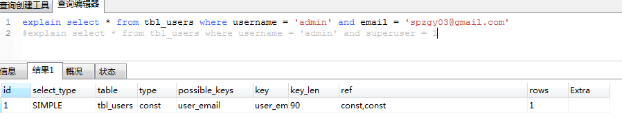
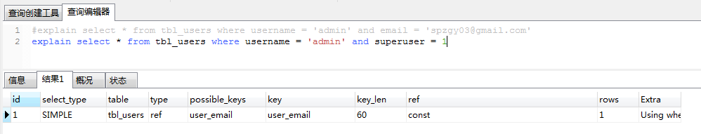
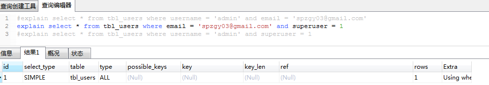
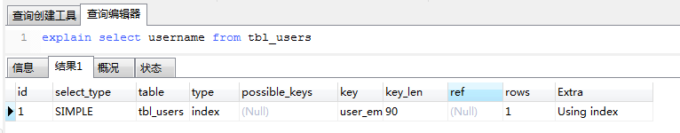
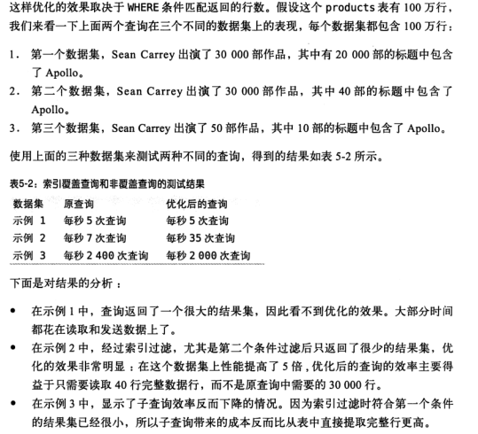
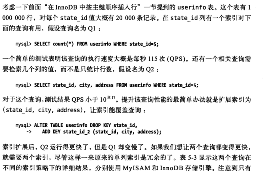
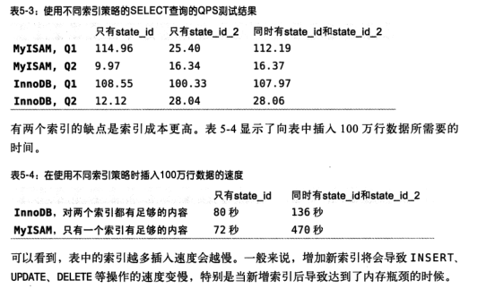

## 积硅步, 致千里

### 索引基础

1. MySQL中， 存储引擎用类似的方法是用索引，其先在索引中找到对应值，然后根据匹配的索引记录找到对应的数据行。
2. 索引可以包含一个或者多个列的值。如果索引包含多个列，那么列的顺序也十分重要，因为__MySQL只能高效使用索引的最左前缀列。__

### 索引的类型

1. __MySQL中，索引是在存储引擎层而不是服务器层实现的。__所以没有统一的索引标准。

2. B-Tree 索引 （索引方法）

   * 各种存储引擎以不同的方式使用B-Tree索引，性能也各有不同。

   * B-Tree通常意味着所有的值都是按顺序存储的，并且每一个叶子页到根的距离相同。

   * B-Tree 索引适用于全键值、键值范围或者键前缀（最左前缀）查找。

   * 因为索引树中的节点是有序的，所以除了按值查找之外，索引还可以用于查询中的`order by` 操作（按照顺序查找）。

   * 关于组合索引B-Tree索引的限制

     1. 如果不是按照索引的最左列开始查找，则无法使用索引。

     2. 不能跳过索引中的列。也就是说，B-Tree索引无法用于查找姓Smith并且在某个特定日期出生的人。

        

        

        

        

        

        

     3. 如果查询中有某个列的范围查询，则其右边所有列都无法使用索引优化查询。

        ```mysql
        #建立last_name,firsh_name,dob 组合索引
        where last_name = 'Smith' and firsh_name like 'J%' and dob = '1976-12-23'
        ```

3. 哈希索引 （索引方法）

   * 哈希索引基于哈希表实现，只有精确匹配索引所有列的查询才有效。

   * 对于每一行数据，存储引擎都会对所有的索引列计算一个哈希码（hash code），哈希码是一个较小的值，并且不同键值的行计算出来的哈希码也不一样。哈希索引将所有的哈希码存储在索引中，同时在哈希表中保存指向每个数据行的指针。

   * 在MySQL中，只有Memory引擎显式支持哈希索引。Memory引擎是支持非唯一哈希索引的。如果多个列的哈希值相同索引就会以链表的方式存放多个记录指针到同一个哈希条目中。

   * 哈希索引也有它的限制

     1. 哈希索引只包含哈希值和行指针，而不存储字段值，所以不能使用索引中的值来避免读取行。

     2. 哈希索引数据并不是按照索引值顺序存储的，所以也就无法用排序。

     3. 哈希索引也不支持部分索引列匹配查找，因为哈希索引始终是使用索引列的全部内容来计算哈希值的。例如，在数据列（A，B）上建立哈希索引，如果查询只有数据列A则无法使用该索引。

     4. 哈希索引只支持等值比较查询，包括 =、In()、<=>。也不支持任何范围查询。

     5. 访问哈希索引的数据非常快，除非有很多哈希冲突。

     6. 如果哈希冲突很多的话，一些索引维护操作的代价也会很高。例如，如果在某个选择性很低（哈希冲突很多）的列上建立哈希索引，那么当从表中删除一行时，存储引擎需要遍历对应哈希值的链表中的每一行，找到并删除对应行的引用，冲突越多代价越大。

     7. InnoDB引擎有一个特殊的功能叫做 “ 自适应哈希索引  ”。当InnoDB注意到某些索引值被使用得非常频繁时，它会在内存中基于B-Tree索引之上再创建一个哈希索引。

     8. 例子

        需要存储大量的URL，并需要根据URL进行搜索查找。这时候就可以使用伪哈希索引。

        ```mysql
        select id from url where url="http://www.mysql.com" and url_crc = CRC32('http://www.mysql.com')
        ```

        这样做的性能会非常高，因为MySQL优化器会使用这个选择性很高而体积很小的基于url_crc列的索引来完成查找。

        __当使用哈希索引进行查询的时候，必须在where子句中包含常量值。这样做保证了一旦出现哈希冲突，常量值也可以起作用__

4. 空间数据索引（R_Tree）

   MyISAM表支持空间索引，可以用作地理数据存储。和B-Tree索引不同，这类索引无须前缀查询。MySQL的GIS支持并不完善，开源关系数据库系统中对GIS的解决方案做得比较好的是PostgreSQL的PostGIS。

### 索引反思

1. 索引并总是最好的工具。总的来说，只有当索引帮助存储引擎快速查找记录带来的好处大于其带来的额外工作时，索引才是有效的。对于非常小的表，大部分情况下简单的全表扫描更高效。对于中到大型的表，索引就非常有效。但对特大型的表，建立和使用索引的代价将随之增长。

### 高性能的索引策略

1. 独立的列 ： 指索引列不能是表达式的一部分，也不能是函数的参数。

   ```mysql
   #不能用到索引
   select actor_id from sakila.actor where actor_id + 1 = 5;
   ```

2. 前缀索引和索引选择性

   有时候需要索引很长的字符列，这会让索引变得大且慢。一个策略是前面提到过的模拟哈希索引，但是这样做还不够的话，就可以__只索引开始的部分字符。__

3. 多列索引

   * 当出现服务对多个索引做相交操作时（通常有多个AND条件），通常意味着需要一个包含所有相关列的多列索引，而不是多个独立的单列索引。
   * 当服务器需要对多个索引做联合操作时（通常有多个OR条件），通常意味着需要一个包含所有相关列的多列索引，而不是的多个独立的单列索引
   * 更重要的是，优化器不会把这些计算到“查询成本”中，优化器只关心随机页面读取。这会使得查询的成本被 ” 低估 “。

4. 选择合适的索引列顺序

   * 索引列的顺序意味着索引首先按照最左列进行排序，其次是第二列。
   * 将选择性最高的列放到索引最前列。
   * 高性能MySQL 第三版 161 页有一个列子。关于索引的区分度不高造成的性能问题。

5. 覆盖索引

   * 通常大家都会根据查询的 where 条件来创建合适的索引，不过这只是索引优化的一个方面。设计优秀的索引应该考虑到整个查询，而不是单单是 where 条件部分。

   * MySQL也可以使用索引来直接获取列的数据。

   * 覆盖索引的好处

     1. 索引条目通常远小于数据行大小，所以如果只需要读取索引，那么MySQL就会极大地减少数据访问量。

     2. 因为索引是按照列值顺序存储的（至少在单个页内是如此），所以对于I/O密集型的范围查询会比随机从磁盘读取每一行数据的 I/O 要少得多。

     3. 由于InnoDB的聚簇索引，覆盖索引对InnoDB表特别有用。在索引中满足查询的成本一般比查询行要小得多。

     4. MySQL只有使用 B-Tree 索引做覆盖索引。

     5. 当发起一个被索引覆盖的查询（也叫索引覆盖查询）时，在 EXPLAIN 的 Extra 列可以看到 “Using index” 的信息。

        __如果一个索引包含（或叫覆盖）所有需要查询的字段的值，该索引就叫覆盖索引。__ 

        

        ```mysql
        #这是一个多列索引的 username,email
        mysql> explain select username,email from tbl_users \G;
        *************************** 1. row ***************************
                   id: 1
          select_type: SIMPLE
                table: tbl_users
                 type: index
        possible_keys: NULL
                  key: user_email
              key_len: 444
                  ref: NULL
                 rows: 1
                Extra: Using index
        1 row in set (0.00 sec)
        ```

     6. 索引覆盖查询还有很多陷阱可能导致无法实现优化。

        ```mysql
        mysql> explain select * from tbl_users where username = "amdin" and activkey like "%95395930d4dd12b6%" \G;
        *************************** 1. row ***************************
                   id: 1
          select_type: SIMPLE
                table: tbl_users
                 type: ref
        possible_keys: user_email
                  key: user_email
              key_len: 60
                  ref: const
                 rows: 1
                Extra: Using where
        1 row in set (0.00 sec)
        ```

        没有使用索引的原因

        * 没有任何索引能够覆盖这个查询。因为查询从表中选择了所有的列，而没有任何索引覆盖所有的列。不过，理论上MySQL还有一个捷径可以利用： where 条件中的列是有索引可以覆盖的，因此MySQL可以使用该索引找到对应的 username 并检查 activkey 是否匹配，过滤之后再读取需要的数据行。

        * MySQL不能在索引中执行LIKE操作。这是底层存储引擎API的限制，但是MySQL能在索引中做最左前缀匹配的 LIKE 比较，因为该操作可以转换为简单的比较操作，__但是如果是通配符开头的LIKE查询，存储引擎就无噶做比较匹配。这种情况下，MySQL服务器只能提取数据行的值而不是索引值来做比较。__

        * 优化,建立三列的数据列索引（username, email, activkey）

          ```mysql
          #优化
          explain select * from tbl_users a
          	JOIN (SELECT
          				username
          			FROM
          				tbl_users
          			WHERE
          				username = "admin"
          			and email = 'spzgy03@gmail.com'
          			AND activkey LIKE "%95395930d4dd12b6%"
          ) as b on (a.username = b.username)
          
          *************************** 1. row ***************************
                     id: 1
            select_type: PRIMARY
                  table: <derived2>
                   type: system
          *************************** 2. row ***************************
                     id: 1
            select_type: PRIMARY
                  table: a
                   type: ref
          *************************** 3. row ***************************
                     id: 2
            select_type: DERIVED
                  table: tbl_users
                   type: ref
          possible_keys: user_email
                    key: user_email
                key_len: 444
                    ref:
                   rows: 1
                  Extra: Using where; Using index
          3 rows in set (0.00 sec)
          ```

          这种查询叫做  __延迟关联__（deferred join），因为延迟了对列的访问。在查询的第一阶段MySQL可以使用覆盖索引，在 from 子句的子查询中找到匹配的 `username` ，然后根据这些 `username`值在外层查询匹配获取需要的所有列值。虽然无法使用索引覆盖整个查询，但总算比完全无法利用索引覆盖的好。

          

     7. 使用索引扫描来做排序

        * MySQL有两种方式可以生成有序的结果：通过排序操作；或者按索引顺序扫描；如果 Explain 出来的 type 列的值为 “index”，则说明使用索引扫描来做排序

        * MySQL可以使用同一个索引即满足排序，又用于查找行。因此，如果可能，设计索引时应该尽可能地同时满足这两种任务。

        * 只有当索引的列顺序和order by 子句的顺序完全一致，并且所有列的顺序方向（倒序或者正序）都一样时，MySQL才能够使用索引来对结果做排序。如果查询需要管理多张表，则只有当order by 子句硬哟娜那个的字段全部为第一表时，才能使用索引做排序。

          ```mysql
          explain select username,email from tbl_users order by id desc
          ```

     8. 压缩（前缀压缩）索引

        MyISAM 使用前缀压缩来减少索引的大小。

     9. 冗余索引

        大多数情况下都不需要冗余索引，应该尽量扩展已有的索引而不是创建新索引。但也有时候处于性能方面的考虑需要冗余索引，因为扩展已有的索引会导致其变得太大，从而影响其他使用该索引的查询性能。

        

        ​	索引对插入性能的影响

        

        

## 名称解释： 

1. ORM：对象关系映射。

2.  二级索引 : 

   * mysql中每个表都有一个聚簇索引（clustered index ），除此之外的表上的每个非聚簇索引都是二级索引，又叫辅助索引（secondary indexes）。
   * 以InnoDB来说，每个InnoDB表具有一个特殊的索引称为聚集索引。如果您的表上定义有主键，该主键索引是聚集索引。如果你不定义为您的表的主键时，MySQL取第一个唯一索引（unique）而且只含非空列（NOT NULL）作为主键，InnoDB使用它作为聚集索引。如果没有这样的列，InnoDB就自己产生一个这样的ID值，它有六个字节，而且是隐藏的，使其作为聚簇索引。

3. __索引条件下推(5.6的版本)__ ： `http://mdba.cn/2014/01/21/index-condition-pushdownicp%E7%B4%A2%E5%BC%95%E6%9D%A1%E4%BB%B6%E4%B8%8B%E6%8E%A8/`; 这个特性能很好的解决 多列索引，当某列出现了范围索引其他列不能应用索引的问题。

4. **注意的事情** 

   > 顺序的主键什么时候会造成更坏的结果
   >
   > 
   >
   > 对于高并发工作负载，在InnoDB中按照主键顺序插入可能会造成明显的争用。主键的上界会成为 “热点”。因为所有的插入都发生在这里，所以并发插入可能导致间隙锁竞争。另一个热点可能是`auto_incremect` 锁机制；如果遇到这个问题，则可能需要考虑重新设计表或者应用，或者更改  innodb_autoinc_lock_mode 配置。 