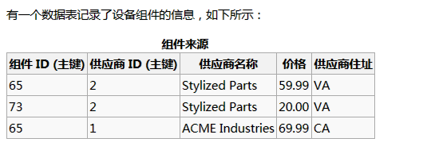
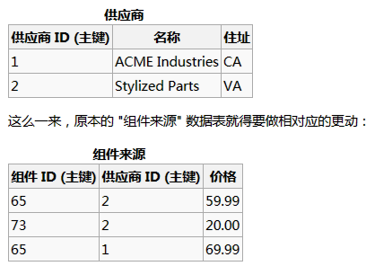
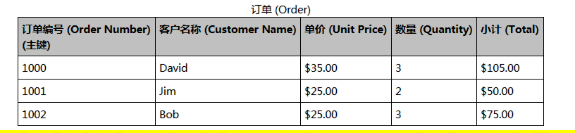

##积硅步, 致千里

###选择优化数据类型

#### 选择的原则

1. 更小的通常更好

   一般情况下，应该尽量使用可以正确存储数据的最小数据类型。更小的数据类型通常更快，因为它们占用更小的磁盘，内存和CPU缓存，并且处理时需要的CPU周期也更少。

2. 简单就好

   简单数据类型的操作需要更少的CPU周期。例如__整形比字符操作代价更低，因为字符集和校对规则使字符串比较比整型比较更复杂。__ 

   * 使用MySQL内建的类型而不是字符串来存储日期和时间

   * 应该用整型存储IP地址， 

     ```php
     $ip = '39.106.99.63';
     echo $intip = sprintf('%u',ip2long($ip)); //转换为无符号整型
     echo long2ip($intip);die;//将整型转换为ip
     ```

3. 尽量避免null

   * 如果查询中包含可为NULL的列，对于MySQL来说更难优化
   * 通常把可为NULL的列改为NOT NULL带来的性能提升比较小，所以（调优时）没有必要首先在现有schema中查找并修改掉这中情况，除非确定这会导致问题。__但是如果计划在列上建立索引，就应该尽量避免涉及成可为NULL的列__

   >DATETIME 和 TIMESTAMP 列都可以存储相同类型的数据，然而TIMESTAMP只是用DATETIME一半的存储空间，__并且会根据时区变化，具有特殊的自动更新能力__ 

#### 整数类型

1. `tinyint` ，`smallint` ，`mediumint` ，`int` ，`bigint` 分别占 8 ，16，24，32，64位存储空间，它们可以存储的值的范围从 `-2的(N-1)方  ～ 2的（N-1）方 `其中N为存储空间的位数。 

   __unsigned属性，表示不允许负值，可以使整数提高上线__

   * MySQL可以为整数类型指定宽度，例如Int（10），对大多数应用这是没有意义的：它不会限制值的合法范围，只是规定了MySQL的一些交互工具用来显示字符的个数。对于存储和计算来说，INT（1）和INT（20）是相同的。

#### 小数类型 ( float,double , decimal)

1. 对小数的计算需要额外的空间和计算开销，所以应该尽量只对小数进行精确计算时才使用`decimal`  --- 例如存储财务数据。__但是在数据量比较大的时候，可以考虑使用BIGINT代替DECIMAL__，将需要存储的货币单位根据小数的位数乘以相应的倍数即可。这样可以同时避免浮点存储计算不精确和`decimal` 精度计算代价高的问题

#### 字符串类型

1. VARCHAR 类型用于存储可变长字符串，它仅使用必要的空间（例如，越短的字符串使用越少的空间）。有一种情况例外，__如果MySQL表使用 ROW_FORMAT=FIXED__ 创建的话，每一行都会使用定长存储，这会浪费空间。

   >## Mysql的row_format
   >
   >在mysql中， 若一张表里面不存在varchar、text以及其变形、blob以及其变形的字段的话，那么张这个表其实也叫静态表，即该表的row_format是fixed，就是说每条记录所占用的字节一样。其优点读取快，缺点浪费额外一部分空间。
   >
   >若一张表里面存在varchar、text以及其变形、blob以及其变形的字段的话，那么张这个表其实也叫动态表，即该表的row_format是dynamic，就是说每条记录所占用的字节是动态的。其优点节省空间，缺点增加读取的时间开销。
   >
   >**静态表，查询速度快，空间利用率不高** 
   >**动态表，查询速度慢，空间利用率较高** 
   >**所以，做搜索查询量大的表一般都以空间来换取时间，设计成静态表。**
   >
   >> row_format还有其他一些值： 
   >> \- DEFAULT 
   >> \- IXED 
   >> \- DYNAMIC 
   >> \- COMPRESSED 
   >> \- REDUNDANT 
   >> \- COMPACT
   >
   >修改行格式 
   >ALTER TABLE table_name ROW_FORMAT = DEFAULT
   >
   >修改过程导致： 
   >fixed—>dynamic: 这会导致CHAR变成VARCHAR 
   >dynamic—>fixed: 这会导致VARCHAR变成CHAR

2. CHAR类型是定长的。

   * 当存储CHAR值时， MySQL会删除所有的末尾空格，
   * 例子
     1. md5的值就应该用CHAR存储
     2. 对于非常短的列用CHAR存储，不容易产生碎片。

3. BLOB和TEXT类型

   * BLOB和TEXT都是为了存储很大的数据而设计的字符串数据类型，分别采用二进制和字符方式是存储。
   * MySQL把每个BLOB和TEXT值当作一个独立的对象处理。存储引擎在存储时通常会做特殊处理。当BLOB和TEXT值太大时，InnoDB会使用专门的“外部存储区域进行存储”。

#### 使用枚举（enum）代替字符串类型

1. 可以使用枚举列代表常用的字符串类型。枚举列可以把一些不重复的字符串存储成一个预定义的集合。MySQL在存储枚举时非常紧凑，会根据列表值的数量压缩到一个或者两个字节中。__MySQL在内部会将每个值在列表中的位置保存为整数，并且在表的.frm文件中保存 “数字---字符串”映射关系__

   ```mysql
   create table enum_test( 
       e enum('fish','apple','dog') not null
   );
   ```

   这三行数据实际存储为整数，而不是字符串。

   ```mysql
   #执行这个sql语句可以看到实际存储是整数
   select e + 0 from enum_test
   ```

   __枚举字段是按照内部存储的整数而不是定义的字符串进行排序的__

   ```mysql
   #可以查看到
   select e from enum_test group by e;
   ```

    一种绕过这种限制的方式是按照需要的顺序定义（按照字母的顺序）枚举列。__另外也可以在查询中使用FIELD（）函数显式地指定排序顺序，但这会导致MySQL无法利用索引消除排序。__ 

   ```mysql
   select e from enum_test group by FIELD(e,'apple','dog','fish');
   ```

2. 在特定情况下，把CHAR/VARCHAR列与枚举列进行关联可能会比直接关联CHAR/VARCHAR列更慢

   **需要后期补测试数据** ????

3. 转换列为枚举型还有一个好处，根据show table status 命令输出结果中date_length列的值，把这两列转换为enum可以让表的大小缩小1/3。在某些情况下，即使可能出现enum和varchar进行关联的情况，这也是值得的。同样，转换后主键也只有原来的一半大小了，因为InnoDB表，如果表上有其他索引，减少主键大小会使非主键索引也变得更小。

#### 日期和时间类型

1. MySQL能存储的最小时间粒度为秒（MariaDB支持微妙级别的时间类型）

2. DATATIME

   这个类型能保存大范围的值，从1001年到9999年，精度为秒。它把日期和时间封装到格式为YYYYMMDDHHMMSS的整数中，与时区无关。使用8个字节存储空间。

3. TIMESTAMP

   时间跨度从1970到2038年。显示的值也依赖于时区，MySQL服务器，操作系统，以及客户端连接都有时区设置。

   ```mysql
   FROM_UNIXTIME() 把Unix时间戳转换为日期。
   UNIX_TIMESTAMP() 把日期转为Unix时间戳
   select FROM_UNIXTIME(create_time, "%Y-%m-%d") create_time from otcms_article limit 5
   ```

4. 二者的区别

   TIMESTAMP 和 DATATIME ，前者提供的值与时区有关系，后者则保留文本表示的日期和时间。

5. 除了特殊行为之外，通常也应该尽量使用TIMESTAMP，因为它比DATETIME空间效率更高。

#### 选择标识符（identifier）

1. 选择标识列的类型时，不仅仅需要考虑存储类型，还需要考虑MySQL对这种类型如何执行计算和比较。例如，__MySQL在内部使用整数存储`ENUM` 和 `SET` 类型，然后在做比较操作时转换为字符串__ 
2. 选定一种类型，要确保在所有关联表中都使用同样的类型。类型之间需要精确匹配，__包括像 `unsignd` 这样的属性__ 。混用不同数据类型可能导致性能问题，即使没有性能问题，在比较操作时隐式类型转换也可能导致难以发现的错误。
3. 小技巧
   * 整数类型是标识列最好的选择，因为它们很快并且可以使用AUTO_INCREMENT
   * 字符串，
     1. 如果可能，应该避免使用字符串类型作为标识列。因为它们很消耗空间，并且通常比数字类型慢。尤其是在MyISAM表里使用字符串作为标识列时要特别小心，MyISAM默认对字符串使用压缩索引，这会导致查询慢很多。
     2. 对于完全随机的字符串也需要注意，例如 MD5()，SHA1() 等产生的字符串。这些函数生成的新值会任意分布在很大的空间内，这会导致 insert 以及一些 select 语句变得很慢。

### Schema 设计中的 陷阱

1. 太多的列

   MySQL的存储引擎API工作时需要在服务器层和存储引擎层之间通过行缓存格式拷贝数据，然后在服务器层将缓存内容解码成各个列。从行缓冲中将编码过的列转换成行数据的操作代价是非常高的。

2. 太多的关联

   MySQL限制了每个关联操作最多只能有61张表。如果希望查询执行得快速且并发性好，单个查询最好在12个表以内做关联。

3. NULL

   * 尽量在设计表的时候，避免使用null，即使需要存储一个事实上的空值到表中时，也不一定非得使用NULL。

   * 遵循这个原则也不要走极端，当确实需要表示未知值时要果断使用NULL

     ```mysql
     #这个时候要果断使用 null
     create table ...(
        dt datetime not null default '0000-00-00 00:00:00'
     )
     ```

### 范式和反范式

#### 概念

1. 第一范式：是为了要排除重复组的出现，所采用的方法是要求数据库的每个列的值域都是由原子值组成；每个字段的值都只能是单一值 

   * 不匹配的情况

     1. 重复组通常会出现在会计账上，每一笔记录可能有不定个数的值 

        

     2. 缺乏唯一的标识码

        

2. 第二范式：它的规则是要求数据表里的所有数据都要和该数据表的主键有完全相依关系；如果有哪些数据只和主键的一部份有关的话，就得把它们独立出来变成另一个数据表。

   

   __供应商的名称和住址就只和供应商 ID 有关(部分依赖)，这不符合第二范式的原则。__ 

   

3. 第三范式：用来检验是否所有非键属性都只和候选键有相关性，也就是说所有非键属性互相之间应该是无关的 

   

   __小计不应该放在这个数据表里面，只要把单价乘上数量就可以得到小计了； __ 下面是符合的

   


#### 范式的优点和缺点

1. 范式化的更新操作通常比反范式化更快
2. 当数据较好地范式化时，就只有很少或者没有重复数据，所以只需要修改更少的数据。
3. 范式化的表通常更小，可以更好地放在内存里
4. 很少有多余的数据意味着检索列表数据时更少需要 `distinct` 或者 `group by` 语句。

#### 反范式的优点和缺点

1. 反范式化的schema因为所有的数据都在一张表中，可以避免关联
2. 单独的表也能使用更有效的索引策略

### 缓存表和汇总表

1. 为了避免复杂，昂贵的实时更新操作，创建一站完全独立的汇总表或缓存表。

2. 缓存表：来表示存储那些可以比较简单地从schema其他表获取（但是每次获取的速度比较慢）数据的表。

3. 计数器表： 如果应用在表中保存技术器，则在更新计数器时可能碰到并发问题。技术器表在web应用中很常见。可以用这种表缓存一个用户的朋友数、文件下载次数等。

   >记录网站的点击次数
   >
   >

   >1. 假设有一个计数器表，只有一行数据。
   >
   >   ```mysql
   >   CREATE TABLE `hit_counter` (
   >     `cnt` int(10) unsigned NOT NULL
   >   ) ENGINE=InnoDB DEFAULT CHARSET=utf8
   >   
   >   #网站每次点击都会导致对计数器进行更新
   >   update hit_counter set cnt = cnt + 1;
   >   ```
   >
   >   问题在于，对于任何想要更新这行的事务来说，这条记录上都有一个全局的互斥锁（mutex）。这会是得这些事务只能串行执行。
   >
   >​	

   

   