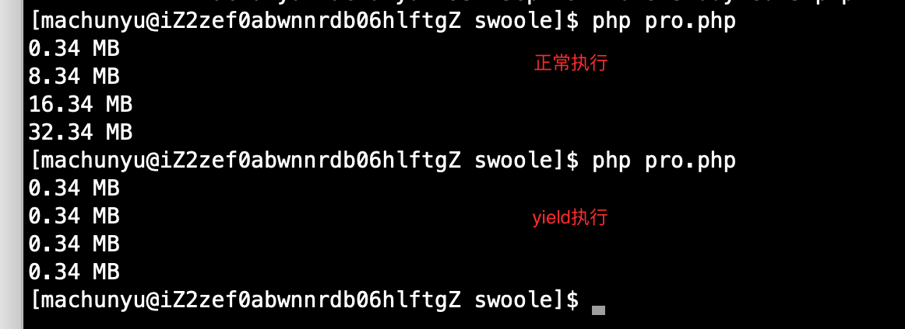

### 生成器

1. PHP 5.5版本开始支持生成器( Generator )

   * 一个生成器函数看起来像一个普通的函数, 不同的是普通函数返回一个值, 而一个生成器可以`yield` 生成许多它所需要的值
   * 生成器允许你在`foreach` 代码块中写代码来迭代一组数据而不需要在内存中创建一个数组, 那会使你的内存达到上限或者会占据可观的处理时间

   ```php
    function createRange($number)
    {
        for ($i=0;$i<$number;$i++) {
            yield time(); //一次只产生一个值
        }
    }
   $result = createRange(10);
   foreach($result as $value) {
        sleep(1);
        echo $value.'<br />';
   }
   //调用函数时就会返回一个生成器(Generator)的对象, 这个对象实现了Iterator接口
   var_dump ($result instanceof Iterator);
   ```

2. 生成器为可中断的函数

   > 跟普通函数值返回次值不同的是, 生成器可以根据需要yield多次, 以便生成需要迭代的值. 普通函数return后, 函数会被从栈中移除, 终止执行, 但是yield会保存生成器的状态, 当被再次调用时, 迭代器会从上次yield的地方恢复调用状态继续执行.

   ```php
   function xrange($start,$end,$step)
   {
       echo 'The generator has started';
       for ($i = $start; $i<= $end; $i += $step){
           yield $i;
           echo "Yielded $i" ."\r\n";
       }
       echo 'The genetator has ended';
   }
   foreach(xrange(1,10,3) as $v){
       echo 'return '.$v."\r\n";
   }
   ```

3. 如果在一个表达式上下文(例如在一个赋值表达式的右侧)中使用yield，你必须使用圆括号把yield申明包围起来。 例如这样是有效的：

   `$data = (yield $value);`

4. 协程

   协程的支持是在迭代生产器的基础上, 增加了可以回送数据给生成器的功能( 调用者发送数据给被调用的生成器函数. ) 

   ```php
   function logger($filename) {
       $filename = fopen($filename,'a');
       while(true) {
           fwrite($filename,yield."\n");
       }
   }
   $logger = logger(__DIR__.'/log');
   $logger -> send('Foo');
   $logger -> send('Bar');
   //这里的yield能被演化成一个值, 这个值就是调用者传递给send()方法的值
   ```

5. 节省内存的示例。

   ```php
   //正常实现
   function getValues() {
      $valuesArray = [];
      // 获取初始内存使用量
      echo round(memory_get_usage() / 1024 / 1024, 2) . ' MB' . PHP_EOL;
      for ($i = 1; $i < 800000; $i++) {
         $valuesArray[] = $i;
         // 为了让我们能进行分析，所以我们测量一下内存使用量
         if (($i % 200000) == 0) {
            // 来 MB 为单位获取内存使用量
            echo round(memory_get_usage() / 1024 / 1024, 2) . ' MB'. PHP_EOL;
         }
      }
      return $valuesArray;
   }
   $myValues = getValues(); // 一旦我们调用函数将会在这里创建数组
   foreach ($myValues as $value) {}
   
   //yield 实现
   function getValues() {
      // 获取内存使用数据
      echo round(memory_get_usage() / 1024 / 1024, 2) . ' MB' . PHP_EOL;
      for ($i = 1; $i < 800000; $i++) {
         yield $i;
         // 做性能分析，因此可测量内存使用率
         if (($i % 200000) == 0) {
            // 内存使用以 MB 为单位
            echo round(memory_get_usage() / 1024 / 1024, 2) . ' MB'. PHP_EOL;
         }
      }
   }
   $myValues = getValues(); // 在循环之前都不会有动作
   foreach ($myValues as $value) {} // 开始生成数据
   ```

   

