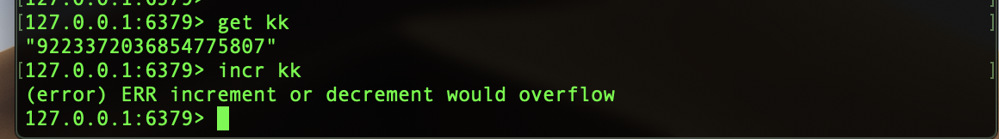

# redis记录

## 常用

1. `incr` 命令是有范围的 `signed long 也就是 2^63` ，超过这个最大值，redis就会报错。

   

2. 设置一个定长的列表 `ltrim log 0 99`

3. **原子操作** 是指不会被线程调度机制打断的操作；这种操作一旦开始，就一直运行到结束，中间不会有任何线程切换。

4. **可重入性** 是指线程在持有锁的情况下再次请求加锁，如果一个锁支持同一个线程的多次加锁，那么这个锁就是可重入的。

5. 延时队列

   ```php
   $scriptLua = <<<LUA
           local tabSoreSet = {};
           tabSoreSet = redis.pcall('ZRANGEBYSCORE',KEYS[1],KEYS[2],KEYS[3],'limit',0,1);
           if (next(tabSoreSet) == nil) then
               return false;
           end;
           local member = tabSoreSet[1];
           redis.pcall('zrem',KEYS[1],member);
           return member;
   LUA
   $redis->eval($scriptLua,array('rediskey',0,$nowTime),3);
   ```

6. redis 插件

   * [布隆过滤器](https://github.com/RedisLabsModules/rebloom#building-and-loading-rebloom)
   * [漏斗限流插件](https://github.com/brandur/redis-cell)

## 布隆过滤器

1. 插件地址：`https://github.com/RedisLabsModules/rebloom#building-and-loading-rebloom`

2. 当布过滤器说某个值存在时，这个值可能不存在；当它说不存在时，那就坑定不存在。

3. [命令](https://github.com/RedisLabsModules/rebloom/blob/master/docs/Bloom_Commands.md)

   ```html
   添加
   bf.add codehole user1
   判断是否存在
   bf.exists codehole user1
   批量添加
   bf.madd codehole user2 user3
   批量判断是否存在
   bf.mexists codehole user1 user2
   ```

4. 应用场景

   * 在爬虫系统中，我们需要对 URL 进行去重，已经爬过的网页就可以不用爬了。

   * 布隆过滤器可以显著的降低数据哭的 IO 请求数量。当用户来查询某个 row 时，可以先通过内存中的布隆过滤器可以显著降低数据库的 IO 请求数量。

   * 邮箱系统的垃圾又看过滤功能也普通用到了布隆过滤器。

## redis 通信协议

### redis协议传输

1. redis 协议将传输的结构数据分为5种最小单元类型，单元结束统一加上回车换行符号 `\r\n`
2. 单行字符串以 `+` 符号开头
3. 多行字符串以 `$` 符号开头，后跟字符串长度。
4. 整数值以 `:` 符号开头，后跟整数的字符串形式。
5. 错误消息以 `-`符号开头。
6. 数组以 `*` 号开头，后跟数组的长度。

## redis 集群方案

1. codis 是 redis 集群方案之一，非官方的。
2. redis-cluster 官方的。

## Info 指令

### 参数配置

1. Server 服务器运行的环境参数
2. Clients 客户端相关信息
3. Memory 服务器运行内存统计数据
4. Persistence 持久化信息
5. Stats 通用统计数据
6. Replication 主从复制相关信息
7. CPU CPU 使用情况
8. Cluster 集群信息
9. KeySpace 键值对统计数量信息

