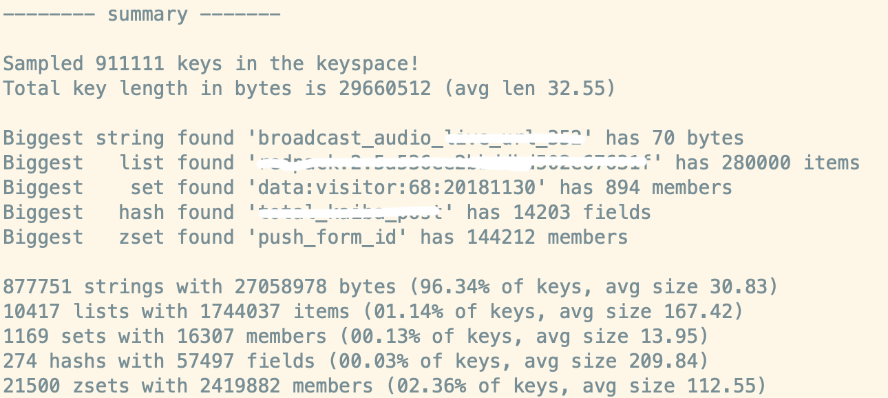

# 命令行

## 单条命令

1. 执行单条命令

   ```shell
   # redis-cli set hello world
   OK
   # redis-cli get hello
   "world"
   ```

2. 重定向输出

   ```shell
   redis-cli info > info.txt
   ```

## 批量执行命令

1. 批量执行

   ```shell
   # cat cmds
   set foo1 bar1
   set foo2 bar2
   
   # cat cmds | redis-cli 
   OK
   OK
   ```

2. 重定向导入

   ```shell
   #redis-cli < cmds
   ```

## 重复执行指令

```shell
# 间隔1s，执行5次，观察qps的变化
redis-cli -r 5 -i 1 info | grep ops
```

## 监控服务器状态

```shell
redis-cli --stat
------- data ------ --------------------- load -------------------- - child -
keys       mem      clients blocked requests            connections          
6          869.05K  2       0       4704 (+1)           2100        
6          869.19K  2       0       4705 (+1)           2100        
6          869.33K  2       0       4706 (+1)           2100        
```

## 采样服务器指令

现在线上有一台 Redis 服务器的 OPS 太高，有很多业务模块都在使用这个 Redis，如何才能判断出来是哪个业务导致了 OPS 异常的高。这时可以对线上服务器的指令进行采样，观察采样的指令大致就可以分析出 OPS 占比高的业务点。

```shell
# redis-cli monitor
1575990794.842490 [0 127.0.0.1:32844] "get" "foo2"
1575990804.924301 [0 127.0.0.1:32844] "get" "foo1"
```

## 扫描大 KEY

redis-cli 提供了 --bigkeys 参数可以很快扫出内存里的大 KEY，使用 -i 参数控制扫描间隔，避免扫描指令导致服务器的 ops 陡增报警。

```shell
# redis-cli --bigkeys -i 0.01
```



## 诊断服务器时延

```shell
# redis-cli --host 192.168.x.x --port 6379 --latency
min: 0, max: 1, avg: 0.06 (558 samples)
```

延时单位是 ms。redis-cli 还能显示延时的分布情况，图形化输出

```shell
# redis-cli --latency-dist
```

## 远程 rdb 备份

```shell
# redis-cli --host 192.168.x.x --port 6379 --rdb ./user.rdb
```

## 根据前缀删除

```shell
redis-cli --scan --pattern "ops-coffee-*" | xargs -L 2000 redis-cli del
```

