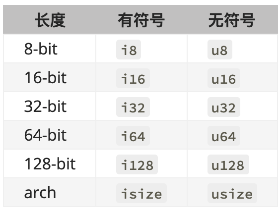

## 其他

1. rustfmt 自动格式化代码工具。

2. Rust 的缩进风格使用 4 个空格，而不是1个制表符。

3. 当看到符号`!` 的时候，就意味着调用的是宏而不是普通函数。

   ```rust
   println!("hello, world!")
   ```

4. Cargo 是 Rust 的构建系统和包管理器。

   ```rust
   cargo build 可以构建项目
   	当项目最终准备好发布时 cargo build --release 来优化编译项目
   cargo run 可以运行项目
   cargo test 可以测试项目
   cargo doc 可以为项目构建文档
   cargo publish 可以将库发布到
   cargo check  可以快速检查代码确保其可以编译，但并不产生可执行文件
   cargo new 创建新项目
   	1. 默认初始化一个 git 仓库
     2. cargo new --vcs=git 来覆盖此行为
   ```

## 变量

1. 变量默认是不可改变的。当变量不可变时，一旦值被绑定一个名称上，你就不能改变这个值。

   ```rust
   fn main() {
       let x = 5;
       println!("The value of x is:{}",x);
       x = 6; //报错
       println!("The value of x is:{}",x);
   }
   ```

2. 在变量之前加 `mut` 来使其可变。

   ```rust
   fn main() {
       let mut x = 5;
       println!("The value of x is:{}",x);
       x = 6;
       println!("The value of x is:{}",x);
   }
   ```

### 常量

1. 常量可以在任何作用域中声明，包括全局作用域。

2. 常量只能被设置为常量表达式，而不可以是其他任何只能在运行时计算出的值。

3. 必须注明值的类型。

   ```rust
   const THREE_HOURS_IN_SECONDS: u32 = 60 * 60 * 3;
   ```

### 隐藏

1. 定义一个与之前变量同名的新变量。

   ```rust
   fn main(){
       let f = 5;
       let f = f + 1;
       println!("The value of x is:{}",f)
   }
   ```

2. 隐藏与将变量标记为 `mut` 是有区别的。

   * 当再次使用 let 时，实际上创建了一个新变量，我们可以改变值的类型。
   * 通过 let，可以用这个值进行一些计算，不过计算之后变量仍然是不可变的。

**隐藏和mut的区别**

```rust
//正确的，隐藏是一个不同的变量，只是使用了同一个名字。  
	let spaces = "  ";
  let spaces = spaces.len();

//错误：mut 不能改变变量的类型
  let mut spaces = "   ";
  spaces = spaces.len();
```

## 类型

Rust 是**静态类型** 语言，也就是说在编译时就必须知道所有变量的类型。

类型声明叫注解。

### 整数

1. 允许使用 `_` 做为分隔符以方便读数，例如`1_000`，它的值与你指定的 `1000` 相同。

   

2. `isize` 和 `usize` 类型依赖运行程序的计算机架构：64 位架构上它们是 64 位的， 32 位架构上它们是 32 位的。

### 浮点

浮点数类型是 `f32` 和 `f64` 。默认是 `f64`。

```rust
fn main(){
  let x :f64 = 2.0;
  let y :f32 = 3.0;
}
```

### bool

```rust
fn main(){
  let t = true;
  let f :bool = false;
}
```

### 字符类型

`char` 类型的大小为四个字节。这意味着可以代表一个 Unicode 标量值。

```rust
fn main(){
  let c = 'z';
}
```

### 复合 - 元组

1. 元组长度固定：一旦声明，其长度不会增加或者缩小。
2. 元组的每一个位置都有一个类型，而且这些不同值的类型也不必是相同的。

```rust
fn main(){
  let tup:(i32,f64,u8) = (500,6.4,1);
  
  
  //解构
  let other = (500,6.4,1);
  let (xx, yy, zz) = other;
  
  //使用点号（.）后跟值的索引来直接访问它们。
  let x:(i32,f64,u8) = (500,6.4,1);
  let five_hundred = x.0;
  let six_point_four = x.1;
  let one = x.2;
  println!("{} {} {}",five_hundred,six_point_four,one);
}
```

### 复合 - 数组

1. 访问无效的数组元素，会导致运行时错误，导致 panic。

```rust
let months = [
  "January", "February", 
  "March", "April", 
  "May", "June", 
  "July", "August", 
  "September", "October",
  "November", "December"
];


let a: [i32;5] = [1,2,3,4,5];
```

## 函数

```rust
fn main(){
  demo(10);
}

fn demo(x: i32, y i){
  println!("The value of x is:{}",x);
}
```

### 包含语句和表达式的函数体

1. 语句是执行一些操作但不返回值的指令。

2. 表达式计算并产生一个值。

   ```rust
   fn main() {
      let _x = 5; //这是一个语句
     //下面这个方式是表达式
      let y = {
          let x = 3;
          x + 1   //这里如果加上 ; 就是语句了。
      };
      println!("The value of y is:{}",y);
   }
   ```

### 具有返回值的函数

1. 要在箭头（->）后声明它的类型。
2. 函数的返回值等同于函数体最后一个表达式的值。
3. 使用 `return` 关键字和指定值，可从函数中提前返回。
4. 大部分函数隐式的返回最后的表达式。

```rust
fn main() {
    let x1: i8 = five();
    let x2: i32 = plus_one(10);
    println!("The value of x is:{}", x1);
    println!("The value of x is:{}", x2);
}

fn five() -> i8 {
    5 //这是一个表达式
}

fn plus_one(x: i32) -> i32 {
    let y = x + 1;
    y
}
```

## 控制流

### if

```rust
fn main() {
    let number = 3;
    if number < 5 {
        println!("condition was true");
    } else {
        println!("condition was false");
    }
}

//在 let 语句中使用if
  //如果if 和 else 分支的值类型是不相容的，代码在编译的时候会报错。
fn main() {
    let condition = true;
    let number = if condition {
        5
    } else {
        6
    };
    println!("The value of number is:{}",number);
}
```

### 循环

1. rust 有三种循环：loop、while和for循环。

#### loop 循环

1. `loop` 关键字一直运行直到明确要求停止。

2. `break` 和 `continue` 

   ```rust
   fn main() {
       loop {
           println!("again!");
           break; //退出循环
       }
   }
   ```

3. 循环标签

   ```rust
   fn main() {
       let mut count = 0;
       'counting_up:loop{
           println!("count= {}",count);
           let mut remaining = 10;
           loop {
               println!("remaining = {}",remaining);
               if remaining == 9 {
                   break;
               }
               if count == 2 {
                   break 'counting_up;
               }
               remaining -= 1;
           }
           count += 1;
       }
       println!("End count = {}",count);
   }
   ```

4. 从循环返回。

   场景：重试可能会失败的操作。

   ```rust
   fn main() {
       let mut counter = 0;
       let result = loop{
           counter += 1;
           if counter == 10 {
               break counter * 2;
           }
       };
       println!("The result is {}",result);
   }
   ```

#### while 循环

```rust
fn main() {
    let a = [10,20,30,40,50];
    let mut index = 0;
    while index < 5 {
        println!("the value is:{}",a[index]);

        index = index + 1;
    }
}
```

#### for 循环

```rust
fn main() {
    let a = [10, 20, 30, 40, 50];
    for element in a.iter() {
        println!("the value is:{}", element);
    }
}
```

## 所有权

所有权的存在就是为了管理堆数据。

所有权让 Rust 无需垃圾回收即可保障内存安全。通过所有权系统管理内存，编译器在编译时会根据一系列的规则进行检查。

当你的代码调用一个函数时，传递给函数的值（包括可能指向堆上数据的指针）和函数的局部变量被压入栈中。当函数结束时，这些值被移出栈。

### 所有权规则

1. rust 中的每一个值都有一个被称为其 **所有者的** 变量。
2. 值在任一时刻有且只有一个所有者。
3. 当所有者（变量）离开作用域，这个值就被丢弃。

内存在拥有它的变量离开作用域后就被自动释放。

```rust
{
  let s = String::from("hello");  //从此处起， S 是有效的
  
  //使用										
}                                 //作用域已结束
																	//s 不再有效
```

### 变量与数据交互的方式（一）：移动

由于 String 类型在内存中分成了两块，一个指向存放字符串内容内存的指针，一个长度，和一个容量。这一组数据存储在栈上。右侧则是堆上存放内容的内存部分。

```rust
let s1 = String::from("hello");
let s2 = s1; // 在这个操作之后，Rust 认为 `s1` 不再有效。
```

避免了__内存的二次释放__ ：两次释放相同内存会导致内存污染，它可能会导致潜在的安全漏洞。

Rust 永远也不会自动创建数据的“深拷贝”。

### 变量与数据交互的方式（二）：克隆

如果我们确实需要深度复制 `String` 中堆上的数据，而不仅仅是栈上的数据，可以使用一个叫做 `clone` 的通用函数。

```rust
fn main() {
    let s1 = String::from("hello");
    let s2 = s1.clone();

    println!("s1 = {}, s2 = {}", s1, s2);
}
```

**注意** 

下面的代码是可以编译通过的，原因是像整型这样的在编译时已知大小的类型被整个存储在栈上。所以拷贝其实际的值时快速的。

```rust
fn main() {
    let x = 5;
    let y = x;
    println!("x = {}, y= {}", x ,y);
}
```

1. 所有整数类型，比如`u32`。
2. 布尔类型，`bool` 
3. 所有浮点类型。
4. 字符类型，`char`。

### 所有权与函数

将值传递给函数在语义上与给变量赋值相似。向函数传递值可能会移动或者复制，就像赋值语句一样。

```rust
fn main() {
    let s = String::from("hello");  // s 进入作用域
    takes_ownership(s);							// s 的值移动函数里 ...
    let x = 5;											// x 进入作用域
    makes_copy(x);									// 应该移动函数里
  																	// 但 i32 是 Copy 的，所以在后面可继续使用 x
}

fn takes_ownership(some_string: String) {  // some_string 进入作用域
    println!("{}", some_string);
} // 这里，some_string 移出作用域并调用 `drop` 方法。占用的内存被释放

fn makes_copy(some_integer: i32) {  // some_integer 进入作用域
    println!("{}", some_integer);
} // 这里，some_integer 移出作用域。不会有特殊操作
```

### 返回值与作用域

变量的所有权总是遵循相同的模式：将值赋给另一个变量时移动它。当持有堆中数据值的变量离开作用域时，其值将通过 `drop` 被清理掉，除非数据被移动为另一个变量所有。

```rust
fn main() {
    let s1 = gives_ownership();        // gives_ownership 将返回值移给 s1

    let s2 = String::from("hello");    // s2 进入作用域

    let s3 = takes_and_gives_back(s2);  // s2 被移动到 takes_and_gives_back 中, 它也将返回值移给 s3
}

fn gives_ownership() -> String {
    let some_string = String::from("hello");

    some_string
}

fn takes_and_gives_back(a_string: String) -> String {
    a_string
}
```

### 引用与借用

**引用:** 允许你使用值但不获取其所有权。 

将创建一个引用的行为称为 **借用** 。

引用默认是不允许修改的值。

```rust
fn main() {
    let s1 = String::from("hello");
    let len = calculate_length(&s1);
    println!("{}", len);
}

fn calculate_length(s: &String) -> usize {
    s.len()
}
```

### 可变引用

1. 必须将 `s` 改为 `mut` 。
2. 在调用函数的地方创建一个可变引用 `&mut s`。并在函数签名接受一个可变引用 `some_string: &mut String` 。

```rust
fn main() {
    let mut s = String::from("hello");

    change(&mut s);

    println!("{}",s);
}

fn change(some_string:&mut String){
    some_string.push_str(", world");
}
```

**注意** 

1. 在同一时间只能有一个对某一个特定数据的可变引用。

   ```rust
   //下面代码说明了这个问题，不能在同一时间多次将 s 作为可变变量借用。
   fn main() {
      let mut s = String::from("hello");
   
      let r1 = &mut s;
      let r2 = &mut s;
   
      println!("{}, {}", r1, r2);
   }
   ```

2. 可以使用大括号来创建一个新的作用域，以允许拥有多个可变引用，只是不能同时拥有。

   ```rust
   fn main() {
      let mut s = String::from("hello");
      {
          let r1 = &mut s;
          println!("{}",r1);
      }// 在这里离开了作用域，所以完全可以创建一个新的引用。
      let r2 = &mut s;
      println!("{}",r2);
   }
   ```

3. 同时使用可变与不可变引用时也会导致错误。

   ```rust
   fn main() {
      let mut s = String::from("hello");
   
      let r1 = &s;
      let r2 = &s;
      let r3 = &mut s;
   
      println!("{}, {}, and {}", r1, r2, r3);
   }
   ```

### 悬垂引用

通过释放内存时保留指向它的指针而错误地生成一个**悬垂指针** 。所谓悬垂指针是其指向的内存可能已经被分配给其它持有者。

```rust
//报错
fn dangle() -> &String {
    let s = String::from("hello");

    &s //返回字符串 S 的引用，这里 s 离开作用域并被丢弃。其内存被释放。
}
```

### slice 类型

slice 允许你引用集合中一段连续的元素序列，而不用引用整个集合。

字符串 `slice` 是 `String` 中一部分值的引用。

```rust
fn main() {
    let s = String::from("hello world");
    let hello = &s[0..5];
    println!("{} {}", hello, hello.len());
}
```

## 结构体

1. 整个实例必须是可变的；Rust 并不允许只将某个字段标记为可变。

```rust
fn main() {
    struct User {
        username: String,
        email: String,
        sign_in_count: i32,
        active: bool,
    }
    let user1 = User {
        email: String::from("someone@example.com"),
        username: String::from("someonename123"),
        active: true,
        sign_in_count: 1,
    };
    println!(
        "{} {} {} {}",
        user1.active, user1.sign_in_count, user1.email, user1.username
    );
}
```

### 函数中返回

```rust
fn build_user(email: String, username: String) -> User {
    User {
        email: email,
        username: username,
        active: true,
        sign_in_count: 1,
    }
}
```

### 变量与字段同名时的字段初始化简写语法

```rust
fn build_user(email: String, username: String) -> User {
    User {
        email,
        username,
        active: true,
        sign_in_count: 1,
    }
}
```

### 元组结构体

```rust
struct Color(i32,i32,i32);
```

### 调试 struct

```rust
#[derive(Debug)]
struct Rectangle {
    width: u32,
    height: u32,
}
fn main() {
    let width1 = 30;
    let height1 = 50;
    let wh = (30, 50);
    println!(
        "The area of the rectangle is {} {} square pixels.",
        area(width1, height1),
        area_v2(wh)
    );
    let scale = 2;
    let rect1 = Rectangle {
        width: dbg!(30 * scale),
        height: 50,
    };
    println!("rect1 is {:?}", rect1);   //第一种
    println!("rect1 is {:#?}", rect1);  //第二种
    dbg!(&rect1); //第三种
}

fn area(width: u32, height: u32) -> u32 {
    width * height
}

fn area_v2(dime: (u32, u32)) -> u32 {
    dime.0 * dime.1
}
```

### 方法语法

```rust
struct Rectangle {
    width: u32,
    height: u32,
}
impl Rectangle {
    fn area(&self) -> u32 {  //self 缩写self: &Self
        self.width * self.height
    }
  
    fn width(&self) -> bool { //可以选择将方法的名称与结构中的一个字段相同
      self.width > 0
    }
  
  	fn can_hold(&self, other: &Rectangle) -> bool {
        self.width > other.width && self.height > other.height
    }
    
    fn square(size:)
}
fn main() {
    let reat1 = Rectangle {
        width: 30,
        height: 50,
    };
    println!(
        "The area of the rectangle is {} {} square pixels.",
        reat1.area(), reat1.can_hold(&reat2)
    );
}
```

#### 关联函数

1. 所有在 `impl` 块中定义的函数被称为 **关联函数** 。

2. 定一个不以`self` 为第一参数的关联函数，使用结构体名和 `::` 语法来调用这个关联函数。

   ```rust
   impl Rectangle {
       fn square(size: u32) -> Rectangle {
           Rectangle {
               width: size,
               height: size,
           }
       }
   }
   
   let sq = Rectangle::square(3);
   ```

#### 一个结构体允许有多个 `impl` 块

## 枚举与模式匹配

1. 使用场景：枚举允许你通过列举可能的成员来定义一个类型。

   ```rust
   enum IpAddrKind {
       V4,
       V6,
   }
   
   //or 
   #[derive(Debug)]
   enum IpAddr {
       V4(u8, u8, u8, u8),
       V6(String),
   }
   fn main() {
       let home = IpAddr::V4(127, 0, 0, 1);
       println!("{:?}", home)
   }
   ```

2. 使用

   ```rust
   #[derive(Debug)]
   enum IpAddrKind {
       V4,
       V6
   }
   
   fn main() { 
       let home = IpAddrKind::V4;
       println!("{:?}", home); //V4
   }
   ```

### Option 枚举

1. `Option` 是标准库定义的另一个枚举。使用场景是，即一个值要么有值要么没值。

2. 空值的问题在于当你尝试像一个非空值那样使用一个空值，会出现某种形式的错误。然而，空值尝试表达的概念仍然是有意义的：空值是一个因为某种原因目前无效或缺失的值。

3. Rust 并没有空值功能。不过rust拥有一个可以编码存在或不存在概念的枚举。

   ```rust
   enum Option<T> {
       Some(T),
       None,
   }
   
   fn main() {
       let some_number = Some(5);
       println!("{:?}", some_number);
   }
   ```

### match

1. 它允许我们将一个值与一系列的模式相比较，并根据相匹配的模式执行相应代码。

   ```rust
   enum Coin {
       Penny,
       Nickel,
       Dime,
       Quarter,
   }
   
   fn value_in_cents(coin: Coin) -> u8 {
       match coin {
           Coin::Penny => {
               println!("Lucky penny!");
               1
           }
           Coin::Nickel => 5,
           Coin::Dime => 10,
           Coin::Quarter => 25,
       }
   }
   
   fn main() {
       let coin = Coin::Penny;
       let value = value_in_cents(coin);
       println!("{}", value)
   }
   ```

2. `_` 通配符

   ```rust
   fn main() {
       let some_u8_value = 1;
       match some_u8_value {
           1 => println!("one"),
           3 => println!("three"),
           5 => println!("five"),
           7 => println!("seven"),
           _ => (),
       }
   }
   ```

## 错误处理

当执行这个宏时，程序会打印出一个错误信息，展开并清理栈数据，然后退出。

Rust 将错误组合成两个主要类别：可恢复错误和不可恢复错误。

### panic! 与不可恢复的错误

```rust
fn main() {
    panic!("hello world");
}

//查看详细的 panic
//RUST_BACKTRACE=1 cargo run
```

### Result 与可恢复的错误

```rust
use std::fs::File;

fn main() {
    let f = File::open("hello.txt");
    let f = match f {
        Ok(file) =>file,
        Err(error) => {
            panic!("Problem opening the file: {:?}", error);
        }
    };
}
```

## 泛型、trait 和生命周期

### 泛型

1. 泛型是具体类型或其他属性的抽象替代。

2. Rust 通过在编译时进行泛型代码的 **单态化** 来保证效率。单态化是一个通过填充编译时使用的具体类型，将通用代码转换为特定代码的过程。

#### 函数泛型

当在函数签名种使用一个类型参数时，必须在使用它之前就声明它。类型参数声明位于函数名称与参数列表中间的尖括号`<>` 。

```rust
fn largest<T>(list: &[T]) -> T {}
```

#### 结构体定义中的泛型

```rust
struct Point<T> {
    x : T,
    y:T,
}
fn main() {
    let integer = Point { x: 5, y: 10 };
    let float = Point { x: 1.0, y: 4.0 };
}

//定义不同的类型
struct Point<T,O> {
    x : T,
    y:O,
}
fn main() {
    let integer = Point { x: 5, y: 10.0 };
    println!("{}", integer.x);
    println!("{}", integer.y);
}
```

#### 枚举泛型

```rust
enum Result <T,E> {
  Ok(T),
  Err(E),
}
```

#### 方法中的泛型

```rust
struct Point<T, O> {
    x: T,
    y: O,
}
impl<T, O> Point<T, O> {
    fn x(&self) -> &T {
        &self.x
    }
    fn y(&self) -> &O {
        &self.y
    }
}
fn main() {
    let integer = Point { x: 5, y: 10.0 };
    println!("{}", integer.x());
    println!("{}", integer.y());
}

//多个类型
struct Point<T, U> {
    x: T,
    y: U,
}

impl<T, U> Point<T, U> {
    fn mixup<V, W>(self, other: Point<V, W>) -> Point<T, W> {
        Point {
            x: self.x,
            y: other.y,
        }
    }
}

fn main() {
    let p1 = Point { x: 5, y: 10.4 };
    let p2 = Point { x: "Hello", y: 'c'};

    let p3 = p1.mixup(p2);

    println!("p3.x = {}, p3.y = {}", p3.x, p3.y);
}
```

### trait

```rust
use std::cmp::PartialOrd;

fn main() {
    let number_list = vec![34,50,25,100,65];
    println!("The largest number is {}", largest(&number_list));
}

fn largest<T:PartialOrd + Copy>(list:&[T]) -> T {
    let mut largest = list[0];
    for &item in list {
        if item > largest {
            largest = item;
        }
    }
    largest
}
```

#### 定义与实现以及方法的重载

```rust
pub trait Summary {
    fn summarize(&self) -> String;
}

pub struct NewsArticle {
    pub headline:String,
    pub location:String,
}

impl Summary for NewsArticle {
    fn summarize(&self) -> String {
        format!("{}, by {}",self.headline,self.location)
    }
}

fn main(){
    let tweet = NewsArticle{
        headline:String::from("Penguins win the Stanley Cup Championship!"),
        location:String::from("Pittsburgh, PA, USA"),
    };
    println!("1 new tweet: {}",tweet.summarize());
}
```

#### 默认实现

```rust
pub trait Summary {
  fn summarize(&self) -> String {
      String::from("Read more...");
  }
}
```

#### trait 作为参数

```rust
pub fn notify(item: impl Summary){
    println!("Breaking news! {}", item.summarize());
}
```

#### trait Bound 语法

泛型 `T` 被指定为 `item1` 和 `item2` 的参数限制，如此传递参数 `item1` 和 `item2` 值的具体类型必须一致。

```rust
pub fn notify<T:Summary>(item1:T, item2:T)
```

如果 `notify` 需要同时实现两个不同的 trait。`Display` 和 `Summary` 。这可以通过`+` 语法实现。

```rust
pub fn notify<T:Summary + Display>(item:T)
```

#### 返回 trait 类型

通过使用 `impl Summary` 作为返回值类型。

```rust
fn returns_summarizable(switch:bool) -> impl Summary{
    
}
```

