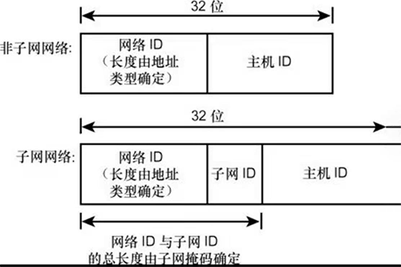
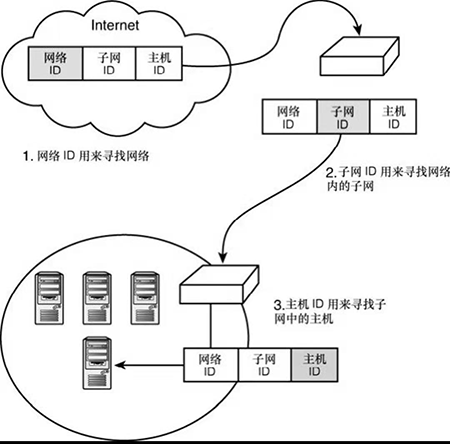

# 网际层

## 寻址与发送

1. 地址解析协议(ARP)是另一种网际层协议，它维护一个表格，用于把IP地址映射到物理地址(MAC地址)。这个ARP表连接了IP地址与网卡物理地址。

## 路由式网络中，TCP/IP 软件使用如下策略在网络上发送数据。

1. 如果目的地址与源地址在同一个网段，源计算机就把数据包直接发送给目的计算机。IP地址被ARP解析为物理地址，数据被直接发送到目的网络适配器。
2. 如果目的地址与源地址不在一个网段上，就执行如下过程。
   * 直接将数据报发送到网关。网关是位于局域网网段上的一个设备，能够把数据报转发到其它网段。网关地址被ARP解析为物理地址，数据被发送到网关的网络适配器。
   * 数据报通过网关被路由到教高级别的网段，再次重复上述过程。如果目的地址在这个新网段里，数据就被发送到目的地。否则数据报就会被发送到另一个网关。
   * 数据报经过一系列网关被转发到目的网段，目的IP地址被ARP解析为物理地址，数据被发送到目的网络适配器。

## 网际层协议必须具有一下功能：

- 识别网络中所有的计算机；
- 提供一种方式来判断何时需要通过网关来传递消息；
- 提供一种与硬件无关的方式来识别目的网段，从而让数据报能够高效地经过路由器到达正确的网段；
- 提供一种方式把目标计算机的逻辑IP地址转化为物理地址，让数据能够传输给目的计算机的网络适配器。

## 网际协议（IP）

Ip协议提供了一种分层的、与硬件无关的寻址系统，具有在复杂的路由式网络中传递数据所需要的服务。TCP/IP网络上的每个网络适配器都有一个唯一的IP地址。

1. IP地址分为两个部分：
   * 网络ID
   * 主机ID

### IP报头字段 [参考文章](<https://zhengyinyong.com/tcp-ip-cheatsheet.html>)

1. 版本：这个4 bits 的字段表示所使用的IP版本。

   * `0100`：IPv4
   * `0110`：IPv6

2. 报头长度**（IP Header Length）**：这个4位字段表示IP报头以 32 bit为单位的长度。

   4 bits，表示 32 位长的 IP 报头长度。比如当 IHL 为 5 时，则 IP 数据报头长度为 `5*32=160` bits，即 `160/8=20` bytes。**一般情况下，IHL 为 5，即 IP 报头最小为 20 个字节，最大为 (2^4-1)\*32=480 bits，即 60 个 bytes**；

3. 服务类型：这个8位字段的主要用途是对等待通过路由器的数据报区分优先级。

4. 总长度（Total Length）

   16 bits，IP 数据包（包括报头）的总长度（以 bytes 为单位），即 IP 数据包最大可以是 65535 bytes；

5. 标识符（Identifier）

   16 bits，通常与标记字段和分片偏移字段一起用于数据包分片。如果数据包原始长度超过数据包所要经过的数据链路的最大传输单元（MTU），那么必须将数据包分片为更小的数据包。

   例如：一个大小为 5000 字节的数据包在穿过网络时，如果遇到一条 MTU 为 1500 字节的数据链路，则路由器需要在数据成帧之前将数据包分片为多个数据包，其中每个数据包长度不同超过 1500 字节，**然后路由器在每片数据包的标识字段上打上相同的标记**，以便接收设备可以识别属于一个数据包的分片（**被分片的数据包不会在数据链路的另一端被重组，而是一直保持分片状态，直至到达最终目的地时才会被重组**）；

6. 标记字段（Flag）

   3 bits，其中：

   - 第 1 位没有使用；
   - 第 2 位是不分片（DF）位，当 DF 位被设置为 1 时，表示路由器不能对数据包进行分片处理。如果数据包不能分片而无法转发，那么路由器将丢弃该数据包并向源站发送错误消息，这一功能可用于在网络测试 MTU 值；
   - 第 3 位表示还有更多分片（MF）位。当路由器对数据包进行分片时，除了最后一个分片的 MF 位设置位 0 之外，其他所有分片的 MF 均设置为 1，以便接收者直到收到 MF 位为 0 的分片为止；

7. **分片偏移（Fragment Offset）**

   13 bits，以 8 个字节为单位（为了使 13 位长的分片偏移字段可以表示的最大数据包长度为 65535 字节），用于指明分片起始点相对于报头起始点的偏移量；

8. 生存时间（TTL）

   8 bits，在最初协议设计时，TTL 被设置为某个特定值（以秒为单位），当数据包逐个沿着路由器被传输时，每台路由器都会降低 TTL 的值。当 TTL 为 0 时，路由器将丢弃该数据包并向源点发送错误信息，**这种方法可以防止数据包在网络上无休止地被传输**。后发现以时间为单位实施起来非常困难，将其改成跳数。常见为 15 和 32，建议默认值为 64；

9. **协议**

   8 bits，给出了主机到主机层（传输层）的协议，常见的有：

   - `1`：ICMP（Internet 消息控制协议）
   - `2`：IGMP（Internet 组管理协议）
   - `4`：IPIP（被 IP 协议封装的 IP 协议）
   - `6`：TCP
   - `17`：UDP
   - `18`：GRE（通用路由选择封装）
   - `89`：OSPF

10. 报头校验和：这个字段包含16位的校验和，只用于校验报头本身的有效性。数据报经过的每个路由器都会对这个值进行重新计算，因为TTL字段的值是在不断变化的。

11. 源IP地址：32 bits 的字段包含了数据报的源IP地址。

12. 目的IP地址：这个32位的字段包含了数据报的目的IP地址。目的IP根据这个值校验发送的正确性。

13. IP选项

14. 填充：IP选项字段的长度不是固定的。填充字段可以提供一些额外的0，从而保证整个报头的长度是32位的整数倍（报头长度必须是32位字的整倍数）。

### IP寻址（地址分类系统）

1. 地址分类
   * A类地址：IP地址的前8位表示网络ID，后24位表示主机ID。
   * B类地址：IP地址的前16位表示网络ID，后16位表示主机ID。
   * C类地址：IP地址的前24位表示网络ID，后8位表示主机ID。
2. 判断地址类型。
   * 如果32位的地址以0开头，它就是A类地址；
   * 如果32位的地址以10开头，它就是B类地址；
   * 如果32位的地址以110开头，它就是C类地址。
   * 如果32位的地址以1110开头，就是D类地址（224～239），用于多播（把一个消息发送到网络的子网）。

### 特殊的IP地址

1. 全0的主机ID表示网络本身，不会分配给主机。例如，IP地址`129.152.0.0` 是指网络ID为129.152的B类网络。
2. 全1的主机ID表示广播。广播是向网络中全部主机发送的消息。IP地址`129.152.255.255` 就是网络ID为`129.152` 的B类网络的广播地址。
3. 地址 `255.255.255.255` 也可以用于网络上的广播。
4. 以127开头的地址是环回地址。目的地为环回地址的消息是有本地TCP/IP软件发送的，其目的在于测试TCP/IP软件是否工作正常。

## 地址解析协议(ARP)

1. 网段上每台主机在内存中都保存着一个被称为ARP表或ARP缓存的表格。其中包含着网段上其它主机的IP地址和物理地址的对应关系。当主机需要向网段上的其它主机发送数据时，它会查看ARP缓存来获得目的地物理地址（MAC）。ARP缓存是动态变化的。如果要接收数据的地址当前并不存在于ARP缓存，主机就会发送一个名为ARP请求帧的广播。
2. ARP请求帧包含未解析的IP地址，还包含发送这个请求的主机的IP地址和物理地址。网段上的其它主机接收到这个ARP请求，拥有这个未解析IP地址的主机会向发出请求的主机发送自己的物理地址。这个新的IP地址与物理地址的对应关系就会添加到请求主机的ARP缓存里。

## 逆向ARP（RARP）

RARP的含义是逆向ARP，也就是ARP的逆过程。

## Interner 控制消息协议（ICMP）

发送到远程计算机的数据通常会经过一个或多个路由器，这些路由器在把数据传输到最终目的地的过程中可能发生多种问题。路由器利用Internet 控制消息协议（ICMP）消息把问题通知给源IP。ICMP还有用于其它调试和排错的功能。

1. ping 命令实际上就是使用ICMP协议。
2. Source Quench（源抑制）:如果一台高速计算机向远程计算机发送大量数据，可能会使路由器产生过载。这时路由器可以利用ICMP向源IP发送`Source Quench` 消息。让它降低发送数据的速度。
3. Destination Unreachable（目的地不可到达）：如果路由器收到一个不能传递的数据报，ICMP就会想源IP返回一个 `Destination Unreachable` 消息。
4. Time Exceeded（超时）：当数据报由于TTL为0而被抛弃时，ICMP就会向源IP发送这个消息。这表示对于当前TTL值来说，到达目标需要经过太多的路由器；或者是说明路由表出了问题。
5. Fragmentation Needed （需要分段）：如果一个数据报的**不可分解**位被设置为1，而路由器必须要对数据报进行分段才能把它转发到下一台路由器或目的地，这时ICMP就会发送这条消息。

## 子网划分和CIDR

### 子网

1. 子网划分就是在网络ID之下提供了第2层逻辑组织。路由器能够把数据报发送给网络里的某个子网地址。

2. TCP/IP的设计者借用了主机ID里的一些位来形成子网地址。一个名为子网掩码的参数指明了地址中多少位用于子网ID、保留多少位作为实际的主机ID。

   

3. 在子网网络上，路由器和主机所使用的路由表包含了与每个IP地址相关的子网掩码信息。数据报根据网络ID被路由到目标网络，而这个网络ID是由地址类别决定的。当数据报到达目标网络之后，它根据子网ID路由到合适的网段。在到达这个网段之后，再根据主机ID传输到正确的计算机。

​	