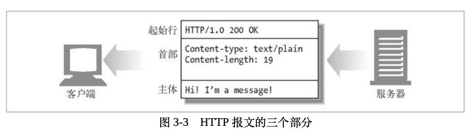

## 记录

| HTTP方法 | 描述                                                         |
| -------- | ------------------------------------------------------------ |
| GET      | 从服务器向客户端发送命名资源                                 |
| PUT      | 将来自客户端的数据存储到一个命名的服务器资源中去             |
| DELETE   | 从服务器中删除命名资源                                       |
| POST     | 将客户端数据发送到一个服务器网关应用程序                     |
| HEAD     | 仅发送命名资源响应中的HTTP首部                               |
| OPTIONS  | 请求Web服务器告知其支持的各种功能。可以询问服务器通常支持哪种方法。 |
| TRACE    | 用于验证请求是否如愿穿过了请 求 / 响应链。它也是一种很好的工具，可以用来查看代理和其他应用程序对用户请求所产生效果。 |

| 整体范围 | 已定义范围 | 分类       |
| -------- | ---------- | ---------- |
| 100～199 | 100～101   | 信息提示   |
| 200～299 | 200～206   | 成功       |
| 300～399 | 300～305   | 重定向     |
| 400～499 | 400～415   | 客户端错误 |
| 500～599 | 500～505   | 服务器错误 |

## 报文组成

对报文进行描述的起始行、包含属性的首部（header）块，以及可选的、包含数据的主体（body）部分。

起始行和首部每行都以一个由两个字符组成的行终止序列作为结束，其中包括一个回车符和一个换行符。

## 其他

1. 方法是用来告诉服务器做什么事情的，状态码则用来告诉客户端，发生了什么事情。