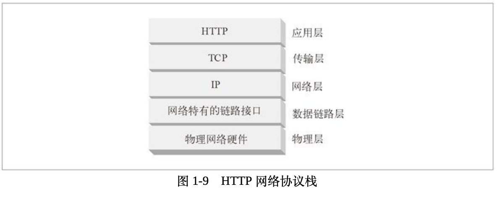

1. HTTP 是一个应用层协议。HTTP 无需操心网络通信的具体细节；它把联网的细节都交给了通用、可靠的因特网传输协议 `TCP/IP`。
2. TCP 提供了：
   * 无差错的数据传输
   * 按序传输（数据总是会按照发送的顺序到达）
   * 未分段的数据流（可以在任意时刻以任意尺寸将数据发送出去）
3. `TCP/IP` 隐藏了各中网络和硬件的特点及弱点，使各种类型的计算机和网络都能够进行可靠地通信。
4. 
5. 其他
   * 代理：位于客户端和服务器之间的 HTTP 中间实体。
   * 缓存：HTTP 的仓库，使常用页面的副本可以保存在离客户端更近的地方。
   * 网关：连接其他应用程序的特殊 Web 服务器。
   * 隧道：对 HTTP 通信报文进行盲转发的特殊代理。
   * Agent 代理：发起自动 HTTP 请求的半智能 Web 客户端。（浏览器）
6. 客户端应用程序在向其他应用程序发送任意 URL 之前，最好把所有不安全或受限字符都进行转换。只要对所有不安全字符都进行了编码，这个 URL 就是可在各应用程序之间共享的规范形式。
7. HTTP 每行都以一个由两个字符组成的行终止序列（CRLF）作为结束，其中包括一个回车符和一个换行符。
8. 